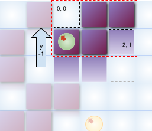

# **Projeto Nº 1**: Manual Técnico

Inteligência Artificial - Escola Superior de Tecnologia de Setúbal
2021/2022

Prof. Joaquim Filipe
Eng. Filipe Mariano

Desenvolvido por:
Bernardo Serra Mota, nº 201900947

Frederico Alcaria, nº201701440

## **Introdução**

Este Manual Técnico é referente ao programa desenolvido de resolução do jogo de puzzle Blockus Uno com variados tabuleiros iniciais utilizando diferentes algoritmos de pesquisa de espaços de estado para alcançar um estado objetivo.

Contém uma explicação geral do sistema desenvolvido e da, da representação do puzzle e implementação dos algoritmos, devidamente comentados. São listados e explicados os objetos que compõem o projeto, incluindo dados e procedimentos; identificação das limitações e opções técnicas. Apresentaremos uma análise critica dos resultados das execuções do programa, tendo em consideração as limitações do projeto.

## 1.**Arquitetura do Sistema**

### Módulos

O programa está dividido em 3 ficheiros *.lisp:

1.  **procura.lisp** *-* implementação dos algoritmos de procura BFS, DFS e A* de forma genérica e recursiva e outras funções auxiliares;
2.  **puzzle.lisp** \- implementação das entidades, regras e funções do jogo, tal como funções heuristicas para o problema;
3.  **projeto.lisp** \- implementação de uma interface com utilizador em consola e funções de leitura e escrita do disco;

A compilação e execução do ficheiro **projeto.lisp** é suficiente para utilizar a aplicação porque os outros dois ficheiros são lidos da pasta fornecida pelo utilizador ao iniciar o programa. Esta pasta também é utilizada para a leitura do ficheiro problemas.dat e escrita do resultados.dat.

O módulo projeto faz a ligação entre o puzzle e o módulo genérico de procura.

## 2.**Entidades** e sua Implementação

Um nó é uma lista composta por:

- um estado
- a profundidade do nó na árvore de procura
- o seu nó pai

O estado é representado como uma lista composta por:

- uma matriz 14x14 (lista de listas) de valores numéricos {0, 1, 2}
- uma lista de 3 valores que representam o número de peças disponíveis para jogar de cada tipo

As peças são funções que devolvem uma lista com uma matriz das casas que a peça ocupa e uma lista de deslocações (explicação mais detalhada em `4.Descrição das opções tomadas`).

### procura.lisp

| Símbolo | Argumentos | Descrição |
| --- | --- | --- |
| no-estado | (no) | "Obtem o estado do nó" |
| no-profundidade | (no) | "Obtem a profundidade do nó" |
| no-pai | (no) | "Obtem a profundidade do nó" |
| no-objetivo-em-lista | (objetivo lista) | "Procura por um nó solução numa lista e devolve" |
| no-repetido | (no lista) | "Verifica se um no com o mesmo estado existe numa lista e devolve a lista começando nesse no" |
| indice-elemento-lista | (no lista &optional (i 0) | "Obtém a posição de um elemento numa lista ou nil caso não exista" |
| criar-resultado | (no numero-nos-gerados numero-nos-expandidos) | "Função para criar a lista com os resultados finais de uma procura<br>(no objetivo, fator de ramificação média, numero de nós gerados, número de nós expandidos e penetrância" |
| abertos-bfs | (abertos sucessores) | "Método BFS de inserção dos sucessores na lista de abertos" |
| nos-nao-repetidos | (nos lista) | "Devolve a lista de nos sem os com estado igual na lista fornecida" |
| bfs | (no objetivo sucessores operadores &optional abertos fechados (numero-nos-gerados 0) (numero-nos-expandidos 0)) | "Algoritmo de procura em largura implementado recursivamente. Recebe um nó inicial, uma função de avaliação de nó objetivo, uma função geradoradora de nós sucessores e uma lista de operadores fornecidos a esta. Um nó é definido como uma lista composta por estado, profundidade e nó pai. A função objetivo deverá receber exclusivamente um nó. A função sucessores deverá receber exclusivamente um nó e uma lista de operadores" |
| abertos-dfs | (abertos sucessores) | "Método DFS de inserção dos sucessores na lista de abertos" |
| remover-subarvore | (raiz lista) | "Dada um nó raiz e uma lista de nós, remove todos os nós dessa lista pertencentes à sub-arvore, incluindo a raiz" |
| remover-subarvores | (a-remover lista) | "Remove múltiplas subarvores fornecidos como uma lista de nós raiz e uma lista de nós" |
| dfs-adicionar-sucessores | (sucessores fechados abertos) | "Função que implementa o método de inserção de sucessores no algoritmo DFS devolve uma lista com a nova lista de nós abertos e a nova lista de nós fechados. Recebe uma lista de nós sucessores, fechados e abertos e:<br>1\. Discarta sucessores que se encontram repetidos na lista de abertos;<br>2\. Procura por sucessores com estado repetido na lista de fechados e:<br>\- caso o sucessor tenha menor profundidade (custo uniforme),remove toda a subarvore do no fechado da lista de fechados e introduz o sucessor na lista de abertos<br>\- caso contrário é discartado<br>3\. Coloca os restantes sucessores em abertos" |
| dfs | (no objetivo sucessores operadores profundidade &optional abertos fechados (numero-nos-gerados 0) (numero-nos-expandidos 0)) | "Algoritmo de procura em profundidade implementado recursivamente. Recebe um nó inicial, uma função de avaliação de nó objetivo, uma função geradoradora de nós sucessores, uma lista de operadores fornecidos a esta e um nível de profundidade máximo.<br>Um nó é definido como uma lista composta por estado, profundidade e nó pai.<br>A função objetivo deverá receber exclusivamente um nó.<br>A função sucessores deverá receber exclusivamente um nó e uma lista de operadores<br>A profundidade máxima deverá ser um numero inteiro > 0" |
| insere | (e p L) | "Insere um elemento e na posição p de uma lista movendo os restantes uma posição para a frente.<br>Devolve a lista de dimensão (length L) +1" |
| procura-binaria | (n L-ord &optional baixo alto) | "Devolve a posição numa lista ordenada de valores numericos (L-ord) em que valor numerico n deve ser colocado" |
| remove-from-list | (l index &optional (i 0) | "Remove da lista l o elemento de indice index, devolvendo uma lista de dimensão (1- (length l))" |
| remover-subarvore-f | (raiz lista f-lista &optional (lista-nova nil) (f-lista-nova nil)) | "Remove de uma lista de nós com uma lista de valores f associados todos os nós que pertençam à arvore definida por raiz, inclusivamente a própria raiz" |
| merge-ordenado-f | (elementos f-elementos lista f-lista) | "Introduz todos os elementos com valores f não ordenados numa lista ordenada por f (definido por uma lista de elementos e uma de f).<br>Devolve uma nova lista de elementos e de valores f corretamente ordenados" |
| a*-adicionar-sucessores | (sucessores f-sucessores fechados f-fechados abertos f-abertos) | "Função que implementa o método de inserção de sucessores no algoritmo A* devolve uma lista com a nova lista de nós abertos, a nova lista de valores f de abertos, a nova lista de nós fechados e a nova lista de valores f de fechados Recebe uma lista de nós sucessores, a sua lista de valores f, lista de fechados, a sua lista de valores f, lista de abertos e a sua lista de valores f:<br>1\. Procura por sucessores com estado repetido na lista de abertos e:<br>\- caso o sucessor tenha valor f menor, remove o nó existente em abertos e introduz o sucessor na lista de abertos<br>\- caso contrário é discartado<br>2\. Procura por sucessores com estado repetido na lista de fechados e:<br>\- caso o sucessor tenha valor f menor,remove toda a subarvore do no fechado da lista de fechados e introduz o sucessor na lista de abertos<br>\- caso contrário é discartado<br>3\. Coloca os restantes sucessores em abertos" |
| a*  | (no objetivo sucessores operadores heuristica) | "Algoritmo de procura informado implementado recursivamente.<br>Recebe um nó inicial, uma função de avaliação de nó objetivo, uma função geradoradora de nós sucessores, uma lista de operadores fornecidos a esta e uma função heuristica<br>Um nó é definido como uma lista composta por estado, profundidade e nó pai.<br>A função objetivo deverá receber exclusivamente um nó.<br>A função sucessores deverá receber exclusivamente um nó e uma lista de operadores<br>A profundidade máxima deverá ser um numero inteiro > 0" |
| avaliar-nos | (nos heuristica) | "Devolve uma lista de avaliações f com base numa lista de nos e uma funcao heuristica em que g(n) é a profundidade do no (custo uniforme)" |

### puzzle.lisp

| Símbolo | Argumentos | Descrição |
| --- | --- | --- |
| no-teste | ()  | Define um no teste de Blockus em que o tabuleiro é vazio, a mao tem a quantidade de pecas inicial, profundidade=0 e pai=NIL |
| no-problema | ()  | Define um no teste de Blockus em que o tabuleiro é o primeiro problema, a mao tem a quantidade de pecas inicial, profundidade=0 e pai=NIL |
| no-vazio | ()  | Define um no teste de Blockus em que o tabuleiro é vazio, a mao tem a quantidade de pecas inicial, profundidade=0 e pai=NIL |
| peca-c-h | ()  | Peça C horizontal descrita como uma matriz 3x2 e uma lista de 4 deslocações cada deslocação é descrita com uma lista de direcões diagonais de contato e um offset em x e y da forma da peça relativamente a posicao no tabuleiro |
| peca-c-v | ()  | Peça C vertical descrita como uma matriz 2x3 e uma lista de 4 deslocações cada deslocação é descrita com uma lista de direcões diagonais de contato e um offset em x e y da forma da peça relativamente a posicao no tabuleiro |
| peca-a | ()  | Peça A descrita como uma matriz 1x1 e uma lista de 1 deslocações cada deslocação é descrita com uma lista de direcões diagonais de contato e um offset em x e y da forma da peça relativamente a posicao no tabuleiro |
| peca-b | ()  | Peça B descrita como uma matriz 2x2 e uma lista de 4 deslocações cada deslocação é descrita com uma lista de direcões diagonais de contato e um offset em x e y da forma da peça relativamente a posicao no tabuleiro |
| operadores | ()  | Devolve os simbolos relativos às 4 peças concretas do jogo |
| obter-vizinhanca | (tabuleiro x y) | Obtem uma matriz 3x3 que representa a vizinhança de uma célula no tabuleiro. Representa espaços fora do tabuleiro com o valor -1 |
| espacos-validos | (tabuleiro) | Procura espaços validos para jogar no tabuleiro. Devolve lista de listas com par de coordenadas e lista de direções diagonais de contacto (sup-esq, sup-dir, inf-esq, inf-dir) |
| tabuleiro-vaziop | (tabuleiro) | Função que avalia se um tabuleiro fornecido não tem peças colocadas |
| deslocacoes-peca | (peca) | Obtem a lista de deslocações (offsets) da peça relativamente aos pontos de contacto |
| eliminar-duplicados | (L) | Elimina elementos duplicados numa lista L |
| potenciais-colocacoes-com-peca | ( posicoes peca) | Obtem uma lista de potenciais colocações da peça no tabuleiro que deve ainda ser testada na prática |
| potenciais-colocacoes | (posicao deslocacoes) | Devolve a resolução em colocações concretas da peça ao comparar a lista de deslocacoes da peça com os contatos da posicao recebida. |
| lista-contem-todos | (lista elementos) | Verifica se a lista recebida contém todos os elementos |
| potenciais-colocacoes-por-peca | (estado operadores) | Obtém todas as potenciais colocações por peça no tabuleiro considerando as peças restantes na mão. Todas as colocações devolvidas devem primeiro ser testadas em prática. Devolve lista de listas com operador e uma lista de potencias colocações em listas de coordenas x y. |
| tem-peca | (peca mao) | Valida se uma peça existe na mão do jogador |
| peca-casas-ocupadas | (x y peca) | Retorna uma lista de listas de coordenas que são as casa ocupadas concretamente de jogar a peça nas posições x y |
| celula | (row col tabuleiro) | Retorna uma celula na linha e coluna do tabuleiro |
| substituir-posicao | (idx line &optional (value 1) | Substitui a célula na posição idx da linha recebida pelo valor |
| substituir | (row col tabuleiro &optional (value 1) | Substitui a célula na posição row col recebida pelo valor |
| valida-casas | (tabuleiro casas) | Valida se é possível jogar no tabuleiro nas casas |
| list-0-to-n | (n) | Devolve uma lista de 0 a n |
| remove-from-list | (l index &optional (i 0) | Remove da lista l o elemento de indice index, devolvendo uma lista de dimensão (1- (length l)) |
| shuffle-list | (l &optional (shuffled-list nil) | Baralha a lista l aleatóriamente |
| sucessores | (no operadores) | Com base no nó e nos operadores disponíveis, devolve uma lista de sucessores válidos |
| ha-jogadas-validas | (no) | Verifica se é possível colocar mais alguma peça das disponiveis no tabuleiro |
| atualizar-mao | (mao peca-jogada) | Devolve uma nova mão sem a peça jogada |
| ocupar-casas | (tabuleiro casas) | Imprime a peça sobre o tabuleiro, devolvendo um novo tabuleiro |
| criar-no-inicial-blockus | (tabuleiro) | Recebe um tabuleiro/problema e constroi um nó inicial com uma mão de 35 peças de 3 tipos, profundidade 0 e pai nil |
| no-solucaop | (no minimo-casas-preenchidas) | Determina se um nó é solução |
| criar-funcao-objetivo | (minimo-casas-preenchidas) | Constroi e devolve uma função lambda objetivo. Permite variar o número minimo de casas preenchidas. |
| criar-funcao-heuristica-base | (minimo-casas-a-preencher) | Constroi e devolve uma função lambda heuristica base. Permite variar o número minimo de casas preenchidas. |
| heuristica-base | (estado minimo-casas-a-preencher) | Função heuristica base definida como o numero de casas restantes para alcançar o minimo de casas preenchidas especificadas pelo problema |
| heuristica-original | (estado) | Função heuristica original definida como o numero de casas vazias que conectam lateralmente com outras casas vazias |
| contar-casas-vazias-nao-sozinhas | (tabuleiro) | Devolve o numero de casas no tabuleiro vazias que conectam lateralmente com outras casas vazias |
| Contar-casas-preenchidas | (tabuleiro) | Devolve o numero de casas preenchidas pelo jogador no tabuleiro |

| Símbolo | Argumentos | Descrição |
| --- | --- | --- |
| iniciar | ()  | Função que inicia o programa |
| definir-pasta | ()  | Pede o path da localização do projeto e compila os ficheiros puzzle.lisp e procura.lisp |
| mostrar-menu-inicial | ()  | Imprime no listener o menu inicial |
| mostrar-selecionar-algoritmo | ()  | Imprime no listener o menu que permite selecionar o algoritmo |
| mostrar-selecionar-heuristica | ()  | Imprime no listener o menu que permite selecionar a heuristica a ser usada |
| mostrar-limite-profundidade | ()  | Imprime no listener o menu que permite inserir o nível máximo de profundidade |
| mostrar-tabuleiros | (numero-tabuleiros &optional (i 1)) | Imprime no listener o menu que permite selecionar o tabuleiro a ser usado |
| menu-limite-profundidade | (minimo-casas-preencher tabuleiro) | Chama a função mostrar-limite-profundidade e lê o input do utilizador |
| menu-inicial | ()  | Chama a função mostrar-menu-inicial, lê o input do utilizador e redireciona para o menu de escolha de tabuleiros |
| menu-algoritmo | (minimo-casas-preencher tabuleiro) | Chama a função mostrar-selecionar-algoritmo, lê o input do utilizador e redireciona para o menu respetivo de cada algoritmo |
| menu-heuristica | (tabuleiro minimo-casas-preencher) | Chama a função mostrar-selecionar-heuristica e lê o input do utilizador |
| menu-tabuleiros | ()  | Chama a função mostrar-tabuleiros e ler-tabuleiros, o nº de opções depende do número de problemas encotrados no ficheiro problemas.dat |
| efetuar-procura | (algoritmo tabuleiro objetivo &optional profundidade-maxima funcao-heuristica) | Executa os algoritmos e conta o tempo total de execução. Chama as funções que registam e imprimem os resultados e estatísticas |
| registar-resultado | (resultado tempo-total algoritmo &optional profundidade-maxima) | Função que gere a criação dos resultados, chama as funções necessárias para tal |
| registar-algoritmo | (algoritmo &optional profundidade-maxima) | Regista no ficheiro resultados.dat as informações iniciais do algoritmo |
| registar-solucao | (no) | Função que gere a criação dos resultados dos nós |
| registar-tabuleiro | (tabuleiro) | Regista no ficheiro resultados.dat o estado do tabuleiro |
| registar-no | (no) | Regista no ficheiro resultados.dat as informações do nó atual |
| registar-estatisticas | (estatisticas tempo-total) | Regista no ficheiro resultados.dat as estatísticas da execução do algoritmo |
| mostrar-algoritmo | (algoritmo &optional profundidade-maxima) | Imprime no listener as informações iniciais do algoritmo |
| mostrar-tabuleiro | (tabuleiro) | Imprime no listener o estado do tabuleiro |
| mostrar-solucao | (no) | Função que gere a impressão da informação dos nós no listener |
| mostrar-resultado | (resultado tempo-total algoritmo &optional profundidade-maxima) | Função que gere a impressão dos resultados e estatísticas |
| mostrar-estatisticas | (estatisticas tempo-total) | Imprime no listener as estatisticas da execução do algoritmo |
| mostrar-no | (no) | Imprime no listener as informações do nó atual |
| tabuleiro-letras | (tabuleiro) | Percorre o tabuleiro e troca os números por símbolos |
| diretorio-problemas | ()  | Devolve o path para o ficheiro problemas.dat |
| diretorio-resultados | ()  | Devolve o path para o ficheiro resultados.dat |
| ler-tabuleiros | ()  | Lê e retorna a informação do ficheiro problemas.dat |

## 3.**Algoritmos** e sua Implementação

Todos os algoritmos implementados fazem contagem do número de nós expandidos e gerados e devolvem como resultado uma lista da solução juntamente com dados estatísticos:

- fator de ramificação média (divisão entre número de nós gerados e número de nós expandidos)
- número de nós gerados
- número de nós expandidos
- penetrância (divisão da profundidade no nó objetivo por o número de nós gerados)

### BFS

O algoritmo de procura em largura é um algoritmo não informado que expande extensamente a árvore mas garante uma solução com o menor custo. Expande primeiro os nós abertos de profundidade menor, este comportamento é alcançado através da utilização de lógica *first-in-first-out* na inserção e remoção de nós da lista de abertos.

Foi implementado tanto recursivamente como sequencialmente. A versão recursiva será a abordada neste manual.

Enquanto existirem nós na lista de abertos, o algoritmo vai retirando o primeiro nó em abertos, insere em fechados, expande os sucessores e verifica se algum dos sucessores é nó objetivo:

- Caso seja, é devolvido numa lista resultado como nó solução.
- Caso não seja os sucessores que não tenham já estado repetido na lista de abertos ou de fechados são inseridos na lista de abertos e o algoritmo chama-se recursivamente com os valores atualizados.

Se a lista de abertos ficar vazia, não existe solução e é retornado `nil`.

### DFS

O algoritmo de procura em profundidade é um algoritmo não informado que procura até um máximo de profundidade definido, expandindo sempre o nó de profundidade maior na lista de abertos. Este comportamento é alcançado através da utilização de lógica *first-in-last-out* na inserção e remoção de nós da lista de abertos. Não garante um melhor resultado, simplesmente devolve a primeira solução encontrada a baixo da profundidade máxima estabelecida ou nenhuma solução caso não seja possível alcançar o objetivo nesse número de jogadas (assumindo custo uniforme).

Enquanto existirem nós na lista de abertos, o algoritmo vai retirando o primeiro nó em abertos, insere em fechados, expande os sucessores e verifica se algum dos sucessores é nó objetivo:

- Caso seja, é devolvido numa lista resultado como nó solução.
- Caso não seja os sucessores são inseridos na lista de abertos segunda a seguinte lógica:
    - Discarta sucessores que se encontram repetidos na lista de abertos;
        
    - Procura por sucessores com estado repetido na lista de fechados e:
        
        - caso o sucessor tenha menor profundidade (custo uniforme), remove toda a sub-árvore do nó fechado da lista de fechados e introduz o sucessor na lista de abertos;
            
        - caso contrário é discartado.
            
    - Coloca os restantes sucessores em abertos.
        

Se a lista de abertos ficar vazia, não existe solução dentro da profundidade definida e é retornado `nil`.

### A*

O algoritmo A* é um algoritmo de procura informado que atribui a cada nó um valor estimativo de distância ao objetivo, definido como `f(n) = g(n) + h(n)` em que `g(h)` é o custo do nó e `h(n)` é o seu valor heurístico. É também caracterizado por só avaliar a condição de objetivo sobre o nó a ser expandido e não sobre a lista de sucessores de todos os nós expandidos, tomando assim também partido da capacidade de avaliação da função heurística para identificação de que nós valem a pena despender recursos a avaliar.

Optámos por preservar a genericidade da entidade nó e, em vez de colocar o valor de f calculado dentro da lista nó, mantemos a todos os momentos uma lista de avaliações f sincronizadas para cada lista de nós usada pelo algoritmo (abertos, f-abertos, fechados, f-fechados, sucessores, f-sucessores). As listas estão ambas ordenadas crescentemente por valores de f) - o problema facilmente é resolvido com o auxilio de uma função de procura-binária que permite obter a posição de inserção de um novo nó nas listas existentes apenas com observando a lista de avaliações f que são valores numéricos inteiros. São também utilizadas funções de inserção e remoção de elementos de listas em posições pretendidas.

- Procura por sucessores com estado repetido na lista de abertos e:
    - caso o sucessor tenha valor f menor, remove o nó existente em abertos e introduz o sucessor na lista de abertos
    - caso contrário é discartado
- Procura por sucessores com estado repetido na lista de fechados e:
    - caso o sucessor tenha valor f menor,remove toda a subarvore do no fechado da lista de fechados e introduz o sucessor na lista de abertos
    - caso contrário é discartado
- Coloca os restantes sucessores em abertos.

Se a lista de abertos ficar vazia, não existe solução possível e é retornado `nil`.

## 4.**Descrição das opções tomadas**

Embora a peça C seja apresentada como uma única peça que pode ser rodada, para fins de implementação dos operadores será tratada como duas peças C-H (horizontal) e C-V (vertical). No entanto, no momento de remoção da peça da "mão" do jogador, ambas decrementam da mesma posição o que produz o resultado pretendido. O mesmo acontece com a verificação de peças disponíveis.

Com o intuito de minimizar o impacto de testar para cada nó expandido todas as possíveis colocações das 4 peças do jogo (14 linhas * 14 colunas * 4 peças = 784 testes) foi desenvolvido um sistema de identificação de potenciais colocações que utiliza informação adicional sobre as peças para diminuir considerávelmente o número de operações:

A função sucessores começa por procurar no tabuleiro do estado do nó que está a ser expandido por casas vazias que contenham pelo menos uma diagonal ocupadada e nenhuma lateral ocupada. Para cada casa encontrada que verifique esta condição é registado as diagonais ocupadas numa lista de símbolos 'sup-dir 'inf-dir 'inf-esq 'sup-esq.


*Figura 1 - ilustração do processo de pre-seleção de casas*


*Figura 2 - ilustração de potenciais jogadas encontradas num tabuleiro exemplo*

Cada peça, para além de ser definida pelas casa que ocupa numa matriz de dimensão variável com espaços nao ocupados representados por 0 e ocupados po 1, tem também uma lista de deslocações em coordenadas X e Y para cada combinação de contatos diagonais, ou seja, o offtset aplicado ao inicio do ciclo de "impressão" da peça sobre o tabuleiro de forma a que a casa fique ocupada com uma extremidade da peça que corresponda à diagonal esperada.

```CommonLisp
(
        (
            (0 1 1)
            (1 1 0)
        )
        (
            ((sup-esq) (-1 0))
            ((sup-dir inf-dir) (-2 0))
            ((inf-dir) (-1 -1))
            ((inf-esq sup-esq) (0 -1))
        )
)
```

*Excerto 1 - Representação da peça C horizontal no programa*


*Figura 3 - ilustração dos pontos de contato da peça C horizontal*

Para identificar as potenciais jogadas da peça C horizontal na casa x:3 y:1 identificada com um contato no canto superior esquerdo ilustrada na figura 2, procura-se correspondências na lista de deslocações por uma deslocação que tenho uma lista de contatos que contenha todos os contatos da casa encontrada. Ambas as deslocações (-1 0) e (0 -1) satisfazem a condição e são guardadas como potenciais colocações:


*Figura 4 - Peça C horizontal colocada na casa (3 1) mas com o o offset (-1 0) encontrado. A posição a que começa a "impressão" da peça no tabuleiro é por isso (2 1).*



*Figura 5 - Peça C horizontal colocada na casa (3 1) mas com o o offset (-1 0) encontrado. A posição a que começa a "impressão" da peça no tabuleiro é por isso (2 1).*

Por fim, deverão ser testadas as potenciais colocações encontradas de cada peça para verificar se concretamente não existem colisões pois tal não é garantido.

Para lidar com o facto do objetivo ter uma pré-condição variável de problema para problema, o número mínimo de casas preenchidas, foi necessário implementar uma função para criar a função objetivo (**criar-funcao-objetivo**) que opera como *lambda-over-lambda*, devolvendo uma função lamba que contém uma closure com o número mínimo de casas a preencher de forma a ser genérica face ao algoritmo de procura.

O mesmo sucede com a função heurística base (fornecida no enunciado) e foi também implementada uma função *lambda-over-lambda* **criar-funcao-heuristica-base**.

Decidimo implementar também uma função recursiva que baralha os elementos numa lista aleatóriamente usando a função `random` pseudo-aleatória de CommonLisp e duas listas auxiliares. Com isto, em todos os algoritmos baralhamos a ordem das operações ao gerar os sucessores (não comprometendo o determinismo da função algoritmo pois esta lógica está contida na função geradora de sucessores que é modular) e como o problema é de custo uniforme é válido com os metodos de inserção programados no BFS e DFS.

Por esta razão é possível observar nos resultados 1-2 e 3-4 em `6.Resultados` que para o mesmo tabuleiro problema é gerado um número diferente de nós.

A heurística original desenvolvida consiste na soma de todas as casas não ocupadas do tabuleiro que têm contato lateral com outra casa não ocupada. Os valores heurísticos são bastantes elevados e nunca alcançam zero num nó objetivo. No entanto é extremamente óptimo para alcançar um tabuleiro que com o máximo de casas ocupada pois dá preferência em separar as casas vazias, o que leva a alcançar estados do tabuleiro que oferecem muitas jogadas válidas e limita o retorno a nós de níveis menores. O facto de produzir valores heurísticos elevados também encoraja o algoritmo a aprofundar pois o custo real uniforme quando obtido é maioria das vezes bastante menor que o previsto. No entanto esta heurística não poderia ser considerada útil se o objetivo do jogo realmente fosse concluir no menor número de jogadas, que é o propósito real da função heurística. É possível que as regras do jogo tenham um pequeno conflito de interesse com o propósito dos algoritmos de procura utilizados ;)

Observamos, relativamente às heurísticas que nem a base fornecida, nem a nossa são admissíveis pois o número de casas a ocupar vai sempre ser em algum momento no jogo maior que o número de peças a jogar para alcançar o objetivo (que é a profundidade e o valor de `g(n)` ).

## 5.**Limitações técnicas e ideias para desenvolvimento futuro**

Observamos que relativamente aos resultados obtidos listados em `6.Resultados` :

- O algoritmo BFS consegue resolver apenas os dois primeiros tabuleiros problema em tempo útil ou dentro da dimensão de stack permitida
    - parou perto do inicio da exploração do 6º nível de profundidade no tabuleiro 2 o que, com uma ramificação média de 12 (que terá tendencia a subir até metade do tabuleiro estar preenchido), nos indica que noo 7º nível teria 12<sup>7</sup> = 2 985 984 nós gerados.
- O algoritmo DFS consegue alcançar rapidamente um nó objetivo desde que a profundida máxima ultrapasse o número de jogadas que garantam vitória, mesmo que não ocupando o espaço de forma estratégica para usar menor número de peças possíveis.
    - No caso de limites de profundidade no limite do número de peças necessárias para alcançar o objetivo tem o potencial de ser ainda menos eficiente que o BFS. Pode ser requisitado um problema que é impossível resolver dentro do limite estabelecido.
    - Nestes casos fácilmente ultrapassa o limite do stack.
- Com o algoritmo A*:
    - Com a heurística base todos os tabuleiros 1-4 são facilmente resolvidos mas os tabuleiros 5-6 ultrapassam a dimensão limite do stack.
    - Com a heuristica original fornecida todos os tabuleiros são facilmente resolvidos mas o nó objetivo tem uma elevada profundidade.
    - Nota-se que no tabuleiro 4 a heuristica base expande 72 e gera 342 em 0.079 segundos enquanto que a heurística original apenas expande 19 e gera 187 mas em 0.107. A partir deste problema a função heuristica original torna-se mais rápida e utiliza menos stack.

### Requisitos não implementados

Todos os requisitos obrigatórios foram implementados. Requisitos bónus não foram implementados.

### Potencial refactoring

- Funções de adição de sucessores a lista de abertos e fechados, principalmente no caso do DFS, poderiam ser subdivididos em mais procedimentos de menor dimensão para ajudar na legibilidade.
- No ficheiro **projeto.lisp** é definida uma variável global *\*path\** para dar persistência em todas as operações do programa de leitura ou escrita do disco da pasta introduzida pelo utilizador no início da execução. Consideramos que tenha impacto minimo mas mesmo assim poderia ser resolvido de outra forma.

### Melhoramentos potenciais de desempenho

- No BFS e DFS, guardar informação de jogadas possíveis no nó quando estas são verificadads na função objetivo. Assim não seria necessário voltar a fazer esse calculo quando a peça for expandida.
    
- As implementações puramente recursivas ocupam espaço desnecessariamente no stack ao manterem para cada frame uma versão da lista de nós abertos e fechados. É fornecido no projeto um exemplo de implementação do algoritmos BFS com a utilização de closure para manter estes valores de forma mais conservadora. No entanto, todos os testes efetuados sobre o programa utilizam a versão recursiva do algoritmo.
    

## 6.**Resultados**

### Resultado 1: BFS - Tabuleiro 1

```
- --/-/-/-/-/R E S U L T A D O/-/-/-/-/-/-/-/-- - 
 
Algoritmo utilizado: BFS 
 
Profundidade: 0 
_ _ _ _ : : : : : : : : : :
_ _ _ _ : : : : : : : : : :
_ _ _ _ : : : : : : : : : :
_ _ _ _ : : : : : : : : : :
: : : : : : : : : : : : : :
: : : : : : : : : : : : : :
: : : : : : : : : : : : : :
: : : : : : : : : : : : : :
: : : : : : : : : : : : : :
: : : : : : : : : : : : : :
: : : : : : : : : : : : : :
: : : : : : : : : : : : : :
: : : : : : : : : : : : : :
: : : : : : : : : : : : : :
Peças disponiveis: (10 10 15) 
 
Profundidade: 1 
# # _ _ : : : : : : : : : :
# # _ _ : : : : : : : : : :
_ _ _ _ : : : : : : : : : :
_ _ _ _ : : : : : : : : : :
: : : : : : : : : : : : : :
: : : : : : : : : : : : : :
: : : : : : : : : : : : : :
: : : : : : : : : : : : : :
: : : : : : : : : : : : : :
: : : : : : : : : : : : : :
: : : : : : : : : : : : : :
: : : : : : : : : : : : : :
: : : : : : : : : : : : : :
: : : : : : : : : : : : : :
Peças disponiveis: (10 9 15) 
 
Profundidade: 2 
# # _ _ : : : : : : : : : :
# # _ _ : : : : : : : : : :
_ _ # # : : : : : : : : : :
_ # # _ : : : : : : : : : :
: : : : : : : : : : : : : :
: : : : : : : : : : : : : :
: : : : : : : : : : : : : :
: : : : : : : : : : : : : :
: : : : : : : : : : : : : :
: : : : : : : : : : : : : :
: : : : : : : : : : : : : :
: : : : : : : : : : : : : :
: : : : : : : : : : : : : :
: : : : : : : : : : : : : :
Peças disponiveis: (10 9 14) 
 
- --/-/-/-/-/E S T A T I S T I C A S/-/-/-/-/-- - 
Factor de ramificação média: 3.0 
Número de nós gerados: 6 
Número de nós expandidos: 2 
Penetrância: 0.33333334 
Tempo de execução em segundos: 0.0 
- --/-/-/-/-/-/-/-/-/-/-/-/-/-/-/-/-/-/-/-/-/-- -
```

### Resultado 2: BFS - Tabuleiro 1

```
- --/-/-/-/-/R E S U L T A D O/-/-/-/-/-/-/-/-- - 
 
Algoritmo utilizado: BFS 
 
Profundidade: 0 
_ _ _ _ : : : : : : : : : :
_ _ _ _ : : : : : : : : : :
_ _ _ _ : : : : : : : : : :
_ _ _ _ : : : : : : : : : :
: : : : : : : : : : : : : :
: : : : : : : : : : : : : :
: : : : : : : : : : : : : :
: : : : : : : : : : : : : :
: : : : : : : : : : : : : :
: : : : : : : : : : : : : :
: : : : : : : : : : : : : :
: : : : : : : : : : : : : :
: : : : : : : : : : : : : :
: : : : : : : : : : : : : :
Peças disponiveis: (10 10 15) 
 
Profundidade: 1 
# # _ _ : : : : : : : : : :
# # _ _ : : : : : : : : : :
_ _ _ _ : : : : : : : : : :
_ _ _ _ : : : : : : : : : :
: : : : : : : : : : : : : :
: : : : : : : : : : : : : :
: : : : : : : : : : : : : :
: : : : : : : : : : : : : :
: : : : : : : : : : : : : :
: : : : : : : : : : : : : :
: : : : : : : : : : : : : :
: : : : : : : : : : : : : :
: : : : : : : : : : : : : :
: : : : : : : : : : : : : :
Peças disponiveis: (10 9 15) 
 
Profundidade: 2 
# # _ _ : : : : : : : : : :
# # _ _ : : : : : : : : : :
_ _ # # : : : : : : : : : :
_ # # _ : : : : : : : : : :
: : : : : : : : : : : : : :
: : : : : : : : : : : : : :
: : : : : : : : : : : : : :
: : : : : : : : : : : : : :
: : : : : : : : : : : : : :
: : : : : : : : : : : : : :
: : : : : : : : : : : : : :
: : : : : : : : : : : : : :
: : : : : : : : : : : : : :
: : : : : : : : : : : : : :
Peças disponiveis: (10 9 14) 
 
- --/-/-/-/-/E S T A T I S T I C A S/-/-/-/-/-- - 
Factor de ramificação média: 3.5 
Número de nós gerados: 14 
Número de nós expandidos: 4 
Penetrância: 0.14285715 
Tempo de execução em segundos: 0.002 
- --/-/-/-/-/-/-/-/-/-/-/-/-/-/-/-/-/-/-/-/-/-- -
```

### Resultado 3: BFS - Tabuleiro 2

```
- --/-/-/-/-/R E S U L T A D O/-/-/-/-/-/-/-/-- - 
 
Algoritmo utilizado: BFS 
 
Profundidade: 0 
_ _ _ _ _ _ _ : : : : : : :
_ _ _ _ _ _ _ : : : : : : :
_ _ _ _ _ _ _ : : : : : : :
_ _ _ _ _ _ _ : : : : : : :
_ _ _ _ _ _ _ : : : : : : :
_ _ _ _ _ _ _ : : : : : : :
_ _ _ _ _ _ _ : : : : : : :
: : : : : : : : : : : : : :
: : : : : : : : : : : : : :
: : : : : : : : : : : : : :
: : : : : : : : : : : : : :
: : : : : : : : : : : : : :
: : : : : : : : : : : : : :
: : : : : : : : : : : : : :
Peças disponiveis: (10 10 15) 
 
Profundidade: 1 
# _ _ _ _ _ _ : : : : : : :
# # _ _ _ _ _ : : : : : : :
_ # _ _ _ _ _ : : : : : : :
_ _ _ _ _ _ _ : : : : : : :
_ _ _ _ _ _ _ : : : : : : :
_ _ _ _ _ _ _ : : : : : : :
_ _ _ _ _ _ _ : : : : : : :
: : : : : : : : : : : : : :
: : : : : : : : : : : : : :
: : : : : : : : : : : : : :
: : : : : : : : : : : : : :
: : : : : : : : : : : : : :
: : : : : : : : : : : : : :
: : : : : : : : : : : : : :
Peças disponiveis: (10 10 14) 
 
Profundidade: 2 
# _ _ _ _ _ _ : : : : : : :
# # _ _ _ _ _ : : : : : : :
_ # _ _ _ _ _ : : : : : : :
_ _ # _ _ _ _ : : : : : : :
_ _ # # _ _ _ : : : : : : :
_ _ _ # _ _ _ : : : : : : :
_ _ _ _ _ _ _ : : : : : : :
: : : : : : : : : : : : : :
: : : : : : : : : : : : : :
: : : : : : : : : : : : : :
: : : : : : : : : : : : : :
: : : : : : : : : : : : : :
: : : : : : : : : : : : : :
: : : : : : : : : : : : : :
Peças disponiveis: (10 10 13) 
 
Profundidade: 3 
# _ _ _ _ _ _ : : : : : : :
# # _ _ _ _ _ : : : : : : :
_ # _ _ _ _ _ : : : : : : :
_ _ # _ _ _ _ : : : : : : :
_ _ # # _ _ _ : : : : : : :
_ _ _ # _ # # : : : : : : :
_ _ _ _ # # _ : : : : : : :
: : : : : : : : : : : : : :
: : : : : : : : : : : : : :
: : : : : : : : : : : : : :
: : : : : : : : : : : : : :
: : : : : : : : : : : : : :
: : : : : : : : : : : : : :
: : : : : : : : : : : : : :
Peças disponiveis: (10 10 12) 
 
Profundidade: 4 
# _ _ _ _ _ _ : : : : : : :
# # _ _ _ _ _ : : : : : : :
_ # _ _ _ _ _ : : : : : : :
_ _ # _ _ _ _ : : : : : : :
# _ # # _ _ _ : : : : : : :
# # _ # _ # # : : : : : : :
_ # _ _ # # _ : : : : : : :
: : : : : : : : : : : : : :
: : : : : : : : : : : : : :
: : : : : : : : : : : : : :
: : : : : : : : : : : : : :
: : : : : : : : : : : : : :
: : : : : : : : : : : : : :
: : : : : : : : : : : : : :
Peças disponiveis: (10 10 11) 
 
Profundidade: 5 
# _ _ _ _ _ _ : : : : : : :
# # _ _ _ _ _ : : : : : : :
_ # _ _ _ # # : : : : : : :
_ _ # _ # # _ : : : : : : :
# _ # # _ _ _ : : : : : : :
# # _ # _ # # : : : : : : :
_ # _ _ # # _ : : : : : : :
: : : : : : : : : : : : : :
: : : : : : : : : : : : : :
: : : : : : : : : : : : : :
: : : : : : : : : : : : : :
: : : : : : : : : : : : : :
: : : : : : : : : : : : : :
: : : : : : : : : : : : : :
Peças disponiveis: (10 10 10) 
 
Profundidade: 6 
# _ _ # # _ _ : : : : : : :
# # _ # # _ _ : : : : : : :
_ # _ _ _ # # : : : : : : :
_ _ # _ # # _ : : : : : : :
# _ # # _ _ _ : : : : : : :
# # _ # _ # # : : : : : : :
_ # _ _ # # _ : : : : : : :
: : : : : : : : : : : : : :
: : : : : : : : : : : : : :
: : : : : : : : : : : : : :
: : : : : : : : : : : : : :
: : : : : : : : : : : : : :
: : : : : : : : : : : : : :
: : : : : : : : : : : : : :
Peças disponiveis: (10 9 10) 
 
- --/-/-/-/-/E S T A T I S T I C A S/-/-/-/-/-- - 
Factor de ramificação média: 10.760986 
Número de nós gerados: 54117 
Número de nós expandidos: 5029 
Penetrância: 1.1087089E-4 
Tempo de execução em segundos: 32.021 
- --/-/-/-/-/-/-/-/-/-/-/-/-/-/-/-/-/-/-/-/-/-- -
```

### Resultado 4: BFS - Tabuleiro 2

```
- --/-/-/-/-/R E S U L T A D O/-/-/-/-/-/-/-/-- - 
 
Algoritmo utilizado: BFS 
 
Profundidade: 0 
_ _ _ _ _ _ _ : : : : : : :
_ _ _ _ _ _ _ : : : : : : :
_ _ _ _ _ _ _ : : : : : : :
_ _ _ _ _ _ _ : : : : : : :
_ _ _ _ _ _ _ : : : : : : :
_ _ _ _ _ _ _ : : : : : : :
_ _ _ _ _ _ _ : : : : : : :
: : : : : : : : : : : : : :
: : : : : : : : : : : : : :
: : : : : : : : : : : : : :
: : : : : : : : : : : : : :
: : : : : : : : : : : : : :
: : : : : : : : : : : : : :
: : : : : : : : : : : : : :
Peças disponiveis: (10 10 15) 
 
Profundidade: 1 
# # _ _ _ _ _ : : : : : : :
# # _ _ _ _ _ : : : : : : :
_ _ _ _ _ _ _ : : : : : : :
_ _ _ _ _ _ _ : : : : : : :
_ _ _ _ _ _ _ : : : : : : :
_ _ _ _ _ _ _ : : : : : : :
_ _ _ _ _ _ _ : : : : : : :
: : : : : : : : : : : : : :
: : : : : : : : : : : : : :
: : : : : : : : : : : : : :
: : : : : : : : : : : : : :
: : : : : : : : : : : : : :
: : : : : : : : : : : : : :
: : : : : : : : : : : : : :
Peças disponiveis: (10 9 15) 
 
Profundidade: 2 
# # _ _ _ _ _ : : : : : : :
# # _ _ _ _ _ : : : : : : :
_ _ # # _ _ _ : : : : : : :
_ # # _ _ _ _ : : : : : : :
_ _ _ _ _ _ _ : : : : : : :
_ _ _ _ _ _ _ : : : : : : :
_ _ _ _ _ _ _ : : : : : : :
: : : : : : : : : : : : : :
: : : : : : : : : : : : : :
: : : : : : : : : : : : : :
: : : : : : : : : : : : : :
: : : : : : : : : : : : : :
: : : : : : : : : : : : : :
: : : : : : : : : : : : : :
Peças disponiveis: (10 9 14) 
 
Profundidade: 3 
# # _ _ _ _ _ : : : : : : :
# # _ _ _ _ _ : : : : : : :
_ _ # # _ _ _ : : : : : : :
_ # # _ _ _ _ : : : : : : :
# _ _ _ _ _ _ : : : : : : :
# # _ _ _ _ _ : : : : : : :
_ # _ _ _ _ _ : : : : : : :
: : : : : : : : : : : : : :
: : : : : : : : : : : : : :
: : : : : : : : : : : : : :
: : : : : : : : : : : : : :
: : : : : : : : : : : : : :
: : : : : : : : : : : : : :
: : : : : : : : : : : : : :
Peças disponiveis: (10 9 13) 
 
Profundidade: 4 
# # _ _ _ _ _ : : : : : : :
# # _ _ _ _ _ : : : : : : :
_ _ # # _ _ _ : : : : : : :
_ # # _ _ _ _ : : : : : : :
# _ _ # _ _ _ : : : : : : :
# # _ # # _ _ : : : : : : :
_ # _ _ # _ _ : : : : : : :
: : : : : : : : : : : : : :
: : : : : : : : : : : : : :
: : : : : : : : : : : : : :
: : : : : : : : : : : : : :
: : : : : : : : : : : : : :
: : : : : : : : : : : : : :
: : : : : : : : : : : : : :
Peças disponiveis: (10 9 12) 
 
Profundidade: 5 
# # _ _ _ _ _ : : : : : : :
# # _ _ _ _ _ : : : : : : :
_ _ # # _ _ _ : : : : : : :
_ # # _ _ # _ : : : : : : :
# _ _ # _ # # : : : : : : :
# # _ # # _ # : : : : : : :
_ # _ _ # _ _ : : : : : : :
: : : : : : : : : : : : : :
: : : : : : : : : : : : : :
: : : : : : : : : : : : : :
: : : : : : : : : : : : : :
: : : : : : : : : : : : : :
: : : : : : : : : : : : : :
: : : : : : : : : : : : : :
Peças disponiveis: (10 9 11) 
 
Profundidade: 6 
# # _ _ _ # _ : : : : : : :
# # _ _ _ # # : : : : : : :
_ _ # # _ _ # : : : : : : :
_ # # _ _ # _ : : : : : : :
# _ _ # _ # # : : : : : : :
# # _ # # _ # : : : : : : :
_ # _ _ # _ _ : : : : : : :
: : : : : : : : : : : : : :
: : : : : : : : : : : : : :
: : : : : : : : : : : : : :
: : : : : : : : : : : : : :
: : : : : : : : : : : : : :
: : : : : : : : : : : : : :
: : : : : : : : : : : : : :
Peças disponiveis: (10 9 10) 
 
- --/-/-/-/-/E S T A T I S T I C A S/-/-/-/-/-- - 
Factor de ramificação média: 11.744529 
Número de nós gerados: 27905 
Número de nós expandidos: 2376 
Penetrância: 2.1501523E-4 
Tempo de execução em segundos: 7.797 
- --/-/-/-/-/-/-/-/-/-/-/-/-/-/-/-/-/-/-/-/-/-- -
```

### Resultado 5: DFS - Tabuleiro 1

```
- --/-/-/-/-/R E S U L T A D O/-/-/-/-/-/-/-/-- - 
 
Algoritmo utilizado: DFS (5 níveis de profundidade) 
 
Profundidade: 0 
_ _ _ _ : : : : : : : : : :
_ _ _ _ : : : : : : : : : :
_ _ _ _ : : : : : : : : : :
_ _ _ _ : : : : : : : : : :
: : : : : : : : : : : : : :
: : : : : : : : : : : : : :
: : : : : : : : : : : : : :
: : : : : : : : : : : : : :
: : : : : : : : : : : : : :
: : : : : : : : : : : : : :
: : : : : : : : : : : : : :
: : : : : : : : : : : : : :
: : : : : : : : : : : : : :
: : : : : : : : : : : : : :
Peças disponiveis: (10 10 15) 
 
Profundidade: 1 
# _ _ _ : : : : : : : : : :
_ _ _ _ : : : : : : : : : :
_ _ _ _ : : : : : : : : : :
_ _ _ _ : : : : : : : : : :
: : : : : : : : : : : : : :
: : : : : : : : : : : : : :
: : : : : : : : : : : : : :
: : : : : : : : : : : : : :
: : : : : : : : : : : : : :
: : : : : : : : : : : : : :
: : : : : : : : : : : : : :
: : : : : : : : : : : : : :
: : : : : : : : : : : : : :
: : : : : : : : : : : : : :
Peças disponiveis: (9 10 15) 
 
Profundidade: 2 
# _ _ _ : : : : : : : : : :
_ # # _ : : : : : : : : : :
_ # # _ : : : : : : : : : :
_ _ _ _ : : : : : : : : : :
: : : : : : : : : : : : : :
: : : : : : : : : : : : : :
: : : : : : : : : : : : : :
: : : : : : : : : : : : : :
: : : : : : : : : : : : : :
: : : : : : : : : : : : : :
: : : : : : : : : : : : : :
: : : : : : : : : : : : : :
: : : : : : : : : : : : : :
: : : : : : : : : : : : : :
Peças disponiveis: (9 9 15) 
 
Profundidade: 3 
# _ _ _ : : : : : : : : : :
_ # # _ : : : : : : : : : :
_ # # _ : : : : : : : : : :
# _ _ _ : : : : : : : : : :
: : : : : : : : : : : : : :
: : : : : : : : : : : : : :
: : : : : : : : : : : : : :
: : : : : : : : : : : : : :
: : : : : : : : : : : : : :
: : : : : : : : : : : : : :
: : : : : : : : : : : : : :
: : : : : : : : : : : : : :
: : : : : : : : : : : : : :
: : : : : : : : : : : : : :
Peças disponiveis: (8 9 15) 
 
Profundidade: 4 
# _ _ # : : : : : : : : : :
_ # # _ : : : : : : : : : :
_ # # _ : : : : : : : : : :
# _ _ _ : : : : : : : : : :
: : : : : : : : : : : : : :
: : : : : : : : : : : : : :
: : : : : : : : : : : : : :
: : : : : : : : : : : : : :
: : : : : : : : : : : : : :
: : : : : : : : : : : : : :
: : : : : : : : : : : : : :
: : : : : : : : : : : : : :
: : : : : : : : : : : : : :
: : : : : : : : : : : : : :
Peças disponiveis: (7 9 15) 
 
Profundidade: 5 
# _ _ # : : : : : : : : : :
_ # # _ : : : : : : : : : :
_ # # _ : : : : : : : : : :
# _ _ # : : : : : : : : : :
: : : : : : : : : : : : : :
: : : : : : : : : : : : : :
: : : : : : : : : : : : : :
: : : : : : : : : : : : : :
: : : : : : : : : : : : : :
: : : : : : : : : : : : : :
: : : : : : : : : : : : : :
: : : : : : : : : : : : : :
: : : : : : : : : : : : : :
: : : : : : : : : : : : : :
Peças disponiveis: (6 9 15) 
 
- --/-/-/-/-/E S T A T I S T I C A S/-/-/-/-/-- - 
Factor de ramificação média: 2.8 
Número de nós gerados: 14 
Número de nós expandidos: 5 
Penetrância: 0.35714287 
Tempo de execução em segundos: 0.001 
- --/-/-/-/-/-/-/-/-/-/-/-/-/-/-/-/-/-/-/-/-/-- -
```

### Resultado 6: DFS - Tabuleiro 2

```
- --/-/-/-/-/R E S U L T A D O/-/-/-/-/-/-/-/-- - 
 
Algoritmo utilizado: DFS (10 níveis de profundidade) 
 
Profundidade: 0 
_ _ _ _ _ _ _ : : : : : : :
_ _ _ _ _ _ _ : : : : : : :
_ _ _ _ _ _ _ : : : : : : :
_ _ _ _ _ _ _ : : : : : : :
_ _ _ _ _ _ _ : : : : : : :
_ _ _ _ _ _ _ : : : : : : :
_ _ _ _ _ _ _ : : : : : : :
: : : : : : : : : : : : : :
: : : : : : : : : : : : : :
: : : : : : : : : : : : : :
: : : : : : : : : : : : : :
: : : : : : : : : : : : : :
: : : : : : : : : : : : : :
: : : : : : : : : : : : : :
Peças disponiveis: (10 10 15) 
 
Profundidade: 1 
# _ _ _ _ _ _ : : : : : : :
_ _ _ _ _ _ _ : : : : : : :
_ _ _ _ _ _ _ : : : : : : :
_ _ _ _ _ _ _ : : : : : : :
_ _ _ _ _ _ _ : : : : : : :
_ _ _ _ _ _ _ : : : : : : :
_ _ _ _ _ _ _ : : : : : : :
: : : : : : : : : : : : : :
: : : : : : : : : : : : : :
: : : : : : : : : : : : : :
: : : : : : : : : : : : : :
: : : : : : : : : : : : : :
: : : : : : : : : : : : : :
: : : : : : : : : : : : : :
Peças disponiveis: (9 10 15) 
 
Profundidade: 2 
# _ _ _ _ _ _ : : : : : : :
_ # _ _ _ _ _ : : : : : : :
_ # # _ _ _ _ : : : : : : :
_ _ # _ _ _ _ : : : : : : :
_ _ _ _ _ _ _ : : : : : : :
_ _ _ _ _ _ _ : : : : : : :
_ _ _ _ _ _ _ : : : : : : :
: : : : : : : : : : : : : :
: : : : : : : : : : : : : :
: : : : : : : : : : : : : :
: : : : : : : : : : : : : :
: : : : : : : : : : : : : :
: : : : : : : : : : : : : :
: : : : : : : : : : : : : :
Peças disponiveis: (9 10 14) 
 
Profundidade: 3 
# _ _ _ _ _ _ : : : : : : :
_ # _ _ _ _ _ : : : : : : :
_ # # _ _ _ _ : : : : : : :
_ _ # _ _ _ _ : : : : : : :
# # _ _ _ _ _ : : : : : : :
# # _ _ _ _ _ : : : : : : :
_ _ _ _ _ _ _ : : : : : : :
: : : : : : : : : : : : : :
: : : : : : : : : : : : : :
: : : : : : : : : : : : : :
: : : : : : : : : : : : : :
: : : : : : : : : : : : : :
: : : : : : : : : : : : : :
: : : : : : : : : : : : : :
Peças disponiveis: (9 9 14) 
 
Profundidade: 4 
# _ _ _ _ _ _ : : : : : : :
_ # _ _ _ _ _ : : : : : : :
_ # # _ _ _ _ : : : : : : :
_ _ # _ _ _ _ : : : : : : :
# # _ # _ _ _ : : : : : : :
# # _ _ _ _ _ : : : : : : :
_ _ _ _ _ _ _ : : : : : : :
: : : : : : : : : : : : : :
: : : : : : : : : : : : : :
: : : : : : : : : : : : : :
: : : : : : : : : : : : : :
: : : : : : : : : : : : : :
: : : : : : : : : : : : : :
: : : : : : : : : : : : : :
Peças disponiveis: (8 9 14) 
 
Profundidade: 5 
# _ _ _ _ _ _ : : : : : : :
_ # _ _ _ _ _ : : : : : : :
_ # # _ _ # # : : : : : : :
_ _ # _ # # _ : : : : : : :
# # _ # _ _ _ : : : : : : :
# # _ _ _ _ _ : : : : : : :
_ _ _ _ _ _ _ : : : : : : :
: : : : : : : : : : : : : :
: : : : : : : : : : : : : :
: : : : : : : : : : : : : :
: : : : : : : : : : : : : :
: : : : : : : : : : : : : :
: : : : : : : : : : : : : :
: : : : : : : : : : : : : :
Peças disponiveis: (8 9 13) 
 
Profundidade: 6 
# _ _ _ _ _ _ : : : : : : :
_ # _ _ _ _ _ : : : : : : :
_ # # _ _ # # : : : : : : :
_ _ # _ # # _ : : : : : : :
# # _ # _ _ _ : : : : : : :
# # _ _ # # _ : : : : : : :
_ _ _ # # _ _ : : : : : : :
: : : : : : : : : : : : : :
: : : : : : : : : : : : : :
: : : : : : : : : : : : : :
: : : : : : : : : : : : : :
: : : : : : : : : : : : : :
: : : : : : : : : : : : : :
: : : : : : : : : : : : : :
Peças disponiveis: (8 9 12) 
 
Profundidade: 7 
# _ _ _ # # _ : : : : : : :
_ # _ # # _ _ : : : : : : :
_ # # _ _ # # : : : : : : :
_ _ # _ # # _ : : : : : : :
# # _ # _ _ _ : : : : : : :
# # _ _ # # _ : : : : : : :
_ _ _ # # _ _ : : : : : : :
: : : : : : : : : : : : : :
: : : : : : : : : : : : : :
: : : : : : : : : : : : : :
: : : : : : : : : : : : : :
: : : : : : : : : : : : : :
: : : : : : : : : : : : : :
: : : : : : : : : : : : : :
Peças disponiveis: (8 9 11) 
 
Profundidade: 8 
# _ # _ # # _ : : : : : : :
_ # _ # # _ _ : : : : : : :
_ # # _ _ # # : : : : : : :
_ _ # _ # # _ : : : : : : :
# # _ # _ _ _ : : : : : : :
# # _ _ # # _ : : : : : : :
_ _ _ # # _ _ : : : : : : :
: : : : : : : : : : : : : :
: : : : : : : : : : : : : :
: : : : : : : : : : : : : :
: : : : : : : : : : : : : :
: : : : : : : : : : : : : :
: : : : : : : : : : : : : :
: : : : : : : : : : : : : :
Peças disponiveis: (7 9 11) 
 
Profundidade: 9 
# _ # _ # # _ : : : : : : :
_ # _ # # _ _ : : : : : : :
_ # # _ _ # # : : : : : : :
_ _ # _ # # _ : : : : : : :
# # _ # _ _ _ : : : : : : :
# # _ _ # # _ : : : : : : :
_ _ _ # # _ # : : : : : : :
: : : : : : : : : : : : : :
: : : : : : : : : : : : : :
: : : : : : : : : : : : : :
: : : : : : : : : : : : : :
: : : : : : : : : : : : : :
: : : : : : : : : : : : : :
: : : : : : : : : : : : : :
Peças disponiveis: (6 9 11) 
 
Profundidade: 10 
# _ # _ # # _ : : : : : : :
_ # _ # # _ _ : : : : : : :
_ # # _ _ # # : : : : : : :
_ _ # _ # # _ : : : : : : :
# # _ # _ _ # : : : : : : :
# # _ _ # # _ : : : : : : :
_ _ _ # # _ # : : : : : : :
: : : : : : : : : : : : : :
: : : : : : : : : : : : : :
: : : : : : : : : : : : : :
: : : : : : : : : : : : : :
: : : : : : : : : : : : : :
: : : : : : : : : : : : : :
: : : : : : : : : : : : : :
Peças disponiveis: (5 9 11) 
 
- --/-/-/-/-/E S T A T I S T I C A S/-/-/-/-/-- - 
Factor de ramificação média: 7.1 
Número de nós gerados: 71 
Número de nós expandidos: 10 
Penetrância: 0.14084508 
Tempo de execução em segundos: 0.01 
- --/-/-/-/-/-/-/-/-/-/-/-/-/-/-/-/-/-/-/-/-/-- -
```

### Resultado 7: DFS - Tabuleiro 3

```
- --/-/-/-/-/R E S U L T A D O/-/-/-/-/-/-/-/-- - 
 
Algoritmo utilizado: DFS (20 níveis de profundidade) 
 
Profundidade: 0 
_ _ : _ _ _ _ _ _ : : : : :
_ _ _ : _ _ _ _ _ : : : : :
_ _ _ _ : _ _ _ _ : : : : :
_ _ _ _ _ : _ _ _ : : : : :
_ _ _ _ _ _ : _ _ : : : : :
_ _ _ _ _ _ _ : _ : : : : :
_ _ _ _ _ _ _ _ : : : : : :
_ _ _ _ _ _ _ _ _ : : : : :
_ _ _ _ _ _ _ _ _ : : : : :
: : : : : : : : : : : : : :
: : : : : : : : : : : : : :
: : : : : : : : : : : : : :
: : : : : : : : : : : : : :
: : : : : : : : : : : : : :
Peças disponiveis: (10 10 15) 
 
Profundidade: 1 
# _ : _ _ _ _ _ _ : : : : :
# # _ : _ _ _ _ _ : : : : :
_ # _ _ : _ _ _ _ : : : : :
_ _ _ _ _ : _ _ _ : : : : :
_ _ _ _ _ _ : _ _ : : : : :
_ _ _ _ _ _ _ : _ : : : : :
_ _ _ _ _ _ _ _ : : : : : :
_ _ _ _ _ _ _ _ _ : : : : :
_ _ _ _ _ _ _ _ _ : : : : :
: : : : : : : : : : : : : :
: : : : : : : : : : : : : :
: : : : : : : : : : : : : :
: : : : : : : : : : : : : :
: : : : : : : : : : : : : :
Peças disponiveis: (10 10 14) 
 
Profundidade: 2 
# _ : _ _ _ _ _ _ : : : : :
# # _ : _ _ _ _ _ : : : : :
_ # _ _ : _ _ _ _ : : : : :
# _ _ _ _ : _ _ _ : : : : :
_ _ _ _ _ _ : _ _ : : : : :
_ _ _ _ _ _ _ : _ : : : : :
_ _ _ _ _ _ _ _ : : : : : :
_ _ _ _ _ _ _ _ _ : : : : :
_ _ _ _ _ _ _ _ _ : : : : :
: : : : : : : : : : : : : :
: : : : : : : : : : : : : :
: : : : : : : : : : : : : :
: : : : : : : : : : : : : :
: : : : : : : : : : : : : :
Peças disponiveis: (9 10 14) 
 
Profundidade: 3 
# _ : _ _ _ _ _ _ : : : : :
# # _ : _ _ _ _ _ : : : : :
_ # _ _ : _ _ _ _ : : : : :
# _ _ _ _ : _ _ _ : : : : :
_ # _ _ _ _ : _ _ : : : : :
_ _ _ _ _ _ _ : _ : : : : :
_ _ _ _ _ _ _ _ : : : : : :
_ _ _ _ _ _ _ _ _ : : : : :
_ _ _ _ _ _ _ _ _ : : : : :
: : : : : : : : : : : : : :
: : : : : : : : : : : : : :
: : : : : : : : : : : : : :
: : : : : : : : : : : : : :
: : : : : : : : : : : : : :
Peças disponiveis: (8 10 14) 
 
Profundidade: 4 
# _ : _ _ _ _ _ _ : : : : :
# # _ : _ _ _ _ _ : : : : :
_ # _ _ : _ _ _ _ : : : : :
# _ _ _ _ : _ _ _ : : : : :
_ # _ _ _ _ : _ _ : : : : :
# _ _ _ _ _ _ : _ : : : : :
_ _ _ _ _ _ _ _ : : : : : :
_ _ _ _ _ _ _ _ _ : : : : :
_ _ _ _ _ _ _ _ _ : : : : :
: : : : : : : : : : : : : :
: : : : : : : : : : : : : :
: : : : : : : : : : : : : :
: : : : : : : : : : : : : :
: : : : : : : : : : : : : :
Peças disponiveis: (7 10 14) 
 
Profundidade: 5 
# _ : _ _ _ _ _ _ : : : : :
# # _ : _ _ _ _ _ : : : : :
_ # _ _ : _ _ _ _ : : : : :
# _ _ _ _ : _ _ _ : : : : :
_ # _ _ _ _ : _ _ : : : : :
# _ # # _ _ _ : _ : : : : :
_ # # _ _ _ _ _ : : : : : :
_ _ _ _ _ _ _ _ _ : : : : :
_ _ _ _ _ _ _ _ _ : : : : :
: : : : : : : : : : : : : :
: : : : : : : : : : : : : :
: : : : : : : : : : : : : :
: : : : : : : : : : : : : :
: : : : : : : : : : : : : :
Peças disponiveis: (7 10 13) 
 
Profundidade: 6 
# _ : _ _ _ _ _ _ : : : : :
# # _ : _ _ _ _ _ : : : : :
_ # _ _ : _ _ _ _ : : : : :
# _ _ _ _ : _ _ _ : : : : :
_ # _ _ # _ : _ _ : : : : :
# _ # # _ _ _ : _ : : : : :
_ # # _ _ _ _ _ : : : : : :
_ _ _ _ _ _ _ _ _ : : : : :
_ _ _ _ _ _ _ _ _ : : : : :
: : : : : : : : : : : : : :
: : : : : : : : : : : : : :
: : : : : : : : : : : : : :
: : : : : : : : : : : : : :
: : : : : : : : : : : : : :
Peças disponiveis: (6 10 13) 
 
Profundidade: 7 
# _ : _ _ _ _ _ _ : : : : :
# # _ : _ _ _ _ _ : : : : :
_ # _ _ : _ _ _ _ : : : : :
# _ _ _ _ : _ _ _ : : : : :
_ # _ _ # _ : _ _ : : : : :
# _ # # _ _ _ : _ : : : : :
_ # # _ _ _ _ _ : : : : : :
# _ _ _ _ _ _ _ _ : : : : :
_ _ _ _ _ _ _ _ _ : : : : :
: : : : : : : : : : : : : :
: : : : : : : : : : : : : :
: : : : : : : : : : : : : :
: : : : : : : : : : : : : :
: : : : : : : : : : : : : :
Peças disponiveis: (5 10 13) 
 
Profundidade: 8 
# _ : _ _ _ _ _ _ : : : : :
# # _ : _ _ _ _ _ : : : : :
_ # _ _ : _ _ _ _ : : : : :
# _ _ _ _ : _ _ _ : : : : :
_ # _ _ # _ : _ _ : : : : :
# _ # # _ _ _ : _ : : : : :
_ # # _ # # _ _ : : : : : :
# _ _ # # _ _ _ _ : : : : :
_ _ _ _ _ _ _ _ _ : : : : :
: : : : : : : : : : : : : :
: : : : : : : : : : : : : :
: : : : : : : : : : : : : :
: : : : : : : : : : : : : :
: : : : : : : : : : : : : :
Peças disponiveis: (5 10 12) 
 
Profundidade: 9 
# _ : _ _ _ _ _ _ : : : : :
# # _ : _ _ _ _ _ : : : : :
_ # _ _ : _ _ _ _ : : : : :
# _ _ _ _ : _ _ _ : : : : :
_ # _ _ # _ : _ _ : : : : :
# _ # # _ _ _ : _ : : : : :
_ # # _ # # _ _ : : : : : :
# _ _ # # _ # _ _ : : : : :
_ _ _ _ _ _ _ _ _ : : : : :
: : : : : : : : : : : : : :
: : : : : : : : : : : : : :
: : : : : : : : : : : : : :
: : : : : : : : : : : : : :
: : : : : : : : : : : : : :
Peças disponiveis: (4 10 12) 
 
Profundidade: 10 
# _ : _ _ _ _ _ _ : : : : :
# # _ : _ _ _ _ _ : : : : :
_ # _ _ : _ _ _ _ : : : : :
# _ _ _ _ : _ _ _ : : : : :
_ # _ _ # _ : _ _ : : : : :
# _ # # _ _ _ : _ : : : : :
_ # # _ # # _ _ : : : : : :
# _ _ # # _ # _ _ : : : : :
_ # _ _ _ _ _ _ _ : : : : :
: : : : : : : : : : : : : :
: : : : : : : : : : : : : :
: : : : : : : : : : : : : :
: : : : : : : : : : : : : :
: : : : : : : : : : : : : :
Peças disponiveis: (3 10 12) 
 
Profundidade: 11 
# _ : _ _ _ _ _ _ : : : : :
# # _ : _ _ _ _ _ : : : : :
_ # _ _ : _ _ _ _ : : : : :
# _ _ _ _ : _ _ _ : : : : :
_ # _ _ # _ : _ _ : : : : :
# _ # # _ _ _ : _ : : : : :
_ # # _ # # _ _ : : : : : :
# _ _ # # _ # _ _ : : : : :
_ # _ _ _ # _ _ _ : : : : :
: : : : : : : : : : : : : :
: : : : : : : : : : : : : :
: : : : : : : : : : : : : :
: : : : : : : : : : : : : :
: : : : : : : : : : : : : :
Peças disponiveis: (2 10 12) 
 
Profundidade: 12 
# _ : _ _ _ _ _ _ : : : : :
# # _ : _ _ _ _ _ : : : : :
_ # _ _ : _ _ _ _ : : : : :
# _ _ # _ : _ _ _ : : : : :
_ # _ _ # _ : _ _ : : : : :
# _ # # _ _ _ : _ : : : : :
_ # # _ # # _ _ : : : : : :
# _ _ # # _ # _ _ : : : : :
_ # _ _ _ # _ _ _ : : : : :
: : : : : : : : : : : : : :
: : : : : : : : : : : : : :
: : : : : : : : : : : : : :
: : : : : : : : : : : : : :
: : : : : : : : : : : : : :
Peças disponiveis: (1 10 12) 
 
Profundidade: 13 
# _ : _ _ _ _ _ _ : : : : :
# # _ : _ _ _ _ _ : : : : :
_ # _ _ : _ _ _ _ : : : : :
# _ _ # _ : _ _ _ : : : : :
_ # _ _ # _ : _ _ : : : : :
# _ # # _ _ _ : _ : : : : :
_ # # _ # # _ # : : : : : :
# _ _ # # _ # _ _ : : : : :
_ # _ _ _ # _ _ _ : : : : :
: : : : : : : : : : : : : :
: : : : : : : : : : : : : :
: : : : : : : : : : : : : :
: : : : : : : : : : : : : :
: : : : : : : : : : : : : :
Peças disponiveis: (0 10 12) 
 
Profundidade: 14 
# _ : _ _ _ _ _ _ : : : : :
# # _ : _ _ _ _ _ : : : : :
_ # _ _ : _ _ _ _ : : : : :
# _ _ # _ : _ # _ : : : : :
_ # _ _ # _ : # # : : : : :
# _ # # _ _ _ : # : : : : :
_ # # _ # # _ # : : : : : :
# _ _ # # _ # _ _ : : : : :
_ # _ _ _ # _ _ _ : : : : :
: : : : : : : : : : : : : :
: : : : : : : : : : : : : :
: : : : : : : : : : : : : :
: : : : : : : : : : : : : :
: : : : : : : : : : : : : :
Peças disponiveis: (0 10 11) 
 
Profundidade: 15 
# _ : _ _ # _ _ _ : : : : :
# # _ : _ # # _ _ : : : : :
_ # _ _ : _ # _ _ : : : : :
# _ _ # _ : _ # _ : : : : :
_ # _ _ # _ : # # : : : : :
# _ # # _ _ _ : # : : : : :
_ # # _ # # _ # : : : : : :
# _ _ # # _ # _ _ : : : : :
_ # _ _ _ # _ _ _ : : : : :
: : : : : : : : : : : : : :
: : : : : : : : : : : : : :
: : : : : : : : : : : : : :
: : : : : : : : : : : : : :
: : : : : : : : : : : : : :
Peças disponiveis: (0 10 10) 
 
- --/-/-/-/-/E S T A T I S T I C A S/-/-/-/-/-- - 
Factor de ramificação média: 7.4666667 
Número de nós gerados: 112 
Número de nós expandidos: 15 
Penetrância: 0.13392857 
Tempo de execução em segundos: 0.019 
- --/-/-/-/-/-/-/-/-/-/-/-/-/-/-/-/-/-/-/-/-/-- -
```

### Resultado 8: DFS - Tabuleiro 4

```
- --/-/-/-/-/R E S U L T A D O/-/-/-/-/-/-/-/-- - 
 
Algoritmo utilizado: DFS (25 níveis de profundidade) 
 
Profundidade: 0 
_ _ _ _ _ _ _ _ _ _ _ _ _ _
_ _ _ _ _ _ _ _ _ _ _ _ _ _
_ _ _ _ _ _ _ _ _ _ _ _ _ _
_ _ _ _ _ _ _ _ _ _ _ _ _ _
_ _ _ _ _ _ _ _ _ _ _ _ _ _
_ _ _ _ _ _ _ _ _ _ _ _ _ _
_ _ _ _ _ _ _ _ _ _ _ _ _ _
: : : : : : : : : : : : : :
: : : : : : : : : : : : : :
: : : : : : : : : : : : : :
: : : : : : : : : : : : : :
: : : : : : : : : : : : : :
: : : : : : : : : : : : : :
: : : : : : : : : : : : : :
Peças disponiveis: (10 10 15) 
 
Profundidade: 1 
# # _ _ _ _ _ _ _ _ _ _ _ _
# # _ _ _ _ _ _ _ _ _ _ _ _
_ _ _ _ _ _ _ _ _ _ _ _ _ _
_ _ _ _ _ _ _ _ _ _ _ _ _ _
_ _ _ _ _ _ _ _ _ _ _ _ _ _
_ _ _ _ _ _ _ _ _ _ _ _ _ _
_ _ _ _ _ _ _ _ _ _ _ _ _ _
: : : : : : : : : : : : : :
: : : : : : : : : : : : : :
: : : : : : : : : : : : : :
: : : : : : : : : : : : : :
: : : : : : : : : : : : : :
: : : : : : : : : : : : : :
: : : : : : : : : : : : : :
Peças disponiveis: (10 9 15) 
 
Profundidade: 2 
# # _ _ _ _ _ _ _ _ _ _ _ _
# # _ _ _ _ _ _ _ _ _ _ _ _
_ _ # _ _ _ _ _ _ _ _ _ _ _
_ _ # # _ _ _ _ _ _ _ _ _ _
_ _ _ # _ _ _ _ _ _ _ _ _ _
_ _ _ _ _ _ _ _ _ _ _ _ _ _
_ _ _ _ _ _ _ _ _ _ _ _ _ _
: : : : : : : : : : : : : :
: : : : : : : : : : : : : :
: : : : : : : : : : : : : :
: : : : : : : : : : : : : :
: : : : : : : : : : : : : :
: : : : : : : : : : : : : :
: : : : : : : : : : : : : :
Peças disponiveis: (10 9 14) 
 
Profundidade: 3 
# # _ _ _ _ _ _ _ _ _ _ _ _
# # _ _ _ _ _ _ _ _ _ _ _ _
_ _ # _ _ _ _ _ _ _ _ _ _ _
_ _ # # _ _ _ _ _ _ _ _ _ _
_ _ _ # _ _ _ _ _ _ _ _ _ _
_ _ _ _ # _ _ _ _ _ _ _ _ _
_ _ _ _ _ _ _ _ _ _ _ _ _ _
: : : : : : : : : : : : : :
: : : : : : : : : : : : : :
: : : : : : : : : : : : : :
: : : : : : : : : : : : : :
: : : : : : : : : : : : : :
: : : : : : : : : : : : : :
: : : : : : : : : : : : : :
Peças disponiveis: (9 9 14) 
 
Profundidade: 4 
# # _ # _ _ _ _ _ _ _ _ _ _
# # _ # # _ _ _ _ _ _ _ _ _
_ _ # _ # _ _ _ _ _ _ _ _ _
_ _ # # _ _ _ _ _ _ _ _ _ _
_ _ _ # _ _ _ _ _ _ _ _ _ _
_ _ _ _ # _ _ _ _ _ _ _ _ _
_ _ _ _ _ _ _ _ _ _ _ _ _ _
: : : : : : : : : : : : : :
: : : : : : : : : : : : : :
: : : : : : : : : : : : : :
: : : : : : : : : : : : : :
: : : : : : : : : : : : : :
: : : : : : : : : : : : : :
: : : : : : : : : : : : : :
Peças disponiveis: (9 9 13) 
 
Profundidade: 5 
# # _ # _ _ _ _ _ _ _ _ _ _
# # _ # # _ _ _ _ _ _ _ _ _
_ _ # _ # _ _ _ _ _ _ _ _ _
_ _ # # _ _ _ _ _ _ _ _ _ _
_ _ _ # _ _ _ _ _ _ _ _ _ _
_ # # _ # _ _ _ _ _ _ _ _ _
# # _ _ _ _ _ _ _ _ _ _ _ _
: : : : : : : : : : : : : :
: : : : : : : : : : : : : :
: : : : : : : : : : : : : :
: : : : : : : : : : : : : :
: : : : : : : : : : : : : :
: : : : : : : : : : : : : :
: : : : : : : : : : : : : :
Peças disponiveis: (9 9 12) 
 
Profundidade: 6 
# # _ # _ _ _ _ _ _ _ _ _ _
# # _ # # _ _ _ _ _ _ _ _ _
_ _ # _ # _ _ _ _ _ _ _ _ _
_ _ # # _ # # _ _ _ _ _ _ _
_ _ _ # _ # # _ _ _ _ _ _ _
_ # # _ # _ _ _ _ _ _ _ _ _
# # _ _ _ _ _ _ _ _ _ _ _ _
: : : : : : : : : : : : : :
: : : : : : : : : : : : : :
: : : : : : : : : : : : : :
: : : : : : : : : : : : : :
: : : : : : : : : : : : : :
: : : : : : : : : : : : : :
: : : : : : : : : : : : : :
Peças disponiveis: (9 8 12) 
 
Profundidade: 7 
# # _ # _ _ _ _ _ _ _ _ _ _
# # _ # # _ _ # # _ _ _ _ _
_ _ # _ # _ _ # # _ _ _ _ _
_ _ # # _ # # _ _ _ _ _ _ _
_ _ _ # _ # # _ _ _ _ _ _ _
_ # # _ # _ _ _ _ _ _ _ _ _
# # _ _ _ _ _ _ _ _ _ _ _ _
: : : : : : : : : : : : : :
: : : : : : : : : : : : : :
: : : : : : : : : : : : : :
: : : : : : : : : : : : : :
: : : : : : : : : : : : : :
: : : : : : : : : : : : : :
: : : : : : : : : : : : : :
Peças disponiveis: (9 7 12) 
 
Profundidade: 8 
# # _ # _ _ _ _ _ _ _ _ _ _
# # _ # # _ _ # # _ _ _ _ _
_ _ # _ # _ _ # # _ # # _ _
_ _ # # _ # # _ _ # # _ _ _
_ _ _ # _ # # _ _ _ _ _ _ _
_ # # _ # _ _ _ _ _ _ _ _ _
# # _ _ _ _ _ _ _ _ _ _ _ _
: : : : : : : : : : : : : :
: : : : : : : : : : : : : :
: : : : : : : : : : : : : :
: : : : : : : : : : : : : :
: : : : : : : : : : : : : :
: : : : : : : : : : : : : :
: : : : : : : : : : : : : :
Peças disponiveis: (9 7 11) 
 
Profundidade: 9 
# # _ # _ _ _ _ _ _ _ _ _ _
# # _ # # _ _ # # _ _ _ # _
_ _ # _ # _ _ # # _ # # _ _
_ _ # # _ # # _ _ # # _ _ _
_ _ _ # _ # # _ _ _ _ _ _ _
_ # # _ # _ _ _ _ _ _ _ _ _
# # _ _ _ _ _ _ _ _ _ _ _ _
: : : : : : : : : : : : : :
: : : : : : : : : : : : : :
: : : : : : : : : : : : : :
: : : : : : : : : : : : : :
: : : : : : : : : : : : : :
: : : : : : : : : : : : : :
: : : : : : : : : : : : : :
Peças disponiveis: (8 7 11) 
 
Profundidade: 10 
# # _ # _ _ _ _ _ _ _ _ _ _
# # _ # # _ _ # # _ _ _ # _
_ _ # _ # _ _ # # _ # # _ _
_ _ # # _ # # _ _ # # _ _ _
_ _ _ # _ # # _ # _ _ _ _ _
_ # # _ # _ _ _ _ _ _ _ _ _
# # _ _ _ _ _ _ _ _ _ _ _ _
: : : : : : : : : : : : : :
: : : : : : : : : : : : : :
: : : : : : : : : : : : : :
: : : : : : : : : : : : : :
: : : : : : : : : : : : : :
: : : : : : : : : : : : : :
: : : : : : : : : : : : : :
Peças disponiveis: (7 7 11) 
 
Profundidade: 11 
# # _ # _ _ _ _ _ _ _ _ _ #
# # _ # # _ _ # # _ _ _ # _
_ _ # _ # _ _ # # _ # # _ _
_ _ # # _ # # _ _ # # _ _ _
_ _ _ # _ # # _ # _ _ _ _ _
_ # # _ # _ _ _ _ _ _ _ _ _
# # _ _ _ _ _ _ _ _ _ _ _ _
: : : : : : : : : : : : : :
: : : : : : : : : : : : : :
: : : : : : : : : : : : : :
: : : : : : : : : : : : : :
: : : : : : : : : : : : : :
: : : : : : : : : : : : : :
: : : : : : : : : : : : : :
Peças disponiveis: (6 7 11) 
 
Profundidade: 12 
# # _ # _ _ _ _ _ _ _ _ _ #
# # _ # # _ _ # # _ _ _ # _
_ _ # _ # _ _ # # _ # # _ _
_ _ # # _ # # _ _ # # _ # _
_ _ _ # _ # # _ # _ _ _ # #
_ # # _ # _ _ _ _ _ _ _ _ #
# # _ _ _ _ _ _ _ _ _ _ _ _
: : : : : : : : : : : : : :
: : : : : : : : : : : : : :
: : : : : : : : : : : : : :
: : : : : : : : : : : : : :
: : : : : : : : : : : : : :
: : : : : : : : : : : : : :
: : : : : : : : : : : : : :
Peças disponiveis: (6 7 10) 
 
Profundidade: 13 
# # _ # _ _ _ _ _ _ _ _ _ #
# # _ # # _ _ # # _ _ _ # _
_ _ # _ # _ _ # # _ # # _ _
_ _ # # _ # # _ _ # # _ # _
_ _ _ # _ # # _ # _ _ _ # #
_ # # _ # _ _ _ _ _ _ _ _ #
# # _ _ _ # _ _ _ _ _ _ _ _
: : : : : : : : : : : : : :
: : : : : : : : : : : : : :
: : : : : : : : : : : : : :
: : : : : : : : : : : : : :
: : : : : : : : : : : : : :
: : : : : : : : : : : : : :
: : : : : : : : : : : : : :
Peças disponiveis: (5 7 10) 
 
Profundidade: 14 
# # _ # _ _ _ _ _ _ _ _ _ #
# # _ # # _ _ # # _ _ _ # _
_ _ # _ # _ _ # # _ # # _ _
_ _ # # _ # # _ _ # # _ # _
_ _ _ # _ # # _ # _ _ _ # #
_ # # _ # _ _ _ _ _ _ _ _ #
# # _ # _ # _ _ _ _ _ _ _ _
: : : : : : : : : : : : : :
: : : : : : : : : : : : : :
: : : : : : : : : : : : : :
: : : : : : : : : : : : : :
: : : : : : : : : : : : : :
: : : : : : : : : : : : : :
: : : : : : : : : : : : : :
Peças disponiveis: (4 7 10) 
 
Profundidade: 15 
# # _ # _ _ # _ _ _ _ _ _ #
# # _ # # _ _ # # _ _ _ # _
_ _ # _ # _ _ # # _ # # _ _
_ _ # # _ # # _ _ # # _ # _
_ _ _ # _ # # _ # _ _ _ # #
_ # # _ # _ _ _ _ _ _ _ _ #
# # _ # _ # _ _ _ _ _ _ _ _
: : : : : : : : : : : : : :
: : : : : : : : : : : : : :
: : : : : : : : : : : : : :
: : : : : : : : : : : : : :
: : : : : : : : : : : : : :
: : : : : : : : : : : : : :
: : : : : : : : : : : : : :
Peças disponiveis: (3 7 10) 
 
Profundidade: 16 
# # _ # _ _ # _ _ _ _ _ _ #
# # _ # # _ _ # # _ _ _ # _
_ _ # _ # _ _ # # _ # # _ _
_ _ # # _ # # _ _ # # _ # _
_ _ _ # _ # # _ # _ _ _ # #
_ # # _ # _ _ _ _ _ _ # _ #
# # _ # _ # _ _ _ _ _ _ _ _
: : : : : : : : : : : : : :
: : : : : : : : : : : : : :
: : : : : : : : : : : : : :
: : : : : : : : : : : : : :
: : : : : : : : : : : : : :
: : : : : : : : : : : : : :
: : : : : : : : : : : : : :
Peças disponiveis: (2 7 10) 
 
Profundidade: 17 
# # _ # _ _ # _ _ _ _ _ _ #
# # _ # # _ _ # # _ _ _ # _
_ _ # _ # _ _ # # _ # # _ _
_ _ # # _ # # _ _ # # _ # _
_ _ _ # _ # # _ # _ _ _ # #
_ # # _ # _ _ # _ _ _ # _ #
# # _ # _ # _ _ _ _ _ _ _ _
: : : : : : : : : : : : : :
: : : : : : : : : : : : : :
: : : : : : : : : : : : : :
: : : : : : : : : : : : : :
: : : : : : : : : : : : : :
: : : : : : : : : : : : : :
: : : : : : : : : : : : : :
Peças disponiveis: (1 7 10) 
 
Profundidade: 18 
# # _ # _ _ # _ _ _ _ _ _ #
# # _ # # _ _ # # _ _ _ # _
_ _ # _ # _ _ # # _ # # _ #
_ _ # # _ # # _ _ # # _ # _
_ _ _ # _ # # _ # _ _ _ # #
_ # # _ # _ _ # _ _ _ # _ #
# # _ # _ # _ _ _ _ _ _ _ _
: : : : : : : : : : : : : :
: : : : : : : : : : : : : :
: : : : : : : : : : : : : :
: : : : : : : : : : : : : :
: : : : : : : : : : : : : :
: : : : : : : : : : : : : :
: : : : : : : : : : : : : :
Peças disponiveis: (0 7 10) 
 
- --/-/-/-/-/E S T A T I S T I C A S/-/-/-/-/-- - 
Factor de ramificação média: 14.611111 
Número de nós gerados: 263 
Número de nós expandidos: 18 
Penetrância: 0.06844106 
Tempo de execução em segundos: 0.058 
- --/-/-/-/-/-/-/-/-/-/-/-/-/-/-/-/-/-/-/-/-/-- -
```

### Resultado 9: DFS - Tabuleiro 5

```
- --/-/-/-/-/R E S U L T A D O/-/-/-/-/-/-/-/-- - 
 
Algoritmo utilizado: DFS (25 níveis de profundidade) 
 
Profundidade: 0 
_ : : : : : : : : : : : : :
: _ : _ _ _ _ _ _ : _ _ _ :
: _ _ : _ _ _ _ _ _ : _ _ :
: _ _ _ : _ _ _ _ _ _ : _ :
: _ _ _ _ : _ _ _ _ _ _ : :
: _ _ _ _ _ : _ _ _ _ _ _ :
: _ _ _ _ _ _ : _ _ _ _ _ :
: _ _ _ _ _ _ _ : _ _ _ _ :
: _ _ _ _ _ _ _ _ : _ _ _ :
: _ : _ _ _ _ _ _ _ : _ _ :
: : _ _ _ _ _ _ _ _ _ : _ :
: _ _ _ : _ _ _ _ _ _ _ : :
: _ _ _ _ : _ _ _ _ _ _ _ :
: : : : : : : : : : : : : :
Peças disponiveis: (10 10 15) 
 
Profundidade: 1 
# : : : : : : : : : : : : :
: _ : _ _ _ _ _ _ : _ _ _ :
: _ _ : _ _ _ _ _ _ : _ _ :
: _ _ _ : _ _ _ _ _ _ : _ :
: _ _ _ _ : _ _ _ _ _ _ : :
: _ _ _ _ _ : _ _ _ _ _ _ :
: _ _ _ _ _ _ : _ _ _ _ _ :
: _ _ _ _ _ _ _ : _ _ _ _ :
: _ _ _ _ _ _ _ _ : _ _ _ :
: _ : _ _ _ _ _ _ _ : _ _ :
: : _ _ _ _ _ _ _ _ _ : _ :
: _ _ _ : _ _ _ _ _ _ _ : :
: _ _ _ _ : _ _ _ _ _ _ _ :
: : : : : : : : : : : : : :
Peças disponiveis: (9 10 15) 
 
Profundidade: 2 
# : : : : : : : : : : : : :
: # : _ _ _ _ _ _ : _ _ _ :
: # # : _ _ _ _ _ _ : _ _ :
: _ # _ : _ _ _ _ _ _ : _ :
: _ _ _ _ : _ _ _ _ _ _ : :
: _ _ _ _ _ : _ _ _ _ _ _ :
: _ _ _ _ _ _ : _ _ _ _ _ :
: _ _ _ _ _ _ _ : _ _ _ _ :
: _ _ _ _ _ _ _ _ : _ _ _ :
: _ : _ _ _ _ _ _ _ : _ _ :
: : _ _ _ _ _ _ _ _ _ : _ :
: _ _ _ : _ _ _ _ _ _ _ : :
: _ _ _ _ : _ _ _ _ _ _ _ :
: : : : : : : : : : : : : :
Peças disponiveis: (9 10 14) 
 
Profundidade: 3 
# : : : : : : : : : : : : :
: # : _ _ _ _ _ _ : _ _ _ :
: # # : _ _ _ _ _ _ : _ _ :
: _ # _ : _ _ _ _ _ _ : _ :
: _ _ # # : _ _ _ _ _ _ : :
: _ _ # # _ : _ _ _ _ _ _ :
: _ _ _ _ _ _ : _ _ _ _ _ :
: _ _ _ _ _ _ _ : _ _ _ _ :
: _ _ _ _ _ _ _ _ : _ _ _ :
: _ : _ _ _ _ _ _ _ : _ _ :
: : _ _ _ _ _ _ _ _ _ : _ :
: _ _ _ : _ _ _ _ _ _ _ : :
: _ _ _ _ : _ _ _ _ _ _ _ :
: : : : : : : : : : : : : :
Peças disponiveis: (9 9 14) 
 
Profundidade: 4 
# : : : : : : : : : : : : :
: # : _ _ _ _ _ _ : _ _ _ :
: # # : _ _ _ _ _ _ : _ _ :
: _ # _ : # _ _ _ _ _ : _ :
: _ _ # # : _ _ _ _ _ _ : :
: _ _ # # _ : _ _ _ _ _ _ :
: _ _ _ _ _ _ : _ _ _ _ _ :
: _ _ _ _ _ _ _ : _ _ _ _ :
: _ _ _ _ _ _ _ _ : _ _ _ :
: _ : _ _ _ _ _ _ _ : _ _ :
: : _ _ _ _ _ _ _ _ _ : _ :
: _ _ _ : _ _ _ _ _ _ _ : :
: _ _ _ _ : _ _ _ _ _ _ _ :
: : : : : : : : : : : : : :
Peças disponiveis: (8 9 14) 
 
Profundidade: 5 
# : : : : : : : : : : : : :
: # : _ _ _ _ _ _ : _ _ _ :
: # # : _ _ _ _ _ _ : _ _ :
: _ # _ : # _ _ _ _ _ : _ :
: _ _ # # : # _ _ _ _ _ : :
: _ _ # # _ : _ _ _ _ _ _ :
: _ _ _ _ _ _ : _ _ _ _ _ :
: _ _ _ _ _ _ _ : _ _ _ _ :
: _ _ _ _ _ _ _ _ : _ _ _ :
: _ : _ _ _ _ _ _ _ : _ _ :
: : _ _ _ _ _ _ _ _ _ : _ :
: _ _ _ : _ _ _ _ _ _ _ : :
: _ _ _ _ : _ _ _ _ _ _ _ :
: : : : : : : : : : : : : :
Peças disponiveis: (7 9 14) 
 
Profundidade: 6 
# : : : : : : : : : : : : :
: # : _ _ _ _ _ _ : _ _ _ :
: # # : _ _ # _ _ _ : _ _ :
: _ # _ : # _ _ _ _ _ : _ :
: _ _ # # : # _ _ _ _ _ : :
: _ _ # # _ : _ _ _ _ _ _ :
: _ _ _ _ _ _ : _ _ _ _ _ :
: _ _ _ _ _ _ _ : _ _ _ _ :
: _ _ _ _ _ _ _ _ : _ _ _ :
: _ : _ _ _ _ _ _ _ : _ _ :
: : _ _ _ _ _ _ _ _ _ : _ :
: _ _ _ : _ _ _ _ _ _ _ : :
: _ _ _ _ : _ _ _ _ _ _ _ :
: : : : : : : : : : : : : :
Peças disponiveis: (6 9 14) 
 
Profundidade: 7 
# : : : : : : : : : : : : :
: # : _ _ _ _ _ _ : _ _ _ :
: # # : _ _ # _ _ _ : _ _ :
: _ # _ : # _ _ _ _ _ : _ :
: _ _ # # : # _ _ _ _ _ : :
: _ _ # # _ : _ _ _ _ _ _ :
: _ # _ _ _ _ : _ _ _ _ _ :
: _ # # _ _ _ _ : _ _ _ _ :
: _ _ # _ _ _ _ _ : _ _ _ :
: _ : _ _ _ _ _ _ _ : _ _ :
: : _ _ _ _ _ _ _ _ _ : _ :
: _ _ _ : _ _ _ _ _ _ _ : :
: _ _ _ _ : _ _ _ _ _ _ _ :
: : : : : : : : : : : : : :
Peças disponiveis: (6 9 13) 
 
Profundidade: 8 
# : : : : : : : : : : : : :
: # : _ _ _ _ _ _ : _ _ _ :
: # # : _ _ # _ _ _ : _ _ :
: _ # _ : # _ _ _ _ _ : _ :
: _ _ # # : # _ _ _ _ _ : :
: _ _ # # _ : # _ _ _ _ _ :
: _ # _ _ _ _ : _ _ _ _ _ :
: _ # # _ _ _ _ : _ _ _ _ :
: _ _ # _ _ _ _ _ : _ _ _ :
: _ : _ _ _ _ _ _ _ : _ _ :
: : _ _ _ _ _ _ _ _ _ : _ :
: _ _ _ : _ _ _ _ _ _ _ : :
: _ _ _ _ : _ _ _ _ _ _ _ :
: : : : : : : : : : : : : :
Peças disponiveis: (5 9 13) 
 
Profundidade: 9 
# : : : : : : : : : : : : :
: # : _ _ _ _ _ _ : _ _ _ :
: # # : _ _ # _ # # : _ _ :
: _ # _ : # _ # # _ _ : _ :
: _ _ # # : # _ _ _ _ _ : :
: _ _ # # _ : # _ _ _ _ _ :
: _ # _ _ _ _ : _ _ _ _ _ :
: _ # # _ _ _ _ : _ _ _ _ :
: _ _ # _ _ _ _ _ : _ _ _ :
: _ : _ _ _ _ _ _ _ : _ _ :
: : _ _ _ _ _ _ _ _ _ : _ :
: _ _ _ : _ _ _ _ _ _ _ : :
: _ _ _ _ : _ _ _ _ _ _ _ :
: : : : : : : : : : : : : :
Peças disponiveis: (5 9 12) 
 
Profundidade: 10 
# : : : : : : : : : : : : :
: # : _ _ _ _ _ _ : _ _ _ :
: # # : _ _ # _ # # : _ _ :
: _ # _ : # _ # # _ _ : _ :
: _ _ # # : # _ _ _ _ _ : :
: # _ # # _ : # _ _ _ _ _ :
: _ # _ _ _ _ : _ _ _ _ _ :
: _ # # _ _ _ _ : _ _ _ _ :
: _ _ # _ _ _ _ _ : _ _ _ :
: _ : _ _ _ _ _ _ _ : _ _ :
: : _ _ _ _ _ _ _ _ _ : _ :
: _ _ _ : _ _ _ _ _ _ _ : :
: _ _ _ _ : _ _ _ _ _ _ _ :
: : : : : : : : : : : : : :
Peças disponiveis: (4 9 12) 
 
Profundidade: 11 
# : : : : : : : : : : : : :
: # : _ _ _ _ _ _ : _ _ _ :
: # # : _ _ # _ # # : _ _ :
: _ # _ : # _ # # _ _ : _ :
: _ _ # # : # _ _ # # _ : :
: # _ # # _ : # _ # # _ _ :
: _ # _ _ _ _ : _ _ _ _ _ :
: _ # # _ _ _ _ : _ _ _ _ :
: _ _ # _ _ _ _ _ : _ _ _ :
: _ : _ _ _ _ _ _ _ : _ _ :
: : _ _ _ _ _ _ _ _ _ : _ :
: _ _ _ : _ _ _ _ _ _ _ : :
: _ _ _ _ : _ _ _ _ _ _ _ :
: : : : : : : : : : : : : :
Peças disponiveis: (4 8 12) 
 
Profundidade: 12 
# : : : : : : : : : : : : :
: # : _ _ _ _ _ _ : # _ _ :
: # # : _ _ # _ # # : _ _ :
: _ # _ : # _ # # _ _ : _ :
: _ _ # # : # _ _ # # _ : :
: # _ # # _ : # _ # # _ _ :
: _ # _ _ _ _ : _ _ _ _ _ :
: _ # # _ _ _ _ : _ _ _ _ :
: _ _ # _ _ _ _ _ : _ _ _ :
: _ : _ _ _ _ _ _ _ : _ _ :
: : _ _ _ _ _ _ _ _ _ : _ :
: _ _ _ : _ _ _ _ _ _ _ : :
: _ _ _ _ : _ _ _ _ _ _ _ :
: : : : : : : : : : : : : :
Peças disponiveis: (3 8 12) 
 
Profundidade: 13 
# : : : : : : : : : : : : :
: # : _ _ _ _ _ _ : # _ _ :
: # # : _ _ # _ # # : _ _ :
: _ # _ : # _ # # _ _ : _ :
: _ _ # # : # _ _ # # _ : :
: # _ # # _ : # _ # # _ _ :
: _ # _ _ _ _ : _ _ _ _ _ :
: _ # # _ _ _ _ : _ _ _ _ :
: # _ # _ _ _ _ _ : _ _ _ :
: _ : _ _ _ _ _ _ _ : _ _ :
: : _ _ _ _ _ _ _ _ _ : _ :
: _ _ _ : _ _ _ _ _ _ _ : :
: _ _ _ _ : _ _ _ _ _ _ _ :
: : : : : : : : : : : : : :
Peças disponiveis: (2 8 12) 
 
Profundidade: 14 
# : : : : : : : : : : : : :
: # : _ _ _ _ _ _ : # _ _ :
: # # : _ _ # _ # # : _ _ :
: _ # _ : # _ # # _ _ : _ :
: _ _ # # : # _ _ # # _ : :
: # _ # # _ : # _ # # _ _ :
: _ # _ _ _ _ : _ _ _ # # :
: _ # # _ _ _ _ : _ # # _ :
: # _ # _ _ _ _ _ : _ _ _ :
: _ : _ _ _ _ _ _ _ : _ _ :
: : _ _ _ _ _ _ _ _ _ : _ :
: _ _ _ : _ _ _ _ _ _ _ : :
: _ _ _ _ : _ _ _ _ _ _ _ :
: : : : : : : : : : : : : :
Peças disponiveis: (2 8 11) 
 
Profundidade: 15 
# : : : : : : : : : : : : :
: # : _ _ _ _ _ _ : # _ _ :
: # # : _ _ # _ # # : _ _ :
: _ # _ : # _ # # _ _ : _ :
: _ _ # # : # _ _ # # _ : :
: # _ # # _ : # _ # # _ _ :
: _ # _ _ _ _ : _ _ _ # # :
: _ # # _ _ _ _ : _ # # _ :
: # _ # _ _ _ _ _ : _ _ _ :
: _ : _ # # _ _ _ _ : _ _ :
: : _ _ # # _ _ _ _ _ : _ :
: _ _ _ : _ _ _ _ _ _ _ : :
: _ _ _ _ : _ _ _ _ _ _ _ :
: : : : : : : : : : : : : :
Peças disponiveis: (2 7 11) 
 
Profundidade: 16 
# : : : : : : : : : : : : :
: # : _ _ _ _ _ _ : # _ _ :
: # # : _ _ # _ # # : _ _ :
: _ # _ : # _ # # _ _ : _ :
: _ _ # # : # _ _ # # _ : :
: # _ # # _ : # _ # # _ _ :
: _ # _ _ # _ : _ _ _ # # :
: _ # # _ # # _ : _ # # _ :
: # _ # _ _ # _ _ : _ _ _ :
: _ : _ # # _ _ _ _ : _ _ :
: : _ _ # # _ _ _ _ _ : _ :
: _ _ _ : _ _ _ _ _ _ _ : :
: _ _ _ _ : _ _ _ _ _ _ _ :
: : : : : : : : : : : : : :
Peças disponiveis: (2 7 10) 
 
Profundidade: 17 
# : : : : : : : : : : : : :
: # : _ _ # _ _ _ : # _ _ :
: # # : _ _ # _ # # : _ _ :
: _ # _ : # _ # # _ _ : _ :
: _ _ # # : # _ _ # # _ : :
: # _ # # _ : # _ # # _ _ :
: _ # _ _ # _ : _ _ _ # # :
: _ # # _ # # _ : _ # # _ :
: # _ # _ _ # _ _ : _ _ _ :
: _ : _ # # _ _ _ _ : _ _ :
: : _ _ # # _ _ _ _ _ : _ :
: _ _ _ : _ _ _ _ _ _ _ : :
: _ _ _ _ : _ _ _ _ _ _ _ :
: : : : : : : : : : : : : :
Peças disponiveis: (1 7 10) 
 
Profundidade: 18 
# : : : : : : : : : : : : :
: # : _ _ # _ # _ : # _ _ :
: # # : _ _ # _ # # : _ _ :
: _ # _ : # _ # # _ _ : _ :
: _ _ # # : # _ _ # # _ : :
: # _ # # _ : # _ # # _ _ :
: _ # _ _ # _ : _ _ _ # # :
: _ # # _ # # _ : _ # # _ :
: # _ # _ _ # _ _ : _ _ _ :
: _ : _ # # _ _ _ _ : _ _ :
: : _ _ # # _ _ _ _ _ : _ :
: _ _ _ : _ _ _ _ _ _ _ : :
: _ _ _ _ : _ _ _ _ _ _ _ :
: : : : : : : : : : : : : :
Peças disponiveis: (0 7 10) 
 
Profundidade: 19 
# : : : : : : : : : : : : :
: # : _ _ # _ # _ : # _ _ :
: # # : _ _ # _ # # : _ _ :
: _ # _ : # _ # # _ _ : _ :
: _ _ # # : # _ _ # # _ : :
: # _ # # _ : # _ # # _ _ :
: _ # _ _ # _ : _ _ _ # # :
: _ # # _ # # _ : _ # # _ :
: # _ # _ _ # _ _ : _ _ _ :
: _ : _ # # _ _ _ _ : _ _ :
: : _ _ # # _ # # _ _ : _ :
: _ _ _ : _ # # _ _ _ _ : :
: _ _ _ _ : _ _ _ _ _ _ _ :
: : : : : : : : : : : : : :
Peças disponiveis: (0 7 9) 
 
Profundidade: 20 
# : : : : : : : : : : : : :
: # : _ _ # _ # _ : # _ _ :
: # # : _ _ # _ # # : _ _ :
: _ # _ : # _ # # _ _ : _ :
: _ _ # # : # _ _ # # _ : :
: # _ # # _ : # _ # # _ _ :
: _ # _ _ # _ : _ _ _ # # :
: _ # # _ # # _ : _ # # _ :
: # _ # _ _ # _ _ : _ _ _ :
: _ : _ # # _ _ _ _ : _ _ :
: : _ _ # # _ # # _ _ : _ :
: _ _ _ : _ # # _ # # _ : :
: _ _ _ _ : _ _ # # _ _ _ :
: : : : : : : : : : : : : :
Peças disponiveis: (0 7 8) 
 
Profundidade: 21 
# : : : : : : : : : : : : :
: # : _ _ # _ # _ : # _ _ :
: # # : _ _ # _ # # : _ _ :
: _ # _ : # _ # # _ _ : _ :
: _ _ # # : # _ _ # # _ : :
: # _ # # _ : # _ # # _ _ :
: _ # _ _ # _ : _ _ _ # # :
: _ # # _ # # _ : _ # # _ :
: # _ # _ _ # _ _ : _ _ _ :
: _ : _ # # _ _ _ _ : _ _ :
: : _ _ # # _ # # _ _ : _ :
: _ # # : _ # # _ # # _ : :
: _ # # _ : _ _ # # _ _ _ :
: : : : : : : : : : : : : :
Peças disponiveis: (0 6 8) 
 
- --/-/-/-/-/E S T A T I S T I C A S/-/-/-/-/-- - 
Factor de ramificação média: 15.285714 
Número de nós gerados: 321 
Número de nós expandidos: 21 
Penetrância: 0.06542056 
Tempo de execução em segundos: 0.071 
- --/-/-/-/-/-/-/-/-/-/-/-/-/-/-/-/-/-/-/-/-/-- -
```

### Resultado 10: DFS - Tabuleiro 6

```
- --/-/-/-/-/R E S U L T A D O/-/-/-/-/-/-/-/-- - 
 
Algoritmo utilizado: DFS (30 níveis de profundidade) 
 
Profundidade: 0 
_ _ _ _ _ _ _ _ _ _ _ _ _ _
_ _ _ _ _ _ _ _ _ _ _ _ _ _
_ _ _ _ _ _ _ _ _ _ _ _ _ _
_ _ _ _ _ _ _ _ _ _ _ _ _ _
_ _ _ _ _ _ _ _ _ _ _ _ _ _
_ _ _ _ _ _ _ _ _ _ _ _ _ _
_ _ _ _ _ _ _ _ _ _ _ _ _ _
_ _ _ _ _ _ _ _ _ _ _ _ _ _
_ _ _ _ _ _ _ _ _ _ _ _ _ _
_ _ _ _ _ _ _ _ _ _ _ _ _ _
_ _ _ _ _ _ _ _ _ _ _ _ _ _
_ _ _ _ _ _ _ _ _ _ _ _ _ _
_ _ _ _ _ _ _ _ _ _ _ _ _ _
_ _ _ _ _ _ _ _ _ _ _ _ _ _
Peças disponiveis: (10 10 15) 
 
Profundidade: 1 
# _ _ _ _ _ _ _ _ _ _ _ _ _
_ _ _ _ _ _ _ _ _ _ _ _ _ _
_ _ _ _ _ _ _ _ _ _ _ _ _ _
_ _ _ _ _ _ _ _ _ _ _ _ _ _
_ _ _ _ _ _ _ _ _ _ _ _ _ _
_ _ _ _ _ _ _ _ _ _ _ _ _ _
_ _ _ _ _ _ _ _ _ _ _ _ _ _
_ _ _ _ _ _ _ _ _ _ _ _ _ _
_ _ _ _ _ _ _ _ _ _ _ _ _ _
_ _ _ _ _ _ _ _ _ _ _ _ _ _
_ _ _ _ _ _ _ _ _ _ _ _ _ _
_ _ _ _ _ _ _ _ _ _ _ _ _ _
_ _ _ _ _ _ _ _ _ _ _ _ _ _
_ _ _ _ _ _ _ _ _ _ _ _ _ _
Peças disponiveis: (9 10 15) 
 
Profundidade: 2 
# _ _ _ _ _ _ _ _ _ _ _ _ _
_ # _ _ _ _ _ _ _ _ _ _ _ _
_ _ _ _ _ _ _ _ _ _ _ _ _ _
_ _ _ _ _ _ _ _ _ _ _ _ _ _
_ _ _ _ _ _ _ _ _ _ _ _ _ _
_ _ _ _ _ _ _ _ _ _ _ _ _ _
_ _ _ _ _ _ _ _ _ _ _ _ _ _
_ _ _ _ _ _ _ _ _ _ _ _ _ _
_ _ _ _ _ _ _ _ _ _ _ _ _ _
_ _ _ _ _ _ _ _ _ _ _ _ _ _
_ _ _ _ _ _ _ _ _ _ _ _ _ _
_ _ _ _ _ _ _ _ _ _ _ _ _ _
_ _ _ _ _ _ _ _ _ _ _ _ _ _
_ _ _ _ _ _ _ _ _ _ _ _ _ _
Peças disponiveis: (8 10 15) 
 
Profundidade: 3 
# _ _ _ _ _ _ _ _ _ _ _ _ _
_ # _ _ _ _ _ _ _ _ _ _ _ _
# _ _ _ _ _ _ _ _ _ _ _ _ _
# # _ _ _ _ _ _ _ _ _ _ _ _
_ # _ _ _ _ _ _ _ _ _ _ _ _
_ _ _ _ _ _ _ _ _ _ _ _ _ _
_ _ _ _ _ _ _ _ _ _ _ _ _ _
_ _ _ _ _ _ _ _ _ _ _ _ _ _
_ _ _ _ _ _ _ _ _ _ _ _ _ _
_ _ _ _ _ _ _ _ _ _ _ _ _ _
_ _ _ _ _ _ _ _ _ _ _ _ _ _
_ _ _ _ _ _ _ _ _ _ _ _ _ _
_ _ _ _ _ _ _ _ _ _ _ _ _ _
_ _ _ _ _ _ _ _ _ _ _ _ _ _
Peças disponiveis: (8 10 14) 
 
Profundidade: 4 
# _ # _ _ _ _ _ _ _ _ _ _ _
_ # _ _ _ _ _ _ _ _ _ _ _ _
# _ _ _ _ _ _ _ _ _ _ _ _ _
# # _ _ _ _ _ _ _ _ _ _ _ _
_ # _ _ _ _ _ _ _ _ _ _ _ _
_ _ _ _ _ _ _ _ _ _ _ _ _ _
_ _ _ _ _ _ _ _ _ _ _ _ _ _
_ _ _ _ _ _ _ _ _ _ _ _ _ _
_ _ _ _ _ _ _ _ _ _ _ _ _ _
_ _ _ _ _ _ _ _ _ _ _ _ _ _
_ _ _ _ _ _ _ _ _ _ _ _ _ _
_ _ _ _ _ _ _ _ _ _ _ _ _ _
_ _ _ _ _ _ _ _ _ _ _ _ _ _
_ _ _ _ _ _ _ _ _ _ _ _ _ _
Peças disponiveis: (7 10 14) 
 
Profundidade: 5 
# _ # _ _ _ _ _ _ _ _ _ _ _
_ # _ _ _ _ _ _ _ _ _ _ _ _
# _ # _ _ _ _ _ _ _ _ _ _ _
# # _ _ _ _ _ _ _ _ _ _ _ _
_ # _ _ _ _ _ _ _ _ _ _ _ _
_ _ _ _ _ _ _ _ _ _ _ _ _ _
_ _ _ _ _ _ _ _ _ _ _ _ _ _
_ _ _ _ _ _ _ _ _ _ _ _ _ _
_ _ _ _ _ _ _ _ _ _ _ _ _ _
_ _ _ _ _ _ _ _ _ _ _ _ _ _
_ _ _ _ _ _ _ _ _ _ _ _ _ _
_ _ _ _ _ _ _ _ _ _ _ _ _ _
_ _ _ _ _ _ _ _ _ _ _ _ _ _
_ _ _ _ _ _ _ _ _ _ _ _ _ _
Peças disponiveis: (6 10 14) 
 
Profundidade: 6 
# _ # _ _ _ _ _ _ _ _ _ _ _
_ # _ _ _ _ _ _ _ _ _ _ _ _
# _ # _ _ _ _ _ _ _ _ _ _ _
# # _ _ _ _ _ _ _ _ _ _ _ _
_ # _ _ _ _ _ _ _ _ _ _ _ _
_ _ # # _ _ _ _ _ _ _ _ _ _
_ _ # # _ _ _ _ _ _ _ _ _ _
_ _ _ _ _ _ _ _ _ _ _ _ _ _
_ _ _ _ _ _ _ _ _ _ _ _ _ _
_ _ _ _ _ _ _ _ _ _ _ _ _ _
_ _ _ _ _ _ _ _ _ _ _ _ _ _
_ _ _ _ _ _ _ _ _ _ _ _ _ _
_ _ _ _ _ _ _ _ _ _ _ _ _ _
_ _ _ _ _ _ _ _ _ _ _ _ _ _
Peças disponiveis: (6 9 14) 
 
Profundidade: 7 
# _ # _ _ _ _ _ _ _ _ _ _ _
_ # _ _ _ _ _ _ _ _ _ _ _ _
# _ # _ _ _ _ _ _ _ _ _ _ _
# # _ _ _ _ _ _ _ _ _ _ _ _
_ # _ _ _ _ _ _ _ _ _ _ _ _
# _ # # _ _ _ _ _ _ _ _ _ _
_ _ # # _ _ _ _ _ _ _ _ _ _
_ _ _ _ _ _ _ _ _ _ _ _ _ _
_ _ _ _ _ _ _ _ _ _ _ _ _ _
_ _ _ _ _ _ _ _ _ _ _ _ _ _
_ _ _ _ _ _ _ _ _ _ _ _ _ _
_ _ _ _ _ _ _ _ _ _ _ _ _ _
_ _ _ _ _ _ _ _ _ _ _ _ _ _
_ _ _ _ _ _ _ _ _ _ _ _ _ _
Peças disponiveis: (5 9 14) 
 
Profundidade: 8 
# _ # _ _ _ _ _ _ _ _ _ _ _
_ # _ _ _ _ _ _ _ _ _ _ _ _
# _ # _ _ _ _ _ _ _ _ _ _ _
# # _ # _ _ _ _ _ _ _ _ _ _
_ # _ _ _ _ _ _ _ _ _ _ _ _
# _ # # _ _ _ _ _ _ _ _ _ _
_ _ # # _ _ _ _ _ _ _ _ _ _
_ _ _ _ _ _ _ _ _ _ _ _ _ _
_ _ _ _ _ _ _ _ _ _ _ _ _ _
_ _ _ _ _ _ _ _ _ _ _ _ _ _
_ _ _ _ _ _ _ _ _ _ _ _ _ _
_ _ _ _ _ _ _ _ _ _ _ _ _ _
_ _ _ _ _ _ _ _ _ _ _ _ _ _
_ _ _ _ _ _ _ _ _ _ _ _ _ _
Peças disponiveis: (4 9 14) 
 
Profundidade: 9 
# _ # _ _ _ _ _ _ _ _ _ _ _
_ # _ _ _ _ _ _ _ _ _ _ _ _
# _ # _ _ _ _ _ _ _ _ _ _ _
# # _ # _ # # _ _ _ _ _ _ _
_ # _ _ # # _ _ _ _ _ _ _ _
# _ # # _ _ _ _ _ _ _ _ _ _
_ _ # # _ _ _ _ _ _ _ _ _ _
_ _ _ _ _ _ _ _ _ _ _ _ _ _
_ _ _ _ _ _ _ _ _ _ _ _ _ _
_ _ _ _ _ _ _ _ _ _ _ _ _ _
_ _ _ _ _ _ _ _ _ _ _ _ _ _
_ _ _ _ _ _ _ _ _ _ _ _ _ _
_ _ _ _ _ _ _ _ _ _ _ _ _ _
_ _ _ _ _ _ _ _ _ _ _ _ _ _
Peças disponiveis: (4 9 13) 
 
Profundidade: 10 
# _ # _ _ _ # _ _ _ _ _ _ _
_ # _ _ _ _ # # _ _ _ _ _ _
# _ # _ _ _ _ # _ _ _ _ _ _
# # _ # _ # # _ _ _ _ _ _ _
_ # _ _ # # _ _ _ _ _ _ _ _
# _ # # _ _ _ _ _ _ _ _ _ _
_ _ # # _ _ _ _ _ _ _ _ _ _
_ _ _ _ _ _ _ _ _ _ _ _ _ _
_ _ _ _ _ _ _ _ _ _ _ _ _ _
_ _ _ _ _ _ _ _ _ _ _ _ _ _
_ _ _ _ _ _ _ _ _ _ _ _ _ _
_ _ _ _ _ _ _ _ _ _ _ _ _ _
_ _ _ _ _ _ _ _ _ _ _ _ _ _
_ _ _ _ _ _ _ _ _ _ _ _ _ _
Peças disponiveis: (4 9 12) 
 
Profundidade: 11 
# _ # _ _ _ # _ _ _ _ _ _ _
_ # _ _ _ _ # # _ _ _ _ _ _
# _ # _ _ _ _ # _ _ _ _ _ _
# # _ # _ # # _ # _ _ _ _ _
_ # _ _ # # _ _ _ _ _ _ _ _
# _ # # _ _ _ _ _ _ _ _ _ _
_ _ # # _ _ _ _ _ _ _ _ _ _
_ _ _ _ _ _ _ _ _ _ _ _ _ _
_ _ _ _ _ _ _ _ _ _ _ _ _ _
_ _ _ _ _ _ _ _ _ _ _ _ _ _
_ _ _ _ _ _ _ _ _ _ _ _ _ _
_ _ _ _ _ _ _ _ _ _ _ _ _ _
_ _ _ _ _ _ _ _ _ _ _ _ _ _
_ _ _ _ _ _ _ _ _ _ _ _ _ _
Peças disponiveis: (3 9 12) 
 
Profundidade: 12 
# _ # _ _ _ # _ _ _ _ _ _ _
_ # _ _ _ _ # # _ _ # # _ _
# _ # _ _ _ _ # _ # # _ _ _
# # _ # _ # # _ # _ _ _ _ _
_ # _ _ # # _ _ _ _ _ _ _ _
# _ # # _ _ _ _ _ _ _ _ _ _
_ _ # # _ _ _ _ _ _ _ _ _ _
_ _ _ _ _ _ _ _ _ _ _ _ _ _
_ _ _ _ _ _ _ _ _ _ _ _ _ _
_ _ _ _ _ _ _ _ _ _ _ _ _ _
_ _ _ _ _ _ _ _ _ _ _ _ _ _
_ _ _ _ _ _ _ _ _ _ _ _ _ _
_ _ _ _ _ _ _ _ _ _ _ _ _ _
_ _ _ _ _ _ _ _ _ _ _ _ _ _
Peças disponiveis: (3 9 11) 
 
Profundidade: 13 
# _ # _ _ _ # _ _ _ _ _ _ _
_ # _ _ _ _ # # _ _ # # _ _
# _ # _ _ _ _ # _ # # _ # #
# # _ # _ # # _ # _ _ _ # #
_ # _ _ # # _ _ _ _ _ _ _ _
# _ # # _ _ _ _ _ _ _ _ _ _
_ _ # # _ _ _ _ _ _ _ _ _ _
_ _ _ _ _ _ _ _ _ _ _ _ _ _
_ _ _ _ _ _ _ _ _ _ _ _ _ _
_ _ _ _ _ _ _ _ _ _ _ _ _ _
_ _ _ _ _ _ _ _ _ _ _ _ _ _
_ _ _ _ _ _ _ _ _ _ _ _ _ _
_ _ _ _ _ _ _ _ _ _ _ _ _ _
_ _ _ _ _ _ _ _ _ _ _ _ _ _
Peças disponiveis: (3 8 11) 
 
Profundidade: 14 
# _ # _ _ _ # _ _ _ _ _ _ _
_ # _ _ _ _ # # _ _ # # _ _
# _ # _ _ _ _ # _ # # _ # #
# # _ # _ # # _ # _ _ _ # #
_ # _ _ # # _ _ _ # # _ _ _
# _ # # _ _ _ _ _ # # _ _ _
_ _ # # _ _ _ _ _ _ _ _ _ _
_ _ _ _ _ _ _ _ _ _ _ _ _ _
_ _ _ _ _ _ _ _ _ _ _ _ _ _
_ _ _ _ _ _ _ _ _ _ _ _ _ _
_ _ _ _ _ _ _ _ _ _ _ _ _ _
_ _ _ _ _ _ _ _ _ _ _ _ _ _
_ _ _ _ _ _ _ _ _ _ _ _ _ _
_ _ _ _ _ _ _ _ _ _ _ _ _ _
Peças disponiveis: (3 7 11) 
 
Profundidade: 15 
# _ # _ _ _ # _ _ _ _ _ _ _
_ # _ _ _ _ # # _ _ # # _ _
# _ # _ _ _ _ # _ # # _ # #
# # _ # _ # # _ # _ _ _ # #
_ # _ _ # # _ _ _ # # _ _ _
# _ # # _ _ _ _ _ # # _ # #
_ _ # # _ _ _ _ _ _ _ # # _
_ _ _ _ _ _ _ _ _ _ _ _ _ _
_ _ _ _ _ _ _ _ _ _ _ _ _ _
_ _ _ _ _ _ _ _ _ _ _ _ _ _
_ _ _ _ _ _ _ _ _ _ _ _ _ _
_ _ _ _ _ _ _ _ _ _ _ _ _ _
_ _ _ _ _ _ _ _ _ _ _ _ _ _
_ _ _ _ _ _ _ _ _ _ _ _ _ _
Peças disponiveis: (3 7 10) 
 
Profundidade: 16 
# _ # _ _ _ # _ _ _ _ _ _ _
_ # _ _ _ _ # # _ _ # # _ _
# _ # _ _ _ _ # _ # # _ # #
# # _ # _ # # _ # _ _ _ # #
_ # _ _ # # _ _ _ # # _ _ _
# _ # # _ _ # _ _ # # _ # #
_ _ # # _ _ # # _ _ _ # # _
_ _ _ _ _ _ _ # _ _ _ _ _ _
_ _ _ _ _ _ _ _ _ _ _ _ _ _
_ _ _ _ _ _ _ _ _ _ _ _ _ _
_ _ _ _ _ _ _ _ _ _ _ _ _ _
_ _ _ _ _ _ _ _ _ _ _ _ _ _
_ _ _ _ _ _ _ _ _ _ _ _ _ _
_ _ _ _ _ _ _ _ _ _ _ _ _ _
Peças disponiveis: (3 7 9) 
 
Profundidade: 17 
# _ # _ _ _ # _ _ _ _ _ _ _
_ # _ _ _ _ # # _ _ # # _ _
# _ # _ _ _ _ # _ # # _ # #
# # _ # _ # # _ # _ _ _ # #
_ # _ _ # # _ _ _ # # _ _ _
# _ # # _ _ # _ _ # # _ # #
_ _ # # _ _ # # _ _ _ # # _
_ _ _ _ _ _ _ # _ # # _ _ _
_ _ _ _ _ _ _ _ _ # # _ _ _
_ _ _ _ _ _ _ _ _ _ _ _ _ _
_ _ _ _ _ _ _ _ _ _ _ _ _ _
_ _ _ _ _ _ _ _ _ _ _ _ _ _
_ _ _ _ _ _ _ _ _ _ _ _ _ _
_ _ _ _ _ _ _ _ _ _ _ _ _ _
Peças disponiveis: (3 6 9) 
 
Profundidade: 18 
# _ # _ _ _ # _ _ _ _ _ _ _
_ # _ _ _ _ # # _ _ # # _ _
# _ # _ _ _ _ # _ # # _ # #
# # _ # _ # # _ # _ _ _ # #
_ # _ _ # # _ _ _ # # _ _ _
# _ # # _ _ # _ _ # # _ # #
_ _ # # _ _ # # _ _ _ # # _
_ _ _ _ _ # _ # _ # # _ _ _
_ _ _ _ _ # # _ _ # # _ _ _
_ _ _ _ _ _ # _ _ _ _ _ _ _
_ _ _ _ _ _ _ _ _ _ _ _ _ _
_ _ _ _ _ _ _ _ _ _ _ _ _ _
_ _ _ _ _ _ _ _ _ _ _ _ _ _
_ _ _ _ _ _ _ _ _ _ _ _ _ _
Peças disponiveis: (3 6 8) 
 
Profundidade: 19 
# _ # _ _ _ # _ _ _ _ _ _ _
_ # _ _ _ _ # # _ _ # # _ _
# _ # _ _ _ _ # _ # # _ # #
# # _ # _ # # _ # _ _ _ # #
_ # _ _ # # _ _ _ # # _ _ _
# _ # # _ _ # _ _ # # _ # #
_ _ # # _ _ # # _ _ _ # # _
_ _ _ _ _ # _ # _ # # _ _ _
_ _ _ _ _ # # _ _ # # _ _ _
_ _ _ _ _ _ # _ _ _ _ _ _ _
_ _ _ _ _ _ _ # # _ _ _ _ _
_ _ _ _ _ _ _ # # _ _ _ _ _
_ _ _ _ _ _ _ _ _ _ _ _ _ _
_ _ _ _ _ _ _ _ _ _ _ _ _ _
Peças disponiveis: (3 5 8) 
 
Profundidade: 20 
# _ # _ _ _ # _ _ _ _ _ _ _
_ # _ _ _ _ # # _ _ # # _ _
# _ # _ _ _ _ # _ # # _ # #
# # _ # _ # # _ # _ _ _ # #
_ # _ _ # # _ _ _ # # _ _ _
# _ # # _ _ # _ _ # # _ # #
_ _ # # _ _ # # _ _ _ # # _
_ _ _ _ _ # _ # _ # # _ _ _
_ _ _ _ _ # # _ _ # # _ # #
_ _ _ _ _ _ # _ _ _ _ # # _
_ _ _ _ _ _ _ # # _ _ _ _ _
_ _ _ _ _ _ _ # # _ _ _ _ _
_ _ _ _ _ _ _ _ _ _ _ _ _ _
_ _ _ _ _ _ _ _ _ _ _ _ _ _
Peças disponiveis: (3 5 7) 
 
Profundidade: 21 
# _ # _ _ _ # _ _ _ _ _ # _
_ # _ _ _ _ # # _ _ # # _ _
# _ # _ _ _ _ # _ # # _ # #
# # _ # _ # # _ # _ _ _ # #
_ # _ _ # # _ _ _ # # _ _ _
# _ # # _ _ # _ _ # # _ # #
_ _ # # _ _ # # _ _ _ # # _
_ _ _ _ _ # _ # _ # # _ _ _
_ _ _ _ _ # # _ _ # # _ # #
_ _ _ _ _ _ # _ _ _ _ # # _
_ _ _ _ _ _ _ # # _ _ _ _ _
_ _ _ _ _ _ _ # # _ _ _ _ _
_ _ _ _ _ _ _ _ _ _ _ _ _ _
_ _ _ _ _ _ _ _ _ _ _ _ _ _
Peças disponiveis: (2 5 7) 
 
Profundidade: 22 
# _ # _ _ _ # _ _ _ _ _ # _
_ # _ _ _ _ # # _ _ # # _ _
# _ # _ _ _ _ # _ # # _ # #
# # _ # _ # # _ # _ _ _ # #
_ # _ _ # # _ _ _ # # _ _ _
# _ # # _ _ # _ _ # # _ # #
_ _ # # _ _ # # _ _ _ # # _
_ _ _ _ _ # _ # _ # # _ _ _
_ _ _ _ _ # # _ _ # # _ # #
_ _ _ _ _ _ # _ _ _ _ # # _
_ _ _ _ _ _ _ # # _ # _ _ _
_ _ _ _ _ _ _ # # _ # # _ _
_ _ _ _ _ _ _ _ _ _ _ # _ _
_ _ _ _ _ _ _ _ _ _ _ _ _ _
Peças disponiveis: (2 5 6) 
 
Profundidade: 23 
# _ # _ _ _ # _ _ _ _ _ # _
_ # _ _ _ _ # # _ _ # # _ _
# _ # _ _ _ _ # _ # # _ # #
# # _ # _ # # _ # _ _ _ # #
_ # _ _ # # _ _ _ # # _ _ _
# _ # # _ _ # _ _ # # _ # #
_ _ # # _ _ # # _ _ _ # # _
_ _ _ _ _ # _ # _ # # _ _ _
_ _ _ # _ # # _ _ # # _ # #
_ _ _ # # _ # _ _ _ _ # # _
_ _ _ _ # _ _ # # _ # _ _ _
_ _ _ _ _ _ _ # # _ # # _ _
_ _ _ _ _ _ _ _ _ _ _ # _ _
_ _ _ _ _ _ _ _ _ _ _ _ _ _
Peças disponiveis: (2 5 5) 
 
Profundidade: 24 
# _ # _ _ _ # _ _ _ _ _ # _
_ # _ _ _ _ # # _ _ # # _ _
# _ # _ _ _ _ # _ # # _ # #
# # _ # _ # # _ # _ _ _ # #
_ # _ _ # # _ _ _ # # _ _ _
# _ # # _ _ # _ _ # # _ # #
_ _ # # _ _ # # _ _ _ # # _
_ _ _ _ _ # _ # _ # # _ _ _
_ _ _ # _ # # _ _ # # _ # #
_ _ _ # # _ # _ _ _ _ # # _
_ _ _ _ # _ _ # # _ # _ _ _
_ _ _ _ _ _ _ # # _ # # _ _
_ _ _ _ _ _ _ _ _ _ _ # _ _
_ _ _ _ _ _ _ _ _ _ # _ _ _
Peças disponiveis: (1 5 5) 
 
Profundidade: 25 
# _ # _ _ _ # _ _ _ _ _ # _
_ # _ _ _ _ # # _ _ # # _ _
# _ # _ _ _ _ # _ # # _ # #
# # _ # _ # # _ # _ _ _ # #
_ # _ _ # # _ _ _ # # _ _ _
# _ # # _ _ # _ _ # # _ # #
_ _ # # _ _ # # _ _ _ # # _
_ _ _ _ _ # _ # _ # # _ _ _
_ _ _ # _ # # _ _ # # _ # #
_ _ _ # # _ # _ _ _ _ # # _
_ _ # _ # _ _ # # _ # _ _ _
_ _ # # _ _ _ # # _ # # _ _
_ _ _ # _ _ _ _ _ _ _ # _ _
_ _ _ _ _ _ _ _ _ _ # _ _ _
Peças disponiveis: (1 5 4) 
 
Profundidade: 26 
# _ # _ _ _ # _ _ _ _ _ # _
_ # _ _ _ _ # # _ _ # # _ _
# _ # _ _ _ _ # _ # # _ # #
# # _ # _ # # _ # _ _ _ # #
_ # _ _ # # _ _ _ # # _ _ _
# _ # # _ _ # _ _ # # _ # #
_ _ # # _ _ # # _ _ _ # # _
_ _ _ _ _ # _ # _ # # _ _ _
_ _ _ # _ # # _ _ # # _ # #
_ _ _ # # _ # _ _ _ _ # # _
_ _ # _ # _ _ # # _ # _ _ _
_ _ # # _ _ _ # # _ # # _ _
_ _ _ # _ _ _ _ _ _ _ # _ _
_ _ # _ _ _ _ _ _ _ # _ _ _
Peças disponiveis: (0 5 4) 
 
Profundidade: 27 
# _ # _ _ _ # _ _ _ _ _ # _
_ # _ _ _ _ # # _ _ # # _ _
# _ # _ _ _ _ # _ # # _ # #
# # _ # _ # # _ # _ _ _ # #
_ # _ _ # # _ _ _ # # _ _ _
# _ # # _ _ # _ _ # # _ # #
_ _ # # _ _ # # _ _ _ # # _
# _ _ _ _ # _ # _ # # _ _ _
# # _ # _ # # _ _ # # _ # #
_ # _ # # _ # _ _ _ _ # # _
_ _ # _ # _ _ # # _ # _ _ _
_ _ # # _ _ _ # # _ # # _ _
_ _ _ # _ _ _ _ _ _ _ # _ _
_ _ # _ _ _ _ _ _ _ # _ _ _
Peças disponiveis: (0 5 3) 
 
Profundidade: 28 
# _ # _ _ _ # _ _ _ _ _ # _
_ # _ _ _ _ # # _ _ # # _ _
# _ # _ _ _ _ # _ # # _ # #
# # _ # _ # # _ # _ _ _ # #
_ # _ _ # # _ _ _ # # _ _ _
# _ # # _ _ # _ _ # # _ # #
_ _ # # _ _ # # _ _ _ # # _
# _ _ _ _ # _ # _ # # _ _ _
# # _ # _ # # _ _ # # _ # #
_ # _ # # _ # _ _ _ _ # # _
_ _ # _ # _ _ # # _ # _ _ _
_ _ # # _ # _ # # _ # # _ _
_ _ _ # _ # # _ _ _ _ # _ _
_ _ # _ _ _ # _ _ _ # _ _ _
Peças disponiveis: (0 5 2) 
 
- --/-/-/-/-/E S T A T I S T I C A S/-/-/-/-/-- - 
Factor de ramificação média: 20.321429 
Número de nós gerados: 569 
Número de nós expandidos: 28 
Penetrância: 0.04920914 
Tempo de execução em segundos: 0.106 
- --/-/-/-/-/-/-/-/-/-/-/-/-/-/-/-/-/-/-/-/-/-- -
```

### Resultado 11: A* Heurística Base - Tabuleiro 1

```
- --/-/-/-/-/R E S U L T A D O/-/-/-/-/-/-/-/-- - 
 
Algoritmo utilizado: A* 
 
Profundidade: 0 
_ _ _ _ : : : : : : : : : :
_ _ _ _ : : : : : : : : : :
_ _ _ _ : : : : : : : : : :
_ _ _ _ : : : : : : : : : :
: : : : : : : : : : : : : :
: : : : : : : : : : : : : :
: : : : : : : : : : : : : :
: : : : : : : : : : : : : :
: : : : : : : : : : : : : :
: : : : : : : : : : : : : :
: : : : : : : : : : : : : :
: : : : : : : : : : : : : :
: : : : : : : : : : : : : :
: : : : : : : : : : : : : :
Peças disponiveis: (10 10 15) 
 
Profundidade: 1 
# _ _ _ : : : : : : : : : :
# # _ _ : : : : : : : : : :
_ # _ _ : : : : : : : : : :
_ _ _ _ : : : : : : : : : :
: : : : : : : : : : : : : :
: : : : : : : : : : : : : :
: : : : : : : : : : : : : :
: : : : : : : : : : : : : :
: : : : : : : : : : : : : :
: : : : : : : : : : : : : :
: : : : : : : : : : : : : :
: : : : : : : : : : : : : :
: : : : : : : : : : : : : :
: : : : : : : : : : : : : :
Peças disponiveis: (10 10 14) 
 
Profundidade: 2 
# _ _ _ : : : : : : : : : :
# # _ _ : : : : : : : : : :
_ # _ _ : : : : : : : : : :
# _ _ _ : : : : : : : : : :
: : : : : : : : : : : : : :
: : : : : : : : : : : : : :
: : : : : : : : : : : : : :
: : : : : : : : : : : : : :
: : : : : : : : : : : : : :
: : : : : : : : : : : : : :
: : : : : : : : : : : : : :
: : : : : : : : : : : : : :
: : : : : : : : : : : : : :
: : : : : : : : : : : : : :
Peças disponiveis: (9 10 14) 
 
Profundidade: 3 
# _ # _ : : : : : : : : : :
# # _ _ : : : : : : : : : :
_ # _ _ : : : : : : : : : :
# _ _ _ : : : : : : : : : :
: : : : : : : : : : : : : :
: : : : : : : : : : : : : :
: : : : : : : : : : : : : :
: : : : : : : : : : : : : :
: : : : : : : : : : : : : :
: : : : : : : : : : : : : :
: : : : : : : : : : : : : :
: : : : : : : : : : : : : :
: : : : : : : : : : : : : :
: : : : : : : : : : : : : :
Peças disponiveis: (8 10 14) 
 
Profundidade: 4 
# _ # _ : : : : : : : : : :
# # _ _ : : : : : : : : : :
_ # _ _ : : : : : : : : : :
# _ # _ : : : : : : : : : :
: : : : : : : : : : : : : :
: : : : : : : : : : : : : :
: : : : : : : : : : : : : :
: : : : : : : : : : : : : :
: : : : : : : : : : : : : :
: : : : : : : : : : : : : :
: : : : : : : : : : : : : :
: : : : : : : : : : : : : :
: : : : : : : : : : : : : :
: : : : : : : : : : : : : :
Peças disponiveis: (7 10 14) 
 
Profundidade: 5 
# _ # _ : : : : : : : : : :
# # _ _ : : : : : : : : : :
_ # _ # : : : : : : : : : :
# _ # _ : : : : : : : : : :
: : : : : : : : : : : : : :
: : : : : : : : : : : : : :
: : : : : : : : : : : : : :
: : : : : : : : : : : : : :
: : : : : : : : : : : : : :
: : : : : : : : : : : : : :
: : : : : : : : : : : : : :
: : : : : : : : : : : : : :
: : : : : : : : : : : : : :
: : : : : : : : : : : : : :
Peças disponiveis: (6 10 14) 
 
- --/-/-/-/-/E S T A T I S T I C A S/-/-/-/-/-- - 
Factor de ramificação média: 1.8333334 
Número de nós gerados: 22 
Número de nós expandidos: 12 
Penetrância: 0.22727274 
Tempo de execução em segundos: 0.001 
- --/-/-/-/-/-/-/-/-/-/-/-/-/-/-/-/-/-/-/-/-/-- -
```

### Resultado 12: A* Heurística Base - Tabuleiro 2

```
- --/-/-/-/-/R E S U L T A D O/-/-/-/-/-/-/-/-- - 
 
Algoritmo utilizado: A* 
 
Profundidade: 0 
_ _ _ _ _ _ _ : : : : : : :
_ _ _ _ _ _ _ : : : : : : :
_ _ _ _ _ _ _ : : : : : : :
_ _ _ _ _ _ _ : : : : : : :
_ _ _ _ _ _ _ : : : : : : :
_ _ _ _ _ _ _ : : : : : : :
_ _ _ _ _ _ _ : : : : : : :
: : : : : : : : : : : : : :
: : : : : : : : : : : : : :
: : : : : : : : : : : : : :
: : : : : : : : : : : : : :
: : : : : : : : : : : : : :
: : : : : : : : : : : : : :
: : : : : : : : : : : : : :
Peças disponiveis: (10 10 15) 
 
Profundidade: 1 
# # _ _ _ _ _ : : : : : : :
# # _ _ _ _ _ : : : : : : :
_ _ _ _ _ _ _ : : : : : : :
_ _ _ _ _ _ _ : : : : : : :
_ _ _ _ _ _ _ : : : : : : :
_ _ _ _ _ _ _ : : : : : : :
_ _ _ _ _ _ _ : : : : : : :
: : : : : : : : : : : : : :
: : : : : : : : : : : : : :
: : : : : : : : : : : : : :
: : : : : : : : : : : : : :
: : : : : : : : : : : : : :
: : : : : : : : : : : : : :
: : : : : : : : : : : : : :
Peças disponiveis: (10 9 15) 
 
Profundidade: 2 
# # _ _ _ _ _ : : : : : : :
# # _ _ _ _ _ : : : : : : :
_ _ # # _ _ _ : : : : : : :
_ # # _ _ _ _ : : : : : : :
_ _ _ _ _ _ _ : : : : : : :
_ _ _ _ _ _ _ : : : : : : :
_ _ _ _ _ _ _ : : : : : : :
: : : : : : : : : : : : : :
: : : : : : : : : : : : : :
: : : : : : : : : : : : : :
: : : : : : : : : : : : : :
: : : : : : : : : : : : : :
: : : : : : : : : : : : : :
: : : : : : : : : : : : : :
Peças disponiveis: (10 9 14) 
 
Profundidade: 3 
# # _ _ _ _ _ : : : : : : :
# # _ _ _ _ _ : : : : : : :
_ _ # # _ _ _ : : : : : : :
_ # # _ # # _ : : : : : : :
_ _ _ _ # # _ : : : : : : :
_ _ _ _ _ _ _ : : : : : : :
_ _ _ _ _ _ _ : : : : : : :
: : : : : : : : : : : : : :
: : : : : : : : : : : : : :
: : : : : : : : : : : : : :
: : : : : : : : : : : : : :
: : : : : : : : : : : : : :
: : : : : : : : : : : : : :
: : : : : : : : : : : : : :
Peças disponiveis: (10 8 14) 
 
Profundidade: 4 
# # _ _ _ # _ : : : : : : :
# # _ _ _ # # : : : : : : :
_ _ # # _ _ # : : : : : : :
_ # # _ # # _ : : : : : : :
_ _ _ _ # # _ : : : : : : :
_ _ _ _ _ _ _ : : : : : : :
_ _ _ _ _ _ _ : : : : : : :
: : : : : : : : : : : : : :
: : : : : : : : : : : : : :
: : : : : : : : : : : : : :
: : : : : : : : : : : : : :
: : : : : : : : : : : : : :
: : : : : : : : : : : : : :
: : : : : : : : : : : : : :
Peças disponiveis: (10 8 13) 
 
Profundidade: 5 
# # _ _ _ # _ : : : : : : :
# # _ _ _ # # : : : : : : :
_ _ # # _ _ # : : : : : : :
_ # # _ # # _ : : : : : : :
# _ _ _ # # _ : : : : : : :
# # _ _ _ _ _ : : : : : : :
_ # _ _ _ _ _ : : : : : : :
: : : : : : : : : : : : : :
: : : : : : : : : : : : : :
: : : : : : : : : : : : : :
: : : : : : : : : : : : : :
: : : : : : : : : : : : : :
: : : : : : : : : : : : : :
: : : : : : : : : : : : : :
Peças disponiveis: (10 8 12) 
 
Profundidade: 6 
# # _ _ _ # _ : : : : : : :
# # _ _ _ # # : : : : : : :
_ _ # # _ _ # : : : : : : :
_ # # _ # # _ : : : : : : :
# _ _ _ # # _ : : : : : : :
# # _ _ _ _ # : : : : : : :
_ # _ _ _ _ _ : : : : : : :
: : : : : : : : : : : : : :
: : : : : : : : : : : : : :
: : : : : : : : : : : : : :
: : : : : : : : : : : : : :
: : : : : : : : : : : : : :
: : : : : : : : : : : : : :
: : : : : : : : : : : : : :
Peças disponiveis: (9 8 12) 
 
Profundidade: 7 
# # _ _ _ # _ : : : : : : :
# # _ _ _ # # : : : : : : :
_ _ # # _ _ # : : : : : : :
_ # # _ # # _ : : : : : : :
# _ _ _ # # _ : : : : : : :
# # _ _ _ _ # : : : : : : :
_ # _ _ _ # _ : : : : : : :
: : : : : : : : : : : : : :
: : : : : : : : : : : : : :
: : : : : : : : : : : : : :
: : : : : : : : : : : : : :
: : : : : : : : : : : : : :
: : : : : : : : : : : : : :
: : : : : : : : : : : : : :
Peças disponiveis: (8 8 12) 
 
Profundidade: 8 
# # _ _ _ # _ : : : : : : :
# # _ _ _ # # : : : : : : :
_ _ # # _ _ # : : : : : : :
_ # # _ # # _ : : : : : : :
# _ _ _ # # _ : : : : : : :
# # _ # _ _ # : : : : : : :
_ # _ _ _ # _ : : : : : : :
: : : : : : : : : : : : : :
: : : : : : : : : : : : : :
: : : : : : : : : : : : : :
: : : : : : : : : : : : : :
: : : : : : : : : : : : : :
: : : : : : : : : : : : : :
: : : : : : : : : : : : : :
Peças disponiveis: (7 8 12) 
 
- --/-/-/-/-/E S T A T I S T I C A S/-/-/-/-/-- - 
Factor de ramificação média: 3.4375 
Número de nós gerados: 55 
Número de nós expandidos: 16 
Penetrância: 0.14545454 
Tempo de execução em segundos: 0.013 
- --/-/-/-/-/-/-/-/-/-/-/-/-/-/-/-/-/-/-/-/-/-- -
```

### Resultado 13: A* Heurística Base - Tabuleiro 3

```
- --/-/-/-/-/R E S U L T A D O/-/-/-/-/-/-/-/-- - 
 
Algoritmo utilizado: A* 
 
Profundidade: 0 
_ _ : _ _ _ _ _ _ : : : : :
_ _ _ : _ _ _ _ _ : : : : :
_ _ _ _ : _ _ _ _ : : : : :
_ _ _ _ _ : _ _ _ : : : : :
_ _ _ _ _ _ : _ _ : : : : :
_ _ _ _ _ _ _ : _ : : : : :
_ _ _ _ _ _ _ _ : : : : : :
_ _ _ _ _ _ _ _ _ : : : : :
_ _ _ _ _ _ _ _ _ : : : : :
: : : : : : : : : : : : : :
: : : : : : : : : : : : : :
: : : : : : : : : : : : : :
: : : : : : : : : : : : : :
: : : : : : : : : : : : : :
Peças disponiveis: (10 10 15) 
 
Profundidade: 1 
# _ : _ _ _ _ _ _ : : : : :
# # _ : _ _ _ _ _ : : : : :
_ # _ _ : _ _ _ _ : : : : :
_ _ _ _ _ : _ _ _ : : : : :
_ _ _ _ _ _ : _ _ : : : : :
_ _ _ _ _ _ _ : _ : : : : :
_ _ _ _ _ _ _ _ : : : : : :
_ _ _ _ _ _ _ _ _ : : : : :
_ _ _ _ _ _ _ _ _ : : : : :
: : : : : : : : : : : : : :
: : : : : : : : : : : : : :
: : : : : : : : : : : : : :
: : : : : : : : : : : : : :
: : : : : : : : : : : : : :
Peças disponiveis: (10 10 14) 
 
Profundidade: 2 
# _ : _ _ _ _ _ _ : : : : :
# # _ : _ _ _ _ _ : : : : :
_ # _ _ : _ _ _ _ : : : : :
_ _ # # _ : _ _ _ : : : : :
_ # # _ _ _ : _ _ : : : : :
_ _ _ _ _ _ _ : _ : : : : :
_ _ _ _ _ _ _ _ : : : : : :
_ _ _ _ _ _ _ _ _ : : : : :
_ _ _ _ _ _ _ _ _ : : : : :
: : : : : : : : : : : : : :
: : : : : : : : : : : : : :
: : : : : : : : : : : : : :
: : : : : : : : : : : : : :
: : : : : : : : : : : : : :
Peças disponiveis: (10 10 13) 
 
Profundidade: 3 
# _ : _ _ _ _ _ _ : : : : :
# # _ : _ _ _ _ _ : : : : :
_ # _ _ : _ _ _ _ : : : : :
_ _ # # _ : _ _ _ : : : : :
_ # # _ _ _ : _ _ : : : : :
_ _ _ # # _ _ : _ : : : : :
_ _ # # _ _ _ _ : : : : : :
_ _ _ _ _ _ _ _ _ : : : : :
_ _ _ _ _ _ _ _ _ : : : : :
: : : : : : : : : : : : : :
: : : : : : : : : : : : : :
: : : : : : : : : : : : : :
: : : : : : : : : : : : : :
: : : : : : : : : : : : : :
Peças disponiveis: (10 10 12) 
 
Profundidade: 4 
# _ : _ _ _ _ _ _ : : : : :
# # _ : _ _ _ _ _ : : : : :
_ # _ _ : _ _ _ _ : : : : :
_ _ # # _ : _ _ _ : : : : :
_ # # _ _ _ : _ _ : : : : :
_ _ _ # # _ _ : _ : : : : :
_ _ # # _ # # _ : : : : : :
_ _ _ _ # # _ _ _ : : : : :
_ _ _ _ _ _ _ _ _ : : : : :
: : : : : : : : : : : : : :
: : : : : : : : : : : : : :
: : : : : : : : : : : : : :
: : : : : : : : : : : : : :
: : : : : : : : : : : : : :
Peças disponiveis: (10 10 11) 
 
Profundidade: 5 
# _ : _ _ _ _ _ _ : : : : :
# # _ : _ _ _ _ _ : : : : :
_ # _ _ : _ _ _ _ : : : : :
_ _ # # _ : _ _ _ : : : : :
_ # # _ _ _ : _ _ : : : : :
_ _ _ # # _ _ : _ : : : : :
_ _ # # _ # # _ : : : : : :
# # _ _ # # _ _ _ : : : : :
# # _ _ _ _ _ _ _ : : : : :
: : : : : : : : : : : : : :
: : : : : : : : : : : : : :
: : : : : : : : : : : : : :
: : : : : : : : : : : : : :
: : : : : : : : : : : : : :
Peças disponiveis: (10 9 11) 
 
Profundidade: 6 
# _ : _ _ _ _ _ _ : : : : :
# # _ : _ _ _ _ _ : : : : :
_ # _ _ : _ _ _ _ : : : : :
_ _ # # _ : _ _ _ : : : : :
_ # # _ _ _ : _ _ : : : : :
_ _ _ # # _ _ : _ : : : : :
_ _ # # _ # # _ : : : : : :
# # _ _ # # _ # # : : : : :
# # _ _ _ _ _ # # : : : : :
: : : : : : : : : : : : : :
: : : : : : : : : : : : : :
: : : : : : : : : : : : : :
: : : : : : : : : : : : : :
: : : : : : : : : : : : : :
Peças disponiveis: (10 8 11) 
 
Profundidade: 7 
# _ : _ _ _ _ _ _ : : : : :
# # _ : _ _ _ _ _ : : : : :
_ # _ _ : _ _ _ _ : : : : :
_ _ # # _ : _ _ _ : : : : :
_ # # _ _ # : _ _ : : : : :
_ _ _ # # _ _ : _ : : : : :
_ _ # # _ # # _ : : : : : :
# # _ _ # # _ # # : : : : :
# # _ _ _ _ _ # # : : : : :
: : : : : : : : : : : : : :
: : : : : : : : : : : : : :
: : : : : : : : : : : : : :
: : : : : : : : : : : : : :
: : : : : : : : : : : : : :
Peças disponiveis: (9 8 11) 
 
Profundidade: 8 
# _ : _ _ _ _ _ _ : : : : :
# # _ : _ _ _ _ _ : : : : :
_ # _ _ : _ # # _ : : : : :
_ _ # # _ : # # _ : : : : :
_ # # _ _ # : _ _ : : : : :
_ _ _ # # _ _ : _ : : : : :
_ _ # # _ # # _ : : : : : :
# # _ _ # # _ # # : : : : :
# # _ _ _ _ _ # # : : : : :
: : : : : : : : : : : : : :
: : : : : : : : : : : : : :
: : : : : : : : : : : : : :
: : : : : : : : : : : : : :
: : : : : : : : : : : : : :
Peças disponiveis: (9 7 11) 
 
Profundidade: 9 
# _ : _ _ # # _ _ : : : : :
# # _ : # # _ _ _ : : : : :
_ # _ _ : _ # # _ : : : : :
_ _ # # _ : # # _ : : : : :
_ # # _ _ # : _ _ : : : : :
_ _ _ # # _ _ : _ : : : : :
_ _ # # _ # # _ : : : : : :
# # _ _ # # _ # # : : : : :
# # _ _ _ _ _ # # : : : : :
: : : : : : : : : : : : : :
: : : : : : : : : : : : : :
: : : : : : : : : : : : : :
: : : : : : : : : : : : : :
: : : : : : : : : : : : : :
Peças disponiveis: (9 7 10) 
 
Profundidade: 10 
# _ : _ _ # # _ _ : : : : :
# # _ : # # _ _ _ : : : : :
_ # _ _ : _ # # _ : : : : :
# _ # # _ : # # _ : : : : :
_ # # _ _ # : _ _ : : : : :
_ _ _ # # _ _ : _ : : : : :
_ _ # # _ # # _ : : : : : :
# # _ _ # # _ # # : : : : :
# # _ _ _ _ _ # # : : : : :
: : : : : : : : : : : : : :
: : : : : : : : : : : : : :
: : : : : : : : : : : : : :
: : : : : : : : : : : : : :
: : : : : : : : : : : : : :
Peças disponiveis: (8 7 10) 
 
Profundidade: 11 
# _ : _ _ # # _ _ : : : : :
# # _ : # # _ _ _ : : : : :
_ # _ _ : _ # # _ : : : : :
# _ # # _ : # # _ : : : : :
_ # # _ _ # : _ # : : : : :
_ _ _ # # _ _ : _ : : : : :
_ _ # # _ # # _ : : : : : :
# # _ _ # # _ # # : : : : :
# # _ _ _ _ _ # # : : : : :
: : : : : : : : : : : : : :
: : : : : : : : : : : : : :
: : : : : : : : : : : : : :
: : : : : : : : : : : : : :
: : : : : : : : : : : : : :
Peças disponiveis: (7 7 10) 
 
Profundidade: 12 
# _ : _ _ # # _ _ : : : : :
# # _ : # # _ _ _ : : : : :
_ # _ _ : _ # # _ : : : : :
# _ # # _ : # # _ : : : : :
_ # # _ _ # : _ # : : : : :
_ _ _ # # _ _ : _ : : : : :
_ _ # # _ # # _ : : : : : :
# # _ _ # # _ # # : : : : :
# # _ # _ _ _ # # : : : : :
: : : : : : : : : : : : : :
: : : : : : : : : : : : : :
: : : : : : : : : : : : : :
: : : : : : : : : : : : : :
: : : : : : : : : : : : : :
Peças disponiveis: (6 7 10) 
 
Profundidade: 13 
# _ : _ _ # # _ _ : : : : :
# # _ : # # _ _ # : : : : :
_ # _ _ : _ # # _ : : : : :
# _ # # _ : # # _ : : : : :
_ # # _ _ # : _ # : : : : :
_ _ _ # # _ _ : _ : : : : :
_ _ # # _ # # _ : : : : : :
# # _ _ # # _ # # : : : : :
# # _ # _ _ _ # # : : : : :
: : : : : : : : : : : : : :
: : : : : : : : : : : : : :
: : : : : : : : : : : : : :
: : : : : : : : : : : : : :
: : : : : : : : : : : : : :
Peças disponiveis: (5 7 10) 
 
Profundidade: 14 
# _ : _ _ # # _ _ : : : : :
# # _ : # # _ _ # : : : : :
_ # _ _ : _ # # _ : : : : :
# _ # # _ : # # _ : : : : :
_ # # _ _ # : _ # : : : : :
# _ _ # # _ _ : _ : : : : :
_ _ # # _ # # _ : : : : : :
# # _ _ # # _ # # : : : : :
# # _ # _ _ _ # # : : : : :
: : : : : : : : : : : : : :
: : : : : : : : : : : : : :
: : : : : : : : : : : : : :
: : : : : : : : : : : : : :
: : : : : : : : : : : : : :
Peças disponiveis: (4 7 10) 
 
Profundidade: 15 
# _ : # _ # # _ _ : : : : :
# # _ : # # _ _ # : : : : :
_ # _ _ : _ # # _ : : : : :
# _ # # _ : # # _ : : : : :
_ # # _ _ # : _ # : : : : :
# _ _ # # _ _ : _ : : : : :
_ _ # # _ # # _ : : : : : :
# # _ _ # # _ # # : : : : :
# # _ # _ _ _ # # : : : : :
: : : : : : : : : : : : : :
: : : : : : : : : : : : : :
: : : : : : : : : : : : : :
: : : : : : : : : : : : : :
: : : : : : : : : : : : : :
Peças disponiveis: (3 7 10) 
 
- --/-/-/-/-/E S T A T I S T I C A S/-/-/-/-/-- - 
Factor de ramificação média: 3.764706 
Número de nós gerados: 256 
Número de nós expandidos: 68 
Penetrância: 0.05859375 
Tempo de execução em segundos: 0.068 
- --/-/-/-/-/-/-/-/-/-/-/-/-/-/-/-/-/-/-/-/-/-- -
```

### Resultado 14: A* Heurística Base - Tabuleiro 4

```
- --/-/-/-/-/R E S U L T A D O/-/-/-/-/-/-/-/-- - 
 
Algoritmo utilizado: A* 
 
Profundidade: 0 
_ _ _ _ _ _ _ _ _ _ _ _ _ _
_ _ _ _ _ _ _ _ _ _ _ _ _ _
_ _ _ _ _ _ _ _ _ _ _ _ _ _
_ _ _ _ _ _ _ _ _ _ _ _ _ _
_ _ _ _ _ _ _ _ _ _ _ _ _ _
_ _ _ _ _ _ _ _ _ _ _ _ _ _
_ _ _ _ _ _ _ _ _ _ _ _ _ _
: : : : : : : : : : : : : :
: : : : : : : : : : : : : :
: : : : : : : : : : : : : :
: : : : : : : : : : : : : :
: : : : : : : : : : : : : :
: : : : : : : : : : : : : :
: : : : : : : : : : : : : :
Peças disponiveis: (10 10 15) 
 
Profundidade: 1 
# _ _ _ _ _ _ _ _ _ _ _ _ _
# # _ _ _ _ _ _ _ _ _ _ _ _
_ # _ _ _ _ _ _ _ _ _ _ _ _
_ _ _ _ _ _ _ _ _ _ _ _ _ _
_ _ _ _ _ _ _ _ _ _ _ _ _ _
_ _ _ _ _ _ _ _ _ _ _ _ _ _
_ _ _ _ _ _ _ _ _ _ _ _ _ _
: : : : : : : : : : : : : :
: : : : : : : : : : : : : :
: : : : : : : : : : : : : :
: : : : : : : : : : : : : :
: : : : : : : : : : : : : :
: : : : : : : : : : : : : :
: : : : : : : : : : : : : :
Peças disponiveis: (10 10 14) 
 
Profundidade: 2 
# _ _ _ _ _ _ _ _ _ _ _ _ _
# # _ _ _ _ _ _ _ _ _ _ _ _
_ # _ _ _ _ _ _ _ _ _ _ _ _
_ _ # # _ _ _ _ _ _ _ _ _ _
_ _ # # _ _ _ _ _ _ _ _ _ _
_ _ _ _ _ _ _ _ _ _ _ _ _ _
_ _ _ _ _ _ _ _ _ _ _ _ _ _
: : : : : : : : : : : : : :
: : : : : : : : : : : : : :
: : : : : : : : : : : : : :
: : : : : : : : : : : : : :
: : : : : : : : : : : : : :
: : : : : : : : : : : : : :
: : : : : : : : : : : : : :
Peças disponiveis: (10 9 14) 
 
Profundidade: 3 
# _ _ _ _ _ _ _ _ _ _ _ _ _
# # _ _ _ _ _ _ _ _ _ _ _ _
_ # _ _ _ _ _ _ _ _ _ _ _ _
_ _ # # _ _ _ _ _ _ _ _ _ _
_ _ # # _ _ _ _ _ _ _ _ _ _
_ _ _ _ # # _ _ _ _ _ _ _ _
_ _ _ _ # # _ _ _ _ _ _ _ _
: : : : : : : : : : : : : :
: : : : : : : : : : : : : :
: : : : : : : : : : : : : :
: : : : : : : : : : : : : :
: : : : : : : : : : : : : :
: : : : : : : : : : : : : :
: : : : : : : : : : : : : :
Peças disponiveis: (10 8 14) 
 
Profundidade: 4 
# _ _ _ _ _ _ _ _ _ _ _ _ _
# # _ _ _ _ _ _ _ _ _ _ _ _
_ # _ _ _ _ _ _ _ _ _ _ _ _
_ _ # # _ _ _ _ _ _ _ _ _ _
_ _ # # _ _ _ _ _ _ _ _ _ _
# # _ _ # # _ _ _ _ _ _ _ _
# # _ _ # # _ _ _ _ _ _ _ _
: : : : : : : : : : : : : :
: : : : : : : : : : : : : :
: : : : : : : : : : : : : :
: : : : : : : : : : : : : :
: : : : : : : : : : : : : :
: : : : : : : : : : : : : :
: : : : : : : : : : : : : :
Peças disponiveis: (10 7 14) 
 
Profundidade: 5 
# _ _ _ _ _ _ _ _ _ _ _ _ _
# # _ _ _ _ _ _ _ _ _ _ _ _
_ # _ _ _ # _ _ _ _ _ _ _ _
_ _ # # _ # # _ _ _ _ _ _ _
_ _ # # _ _ # _ _ _ _ _ _ _
# # _ _ # # _ _ _ _ _ _ _ _
# # _ _ # # _ _ _ _ _ _ _ _
: : : : : : : : : : : : : :
: : : : : : : : : : : : : :
: : : : : : : : : : : : : :
: : : : : : : : : : : : : :
: : : : : : : : : : : : : :
: : : : : : : : : : : : : :
: : : : : : : : : : : : : :
Peças disponiveis: (10 7 13) 
 
Profundidade: 6 
# _ _ _ _ _ _ _ _ _ _ _ _ _
# # _ _ _ _ _ _ # # _ _ _ _
_ # _ _ _ # _ # # _ _ _ _ _
_ _ # # _ # # _ _ _ _ _ _ _
_ _ # # _ _ # _ _ _ _ _ _ _
# # _ _ # # _ _ _ _ _ _ _ _
# # _ _ # # _ _ _ _ _ _ _ _
: : : : : : : : : : : : : :
: : : : : : : : : : : : : :
: : : : : : : : : : : : : :
: : : : : : : : : : : : : :
: : : : : : : : : : : : : :
: : : : : : : : : : : : : :
: : : : : : : : : : : : : :
Peças disponiveis: (10 7 12) 
 
Profundidade: 7 
# _ _ _ _ _ _ _ _ _ _ _ _ _
# # _ _ _ _ _ _ # # _ _ _ _
_ # _ _ _ # _ # # _ # # _ _
_ _ # # _ # # _ _ # # _ _ _
_ _ # # _ _ # _ _ _ _ _ _ _
# # _ _ # # _ _ _ _ _ _ _ _
# # _ _ # # _ _ _ _ _ _ _ _
: : : : : : : : : : : : : :
: : : : : : : : : : : : : :
: : : : : : : : : : : : : :
: : : : : : : : : : : : : :
: : : : : : : : : : : : : :
: : : : : : : : : : : : : :
: : : : : : : : : : : : : :
Peças disponiveis: (10 7 11) 
 
Profundidade: 8 
# _ _ _ _ _ _ _ _ _ _ _ _ _
# # _ _ _ _ _ _ # # _ _ _ _
_ # _ _ _ # _ # # _ # # _ _
_ _ # # _ # # _ _ # # _ _ _
_ _ # # _ _ # _ # _ _ _ _ _
# # _ _ # # _ _ # # _ _ _ _
# # _ _ # # _ _ _ # _ _ _ _
: : : : : : : : : : : : : :
: : : : : : : : : : : : : :
: : : : : : : : : : : : : :
: : : : : : : : : : : : : :
: : : : : : : : : : : : : :
: : : : : : : : : : : : : :
: : : : : : : : : : : : : :
Peças disponiveis: (10 7 10) 
 
Profundidade: 9 
# _ _ # # _ _ _ _ _ _ _ _ _
# # _ # # _ _ _ # # _ _ _ _
_ # _ _ _ # _ # # _ # # _ _
_ _ # # _ # # _ _ # # _ _ _
_ _ # # _ _ # _ # _ _ _ _ _
# # _ _ # # _ _ # # _ _ _ _
# # _ _ # # _ _ _ # _ _ _ _
: : : : : : : : : : : : : :
: : : : : : : : : : : : : :
: : : : : : : : : : : : : :
: : : : : : : : : : : : : :
: : : : : : : : : : : : : :
: : : : : : : : : : : : : :
: : : : : : : : : : : : : :
Peças disponiveis: (10 6 10) 
 
Profundidade: 10 
# _ _ # # _ _ _ _ _ _ _ _ _
# # _ # # _ _ _ # # _ _ _ _
_ # _ _ _ # _ # # _ # # _ _
_ _ # # _ # # _ _ # # _ _ _
_ _ # # _ _ # _ # _ _ # # _
# # _ _ # # _ _ # # _ # # _
# # _ _ # # _ _ _ # _ _ _ _
: : : : : : : : : : : : : :
: : : : : : : : : : : : : :
: : : : : : : : : : : : : :
: : : : : : : : : : : : : :
: : : : : : : : : : : : : :
: : : : : : : : : : : : : :
: : : : : : : : : : : : : :
Peças disponiveis: (10 5 10) 
 
Profundidade: 11 
# _ _ # # _ _ _ _ _ _ _ # _
# # _ # # _ _ _ # # _ _ # #
_ # _ _ _ # _ # # _ # # _ #
_ _ # # _ # # _ _ # # _ _ _
_ _ # # _ _ # _ # _ _ # # _
# # _ _ # # _ _ # # _ # # _
# # _ _ # # _ _ _ # _ _ _ _
: : : : : : : : : : : : : :
: : : : : : : : : : : : : :
: : : : : : : : : : : : : :
: : : : : : : : : : : : : :
: : : : : : : : : : : : : :
: : : : : : : : : : : : : :
: : : : : : : : : : : : : :
Peças disponiveis: (10 5 9) 
 
Profundidade: 12 
# _ _ # # _ _ _ _ _ _ _ # _
# # _ # # _ # _ # # _ _ # #
_ # _ _ _ # _ # # _ # # _ #
_ _ # # _ # # _ _ # # _ _ _
_ _ # # _ _ # _ # _ _ # # _
# # _ _ # # _ _ # # _ # # _
# # _ _ # # _ _ _ # _ _ _ _
: : : : : : : : : : : : : :
: : : : : : : : : : : : : :
: : : : : : : : : : : : : :
: : : : : : : : : : : : : :
: : : : : : : : : : : : : :
: : : : : : : : : : : : : :
: : : : : : : : : : : : : :
Peças disponiveis: (9 5 9) 
 
Profundidade: 13 
# _ _ # # _ _ _ _ _ _ _ # _
# # _ # # _ # _ # # _ _ # #
_ # _ _ _ # _ # # _ # # _ #
_ _ # # _ # # _ _ # # _ _ _
_ _ # # _ _ # _ # _ _ # # _
# # _ _ # # _ _ # # _ # # _
# # _ _ # # _ # _ # _ _ _ _
: : : : : : : : : : : : : :
: : : : : : : : : : : : : :
: : : : : : : : : : : : : :
: : : : : : : : : : : : : :
: : : : : : : : : : : : : :
: : : : : : : : : : : : : :
: : : : : : : : : : : : : :
Peças disponiveis: (8 5 9) 
 
Profundidade: 14 
# _ _ # # _ _ _ _ _ _ _ # _
# # _ # # _ # _ # # _ _ # #
_ # _ _ _ # _ # # _ # # _ #
# _ # # _ # # _ _ # # _ _ _
_ _ # # _ _ # _ # _ _ # # _
# # _ _ # # _ _ # # _ # # _
# # _ _ # # _ # _ # _ _ _ _
: : : : : : : : : : : : : :
: : : : : : : : : : : : : :
: : : : : : : : : : : : : :
: : : : : : : : : : : : : :
: : : : : : : : : : : : : :
: : : : : : : : : : : : : :
: : : : : : : : : : : : : :
Peças disponiveis: (7 5 9) 
 
Profundidade: 15 
# _ _ # # _ _ _ _ _ _ _ # _
# # _ # # _ # _ # # _ _ # #
_ # _ _ _ # _ # # _ # # _ #
# _ # # _ # # _ _ # # _ _ _
_ _ # # _ _ # _ # _ _ # # _
# # _ _ # # _ _ # # _ # # _
# # _ _ # # _ # _ # _ _ _ #
: : : : : : : : : : : : : :
: : : : : : : : : : : : : :
: : : : : : : : : : : : : :
: : : : : : : : : : : : : :
: : : : : : : : : : : : : :
: : : : : : : : : : : : : :
: : : : : : : : : : : : : :
Peças disponiveis: (6 5 9) 
 
Profundidade: 16 
# _ _ # # _ _ _ _ _ # _ # _
# # _ # # _ # _ # # _ _ # #
_ # _ _ _ # _ # # _ # # _ #
# _ # # _ # # _ _ # # _ _ _
_ _ # # _ _ # _ # _ _ # # _
# # _ _ # # _ _ # # _ # # _
# # _ _ # # _ # _ # _ _ _ #
: : : : : : : : : : : : : :
: : : : : : : : : : : : : :
: : : : : : : : : : : : : :
: : : : : : : : : : : : : :
: : : : : : : : : : : : : :
: : : : : : : : : : : : : :
: : : : : : : : : : : : : :
Peças disponiveis: (5 5 9) 
 
Profundidade: 17 
# _ _ # # _ _ # _ _ # _ # _
# # _ # # _ # _ # # _ _ # #
_ # _ _ _ # _ # # _ # # _ #
# _ # # _ # # _ _ # # _ _ _
_ _ # # _ _ # _ # _ _ # # _
# # _ _ # # _ _ # # _ # # _
# # _ _ # # _ # _ # _ _ _ #
: : : : : : : : : : : : : :
: : : : : : : : : : : : : :
: : : : : : : : : : : : : :
: : : : : : : : : : : : : :
: : : : : : : : : : : : : :
: : : : : : : : : : : : : :
: : : : : : : : : : : : : :
Peças disponiveis: (4 5 9) 
 
- --/-/-/-/-/E S T A T I S T I C A S/-/-/-/-/-- - 
Factor de ramificação média: 4.75 
Número de nós gerados: 342 
Número de nós expandidos: 72 
Penetrância: 0.049707603 
Tempo de execução em segundos: 0.079 
- --/-/-/-/-/-/-/-/-/-/-/-/-/-/-/-/-/-/-/-/-/-- -
```

### Resultado 15: A* Heurística Base - Tabuleiro 5

`"Stack overflow (deep)"`

### Resultado 16: A* Heurística Base - Tabuleiro 6

`"Stack overflow (deep)"`

### Resultado 17: A* Heurística Original - Tabuleiro 1

```
- --/-/-/-/-/R E S U L T A D O/-/-/-/-/-/-/-/-- - 
 
Algoritmo utilizado: A* 
 
Profundidade: 0 
_ _ _ _ : : : : : : : : : :
_ _ _ _ : : : : : : : : : :
_ _ _ _ : : : : : : : : : :
_ _ _ _ : : : : : : : : : :
: : : : : : : : : : : : : :
: : : : : : : : : : : : : :
: : : : : : : : : : : : : :
: : : : : : : : : : : : : :
: : : : : : : : : : : : : :
: : : : : : : : : : : : : :
: : : : : : : : : : : : : :
: : : : : : : : : : : : : :
: : : : : : : : : : : : : :
: : : : : : : : : : : : : :
Peças disponiveis: (10 10 15) 
 
Profundidade: 1 
# # _ _ : : : : : : : : : :
# # _ _ : : : : : : : : : :
_ _ _ _ : : : : : : : : : :
_ _ _ _ : : : : : : : : : :
: : : : : : : : : : : : : :
: : : : : : : : : : : : : :
: : : : : : : : : : : : : :
: : : : : : : : : : : : : :
: : : : : : : : : : : : : :
: : : : : : : : : : : : : :
: : : : : : : : : : : : : :
: : : : : : : : : : : : : :
: : : : : : : : : : : : : :
: : : : : : : : : : : : : :
Peças disponiveis: (10 9 15) 
 
Profundidade: 2 
# # _ _ : : : : : : : : : :
# # _ _ : : : : : : : : : :
_ _ # # : : : : : : : : : :
_ # # _ : : : : : : : : : :
: : : : : : : : : : : : : :
: : : : : : : : : : : : : :
: : : : : : : : : : : : : :
: : : : : : : : : : : : : :
: : : : : : : : : : : : : :
: : : : : : : : : : : : : :
: : : : : : : : : : : : : :
: : : : : : : : : : : : : :
: : : : : : : : : : : : : :
: : : : : : : : : : : : : :
Peças disponiveis: (10 9 14) 
 
- --/-/-/-/-/E S T A T I S T I C A S/-/-/-/-/-- - 
Factor de ramificação média: 2.0 
Número de nós gerados: 6 
Número de nós expandidos: 3 
Penetrância: 0.33333334 
Tempo de execução em segundos: 0.001 
- --/-/-/-/-/-/-/-/-/-/-/-/-/-/-/-/-/-/-/-/-/-- -
```

### Resultado 18: A* Heurística Original - Tabuleiro 2

```
- --/-/-/-/-/R E S U L T A D O/-/-/-/-/-/-/-/-- - 
 
Algoritmo utilizado: A* 
 
Profundidade: 0 
_ _ _ _ _ _ _ : : : : : : :
_ _ _ _ _ _ _ : : : : : : :
_ _ _ _ _ _ _ : : : : : : :
_ _ _ _ _ _ _ : : : : : : :
_ _ _ _ _ _ _ : : : : : : :
_ _ _ _ _ _ _ : : : : : : :
_ _ _ _ _ _ _ : : : : : : :
: : : : : : : : : : : : : :
: : : : : : : : : : : : : :
: : : : : : : : : : : : : :
: : : : : : : : : : : : : :
: : : : : : : : : : : : : :
: : : : : : : : : : : : : :
: : : : : : : : : : : : : :
Peças disponiveis: (10 10 15) 
 
Profundidade: 1 
# _ _ _ _ _ _ : : : : : : :
# # _ _ _ _ _ : : : : : : :
_ # _ _ _ _ _ : : : : : : :
_ _ _ _ _ _ _ : : : : : : :
_ _ _ _ _ _ _ : : : : : : :
_ _ _ _ _ _ _ : : : : : : :
_ _ _ _ _ _ _ : : : : : : :
: : : : : : : : : : : : : :
: : : : : : : : : : : : : :
: : : : : : : : : : : : : :
: : : : : : : : : : : : : :
: : : : : : : : : : : : : :
: : : : : : : : : : : : : :
: : : : : : : : : : : : : :
Peças disponiveis: (10 10 14) 
 
Profundidade: 2 
# _ _ _ _ _ _ : : : : : : :
# # _ _ _ _ _ : : : : : : :
_ # _ _ _ _ _ : : : : : : :
# _ _ _ _ _ _ : : : : : : :
# # _ _ _ _ _ : : : : : : :
_ # _ _ _ _ _ : : : : : : :
_ _ _ _ _ _ _ : : : : : : :
: : : : : : : : : : : : : :
: : : : : : : : : : : : : :
: : : : : : : : : : : : : :
: : : : : : : : : : : : : :
: : : : : : : : : : : : : :
: : : : : : : : : : : : : :
: : : : : : : : : : : : : :
Peças disponiveis: (10 10 13) 
 
Profundidade: 3 
# _ _ _ _ _ _ : : : : : : :
# # _ _ _ _ _ : : : : : : :
_ # _ # # _ _ : : : : : : :
# _ # # _ _ _ : : : : : : :
# # _ _ _ _ _ : : : : : : :
_ # _ _ _ _ _ : : : : : : :
_ _ _ _ _ _ _ : : : : : : :
: : : : : : : : : : : : : :
: : : : : : : : : : : : : :
: : : : : : : : : : : : : :
: : : : : : : : : : : : : :
: : : : : : : : : : : : : :
: : : : : : : : : : : : : :
: : : : : : : : : : : : : :
Peças disponiveis: (10 10 12) 
 
Profundidade: 4 
# _ _ _ _ # _ : : : : : : :
# # _ _ _ # # : : : : : : :
_ # _ # # _ # : : : : : : :
# _ # # _ _ _ : : : : : : :
# # _ _ _ _ _ : : : : : : :
_ # _ _ _ _ _ : : : : : : :
_ _ _ _ _ _ _ : : : : : : :
: : : : : : : : : : : : : :
: : : : : : : : : : : : : :
: : : : : : : : : : : : : :
: : : : : : : : : : : : : :
: : : : : : : : : : : : : :
: : : : : : : : : : : : : :
: : : : : : : : : : : : : :
Peças disponiveis: (10 10 11) 
 
Profundidade: 5 
# _ _ _ _ # _ : : : : : : :
# # _ _ _ # # : : : : : : :
_ # _ # # _ # : : : : : : :
# _ # # _ # _ : : : : : : :
# # _ _ _ # # : : : : : : :
_ # _ _ _ _ # : : : : : : :
_ _ _ _ _ _ _ : : : : : : :
: : : : : : : : : : : : : :
: : : : : : : : : : : : : :
: : : : : : : : : : : : : :
: : : : : : : : : : : : : :
: : : : : : : : : : : : : :
: : : : : : : : : : : : : :
: : : : : : : : : : : : : :
Peças disponiveis: (10 10 10) 
 
Profundidade: 6 
# _ _ _ _ # _ : : : : : : :
# # _ _ _ # # : : : : : : :
_ # _ # # _ # : : : : : : :
# _ # # _ # _ : : : : : : :
# # _ _ _ # # : : : : : : :
_ # _ # # _ # : : : : : : :
_ _ # # _ _ _ : : : : : : :
: : : : : : : : : : : : : :
: : : : : : : : : : : : : :
: : : : : : : : : : : : : :
: : : : : : : : : : : : : :
: : : : : : : : : : : : : :
: : : : : : : : : : : : : :
: : : : : : : : : : : : : :
Peças disponiveis: (10 10 9) 
 
Profundidade: 7 
# _ _ _ _ # _ : : : : : : :
# # _ _ _ # # : : : : : : :
_ # _ # # _ # : : : : : : :
# _ # # _ # _ : : : : : : :
# # _ _ _ # # : : : : : : :
_ # _ # # _ # : : : : : : :
_ _ # # _ # _ : : : : : : :
: : : : : : : : : : : : : :
: : : : : : : : : : : : : :
: : : : : : : : : : : : : :
: : : : : : : : : : : : : :
: : : : : : : : : : : : : :
: : : : : : : : : : : : : :
: : : : : : : : : : : : : :
Peças disponiveis: (9 10 9) 
 
Profundidade: 8 
# _ _ _ _ # _ : : : : : : :
# # _ _ _ # # : : : : : : :
_ # _ # # _ # : : : : : : :
# _ # # _ # _ : : : : : : :
# # _ _ _ # # : : : : : : :
_ # _ # # _ # : : : : : : :
# _ # # _ # _ : : : : : : :
: : : : : : : : : : : : : :
: : : : : : : : : : : : : :
: : : : : : : : : : : : : :
: : : : : : : : : : : : : :
: : : : : : : : : : : : : :
: : : : : : : : : : : : : :
: : : : : : : : : : : : : :
Peças disponiveis: (8 10 9) 
 
Profundidade: 9 
# _ # _ _ # _ : : : : : : :
# # _ _ _ # # : : : : : : :
_ # _ # # _ # : : : : : : :
# _ # # _ # _ : : : : : : :
# # _ _ _ # # : : : : : : :
_ # _ # # _ # : : : : : : :
# _ # # _ # _ : : : : : : :
: : : : : : : : : : : : : :
: : : : : : : : : : : : : :
: : : : : : : : : : : : : :
: : : : : : : : : : : : : :
: : : : : : : : : : : : : :
: : : : : : : : : : : : : :
: : : : : : : : : : : : : :
Peças disponiveis: (7 10 9) 
 
- --/-/-/-/-/E S T A T I S T I C A S/-/-/-/-/-- - 
Factor de ramificação média: 5.5 
Número de nós gerados: 55 
Número de nós expandidos: 10 
Penetrância: 0.16363636 
Tempo de execução em segundos: 0.02 
- --/-/-/-/-/-/-/-/-/-/-/-/-/-/-/-/-/-/-/-/-/-- -
```

### Resultado 19: A* Heurística Original - Tabuleiro 3

```
- --/-/-/-/-/R E S U L T A D O/-/-/-/-/-/-/-/-- - 
 
Algoritmo utilizado: A* 
 
Profundidade: 0 
_ _ : _ _ _ _ _ _ : : : : :
_ _ _ : _ _ _ _ _ : : : : :
_ _ _ _ : _ _ _ _ : : : : :
_ _ _ _ _ : _ _ _ : : : : :
_ _ _ _ _ _ : _ _ : : : : :
_ _ _ _ _ _ _ : _ : : : : :
_ _ _ _ _ _ _ _ : : : : : :
_ _ _ _ _ _ _ _ _ : : : : :
_ _ _ _ _ _ _ _ _ : : : : :
: : : : : : : : : : : : : :
: : : : : : : : : : : : : :
: : : : : : : : : : : : : :
: : : : : : : : : : : : : :
: : : : : : : : : : : : : :
Peças disponiveis: (10 10 15) 
 
Profundidade: 1 
# _ : _ _ _ _ _ _ : : : : :
# # _ : _ _ _ _ _ : : : : :
_ # _ _ : _ _ _ _ : : : : :
_ _ _ _ _ : _ _ _ : : : : :
_ _ _ _ _ _ : _ _ : : : : :
_ _ _ _ _ _ _ : _ : : : : :
_ _ _ _ _ _ _ _ : : : : : :
_ _ _ _ _ _ _ _ _ : : : : :
_ _ _ _ _ _ _ _ _ : : : : :
: : : : : : : : : : : : : :
: : : : : : : : : : : : : :
: : : : : : : : : : : : : :
: : : : : : : : : : : : : :
: : : : : : : : : : : : : :
Peças disponiveis: (10 10 14) 
 
Profundidade: 2 
# _ : _ _ _ _ _ _ : : : : :
# # _ : _ _ _ _ _ : : : : :
_ # _ _ : _ _ _ _ : : : : :
# _ _ _ _ : _ _ _ : : : : :
# # _ _ _ _ : _ _ : : : : :
_ # _ _ _ _ _ : _ : : : : :
_ _ _ _ _ _ _ _ : : : : : :
_ _ _ _ _ _ _ _ _ : : : : :
_ _ _ _ _ _ _ _ _ : : : : :
: : : : : : : : : : : : : :
: : : : : : : : : : : : : :
: : : : : : : : : : : : : :
: : : : : : : : : : : : : :
: : : : : : : : : : : : : :
Peças disponiveis: (10 10 13) 
 
Profundidade: 3 
# _ : _ _ _ _ _ _ : : : : :
# # _ : _ _ _ _ _ : : : : :
_ # _ _ : _ _ _ _ : : : : :
# _ _ _ _ : _ _ _ : : : : :
# # _ _ _ _ : _ _ : : : : :
_ # _ _ _ _ _ : _ : : : : :
# _ _ _ _ _ _ _ : : : : : :
# # _ _ _ _ _ _ _ : : : : :
_ # _ _ _ _ _ _ _ : : : : :
: : : : : : : : : : : : : :
: : : : : : : : : : : : : :
: : : : : : : : : : : : : :
: : : : : : : : : : : : : :
: : : : : : : : : : : : : :
Peças disponiveis: (10 10 12) 
 
Profundidade: 4 
# _ : _ _ _ _ _ _ : : : : :
# # _ : _ _ _ _ _ : : : : :
_ # _ _ : _ _ _ _ : : : : :
# _ _ _ _ : _ _ _ : : : : :
# # _ _ _ _ : _ _ : : : : :
_ # _ # # _ _ : _ : : : : :
# _ # # _ _ _ _ : : : : : :
# # _ _ _ _ _ _ _ : : : : :
_ # _ _ _ _ _ _ _ : : : : :
: : : : : : : : : : : : : :
: : : : : : : : : : : : : :
: : : : : : : : : : : : : :
: : : : : : : : : : : : : :
: : : : : : : : : : : : : :
Peças disponiveis: (10 10 11) 
 
Profundidade: 5 
# _ : _ _ _ _ _ _ : : : : :
# # _ : _ _ _ _ _ : : : : :
_ # _ _ : _ _ _ _ : : : : :
# _ _ _ _ : _ _ _ : : : : :
# # _ _ _ _ : _ _ : : : : :
_ # _ # # _ _ : _ : : : : :
# _ # # _ # # _ : : : : : :
# # _ _ # # _ _ _ : : : : :
_ # _ _ _ _ _ _ _ : : : : :
: : : : : : : : : : : : : :
: : : : : : : : : : : : : :
: : : : : : : : : : : : : :
: : : : : : : : : : : : : :
: : : : : : : : : : : : : :
Peças disponiveis: (10 10 10) 
 
Profundidade: 6 
# _ : _ _ _ _ _ _ : : : : :
# # _ : _ _ _ _ _ : : : : :
_ # _ _ : _ _ _ _ : : : : :
# _ _ _ _ : _ _ _ : : : : :
# # _ _ _ _ : _ _ : : : : :
_ # _ # # _ _ : _ : : : : :
# _ # # _ # # _ : : : : : :
# # _ _ # # _ # # : : : : :
_ # _ _ _ _ # # _ : : : : :
: : : : : : : : : : : : : :
: : : : : : : : : : : : : :
: : : : : : : : : : : : : :
: : : : : : : : : : : : : :
: : : : : : : : : : : : : :
Peças disponiveis: (10 10 9) 
 
Profundidade: 7 
# _ : _ _ _ _ _ _ : : : : :
# # _ : _ _ _ _ _ : : : : :
_ # _ _ : _ _ _ _ : : : : :
# _ # _ _ : _ _ _ : : : : :
# # _ _ _ _ : _ _ : : : : :
_ # _ # # _ _ : _ : : : : :
# _ # # _ # # _ : : : : : :
# # _ _ # # _ # # : : : : :
_ # _ _ _ _ # # _ : : : : :
: : : : : : : : : : : : : :
: : : : : : : : : : : : : :
: : : : : : : : : : : : : :
: : : : : : : : : : : : : :
: : : : : : : : : : : : : :
Peças disponiveis: (9 10 9) 
 
Profundidade: 8 
# _ : _ _ _ _ _ _ : : : : :
# # _ : _ _ _ _ _ : : : : :
_ # _ # : _ _ _ _ : : : : :
# _ # _ _ : _ _ _ : : : : :
# # _ _ _ _ : _ _ : : : : :
_ # _ # # _ _ : _ : : : : :
# _ # # _ # # _ : : : : : :
# # _ _ # # _ # # : : : : :
_ # _ _ _ _ # # _ : : : : :
: : : : : : : : : : : : : :
: : : : : : : : : : : : : :
: : : : : : : : : : : : : :
: : : : : : : : : : : : : :
: : : : : : : : : : : : : :
Peças disponiveis: (8 10 9) 
 
Profundidade: 9 
# _ : _ # # _ _ _ : : : : :
# # _ : # # _ _ _ : : : : :
_ # _ # : _ _ _ _ : : : : :
# _ # _ _ : _ _ _ : : : : :
# # _ _ _ _ : _ _ : : : : :
_ # _ # # _ _ : _ : : : : :
# _ # # _ # # _ : : : : : :
# # _ _ # # _ # # : : : : :
_ # _ _ _ _ # # _ : : : : :
: : : : : : : : : : : : : :
: : : : : : : : : : : : : :
: : : : : : : : : : : : : :
: : : : : : : : : : : : : :
: : : : : : : : : : : : : :
Peças disponiveis: (8 9 9) 
 
Profundidade: 10 
# _ : _ # # _ _ _ : : : : :
# # _ : # # _ _ _ : : : : :
_ # _ # : _ # _ _ : : : : :
# _ # _ _ : # # _ : : : : :
# # _ _ _ _ : # _ : : : : :
_ # _ # # _ _ : _ : : : : :
# _ # # _ # # _ : : : : : :
# # _ _ # # _ # # : : : : :
_ # _ _ _ _ # # _ : : : : :
: : : : : : : : : : : : : :
: : : : : : : : : : : : : :
: : : : : : : : : : : : : :
: : : : : : : : : : : : : :
: : : : : : : : : : : : : :
Peças disponiveis: (8 9 8) 
 
Profundidade: 11 
# _ : _ # # _ # _ : : : : :
# # _ : # # _ # # : : : : :
_ # _ # : _ # _ # : : : : :
# _ # _ _ : # # _ : : : : :
# # _ _ _ _ : # _ : : : : :
_ # _ # # _ _ : _ : : : : :
# _ # # _ # # _ : : : : : :
# # _ _ # # _ # # : : : : :
_ # _ _ _ _ # # _ : : : : :
: : : : : : : : : : : : : :
: : : : : : : : : : : : : :
: : : : : : : : : : : : : :
: : : : : : : : : : : : : :
: : : : : : : : : : : : : :
Peças disponiveis: (8 9 7) 
 
Profundidade: 12 
# _ : _ # # _ # _ : : : : :
# # _ : # # _ # # : : : : :
_ # _ # : _ # _ # : : : : :
# _ # _ _ : # # _ : : : : :
# # _ _ _ _ : # _ : : : : :
_ # _ # # _ _ : _ : : : : :
# _ # # _ # # _ : : : : : :
# # _ _ # # _ # # : : : : :
_ # _ # _ _ # # _ : : : : :
: : : : : : : : : : : : : :
: : : : : : : : : : : : : :
: : : : : : : : : : : : : :
: : : : : : : : : : : : : :
: : : : : : : : : : : : : :
Peças disponiveis: (7 9 7) 
 
Profundidade: 13 
# _ : _ # # _ # _ : : : : :
# # _ : # # _ # # : : : : :
_ # _ # : _ # _ # : : : : :
# _ # _ # : # # _ : : : : :
# # _ _ _ _ : # _ : : : : :
_ # _ # # _ _ : _ : : : : :
# _ # # _ # # _ : : : : : :
# # _ _ # # _ # # : : : : :
_ # _ # _ _ # # _ : : : : :
: : : : : : : : : : : : : :
: : : : : : : : : : : : : :
: : : : : : : : : : : : : :
: : : : : : : : : : : : : :
: : : : : : : : : : : : : :
Peças disponiveis: (6 9 7) 
 
Profundidade: 14 
# _ : _ # # _ # _ : : : : :
# # _ : # # _ # # : : : : :
_ # _ # : _ # _ # : : : : :
# _ # _ # : # # _ : : : : :
# # _ _ _ # : # _ : : : : :
_ # _ # # _ _ : _ : : : : :
# _ # # _ # # _ : : : : : :
# # _ _ # # _ # # : : : : :
_ # _ # _ _ # # _ : : : : :
: : : : : : : : : : : : : :
: : : : : : : : : : : : : :
: : : : : : : : : : : : : :
: : : : : : : : : : : : : :
: : : : : : : : : : : : : :
Peças disponiveis: (5 9 7) 
 
Profundidade: 15 
# _ : _ # # _ # _ : : : : :
# # _ : # # _ # # : : : : :
_ # _ # : _ # _ # : : : : :
# _ # _ # : # # _ : : : : :
# # _ _ _ # : # _ : : : : :
_ # _ # # _ _ : # : : : : :
# _ # # _ # # _ : : : : : :
# # _ _ # # _ # # : : : : :
_ # _ # _ _ # # _ : : : : :
: : : : : : : : : : : : : :
: : : : : : : : : : : : : :
: : : : : : : : : : : : : :
: : : : : : : : : : : : : :
: : : : : : : : : : : : : :
Peças disponiveis: (4 9 7) 
 
- --/-/-/-/-/E S T A T I S T I C A S/-/-/-/-/-- - 
Factor de ramificação média: 3.5185185 
Número de nós gerados: 95 
Número de nós expandidos: 27 
Penetrância: 0.15789473 
Tempo de execução em segundos: 0.057 
- --/-/-/-/-/-/-/-/-/-/-/-/-/-/-/-/-/-/-/-/-/-- -
```

### Resultado 20: A* Heurística Original - Tabuleiro 4

```
- --/-/-/-/-/R E S U L T A D O/-/-/-/-/-/-/-/-- - 
 
Algoritmo utilizado: A* 
 
Profundidade: 0 
_ _ _ _ _ _ _ _ _ _ _ _ _ _
_ _ _ _ _ _ _ _ _ _ _ _ _ _
_ _ _ _ _ _ _ _ _ _ _ _ _ _
_ _ _ _ _ _ _ _ _ _ _ _ _ _
_ _ _ _ _ _ _ _ _ _ _ _ _ _
_ _ _ _ _ _ _ _ _ _ _ _ _ _
_ _ _ _ _ _ _ _ _ _ _ _ _ _
: : : : : : : : : : : : : :
: : : : : : : : : : : : : :
: : : : : : : : : : : : : :
: : : : : : : : : : : : : :
: : : : : : : : : : : : : :
: : : : : : : : : : : : : :
: : : : : : : : : : : : : :
Peças disponiveis: (10 10 15) 
 
Profundidade: 1 
# # _ _ _ _ _ _ _ _ _ _ _ _
# # _ _ _ _ _ _ _ _ _ _ _ _
_ _ _ _ _ _ _ _ _ _ _ _ _ _
_ _ _ _ _ _ _ _ _ _ _ _ _ _
_ _ _ _ _ _ _ _ _ _ _ _ _ _
_ _ _ _ _ _ _ _ _ _ _ _ _ _
_ _ _ _ _ _ _ _ _ _ _ _ _ _
: : : : : : : : : : : : : :
: : : : : : : : : : : : : :
: : : : : : : : : : : : : :
: : : : : : : : : : : : : :
: : : : : : : : : : : : : :
: : : : : : : : : : : : : :
: : : : : : : : : : : : : :
Peças disponiveis: (10 9 15) 
 
Profundidade: 2 
# # _ _ _ _ _ _ _ _ _ _ _ _
# # _ _ _ _ _ _ _ _ _ _ _ _
_ _ # # _ _ _ _ _ _ _ _ _ _
_ # # _ _ _ _ _ _ _ _ _ _ _
_ _ _ _ _ _ _ _ _ _ _ _ _ _
_ _ _ _ _ _ _ _ _ _ _ _ _ _
_ _ _ _ _ _ _ _ _ _ _ _ _ _
: : : : : : : : : : : : : :
: : : : : : : : : : : : : :
: : : : : : : : : : : : : :
: : : : : : : : : : : : : :
: : : : : : : : : : : : : :
: : : : : : : : : : : : : :
: : : : : : : : : : : : : :
Peças disponiveis: (10 9 14) 
 
Profundidade: 3 
# # _ _ _ _ _ _ _ _ _ _ _ _
# # _ _ _ _ _ _ _ _ _ _ _ _
_ _ # # _ _ _ _ _ _ _ _ _ _
_ # # _ # # _ _ _ _ _ _ _ _
_ _ _ # # _ _ _ _ _ _ _ _ _
_ _ _ _ _ _ _ _ _ _ _ _ _ _
_ _ _ _ _ _ _ _ _ _ _ _ _ _
: : : : : : : : : : : : : :
: : : : : : : : : : : : : :
: : : : : : : : : : : : : :
: : : : : : : : : : : : : :
: : : : : : : : : : : : : :
: : : : : : : : : : : : : :
: : : : : : : : : : : : : :
Peças disponiveis: (10 9 13) 
 
Profundidade: 4 
# # _ _ _ _ _ _ _ _ _ _ _ _
# # _ _ _ _ _ _ _ _ _ _ _ _
_ _ # # _ _ _ _ _ _ _ _ _ _
_ # # _ # # _ _ _ _ _ _ _ _
# _ _ # # _ _ _ _ _ _ _ _ _
# # _ _ _ _ _ _ _ _ _ _ _ _
_ # _ _ _ _ _ _ _ _ _ _ _ _
: : : : : : : : : : : : : :
: : : : : : : : : : : : : :
: : : : : : : : : : : : : :
: : : : : : : : : : : : : :
: : : : : : : : : : : : : :
: : : : : : : : : : : : : :
: : : : : : : : : : : : : :
Peças disponiveis: (10 9 12) 
 
Profundidade: 5 
# # _ _ _ _ _ _ _ _ _ _ _ _
# # _ _ _ _ _ _ _ _ _ _ _ _
_ _ # # _ _ _ _ _ _ _ _ _ _
_ # # _ # # _ _ _ _ _ _ _ _
# _ _ # # _ # # _ _ _ _ _ _
# # _ _ _ # # _ _ _ _ _ _ _
_ # _ _ _ _ _ _ _ _ _ _ _ _
: : : : : : : : : : : : : :
: : : : : : : : : : : : : :
: : : : : : : : : : : : : :
: : : : : : : : : : : : : :
: : : : : : : : : : : : : :
: : : : : : : : : : : : : :
: : : : : : : : : : : : : :
Peças disponiveis: (10 9 11) 
 
Profundidade: 6 
# # _ _ _ _ _ _ _ _ _ _ _ _
# # _ _ _ _ _ _ _ _ _ _ _ _
_ _ # # _ _ _ _ _ _ _ _ _ _
_ # # _ # # _ _ _ _ _ _ _ _
# _ _ # # _ # # _ _ _ _ _ _
# # _ _ _ # # _ # # _ _ _ _
_ # _ _ _ _ _ # # _ _ _ _ _
: : : : : : : : : : : : : :
: : : : : : : : : : : : : :
: : : : : : : : : : : : : :
: : : : : : : : : : : : : :
: : : : : : : : : : : : : :
: : : : : : : : : : : : : :
: : : : : : : : : : : : : :
Peças disponiveis: (10 9 10) 
 
Profundidade: 7 
# # _ _ _ _ _ _ _ _ _ _ _ _
# # _ _ _ _ _ _ _ _ _ _ _ _
_ _ # # _ _ _ _ _ _ _ _ _ _
_ # # _ # # _ _ _ _ _ _ _ _
# _ _ # # _ # # _ _ _ _ _ _
# # _ _ _ # # _ # # _ # # _
_ # _ _ _ _ _ # # _ # # _ _
: : : : : : : : : : : : : :
: : : : : : : : : : : : : :
: : : : : : : : : : : : : :
: : : : : : : : : : : : : :
: : : : : : : : : : : : : :
: : : : : : : : : : : : : :
: : : : : : : : : : : : : :
Peças disponiveis: (10 9 9) 
 
Profundidade: 8 
# # _ _ _ _ _ _ _ _ _ _ _ _
# # _ _ _ _ _ _ _ _ _ _ _ _
_ _ # # _ _ _ _ _ # _ _ _ _
_ # # _ # # _ _ _ # # _ _ _
# _ _ # # _ # # _ _ # _ _ _
# # _ _ _ # # _ # # _ # # _
_ # _ _ _ _ _ # # _ # # _ _
: : : : : : : : : : : : : :
: : : : : : : : : : : : : :
: : : : : : : : : : : : : :
: : : : : : : : : : : : : :
: : : : : : : : : : : : : :
: : : : : : : : : : : : : :
: : : : : : : : : : : : : :
Peças disponiveis: (10 9 8) 
 
Profundidade: 9 
# # _ _ _ _ _ _ _ _ # _ _ _
# # _ _ _ _ _ _ _ _ # # _ _
_ _ # # _ _ _ _ _ # _ # _ _
_ # # _ # # _ _ _ # # _ _ _
# _ _ # # _ # # _ _ # _ _ _
# # _ _ _ # # _ # # _ # # _
_ # _ _ _ _ _ # # _ # # _ _
: : : : : : : : : : : : : :
: : : : : : : : : : : : : :
: : : : : : : : : : : : : :
: : : : : : : : : : : : : :
: : : : : : : : : : : : : :
: : : : : : : : : : : : : :
: : : : : : : : : : : : : :
Peças disponiveis: (10 9 7) 
 
Profundidade: 10 
# # _ _ _ _ _ _ _ _ # _ _ _
# # _ _ _ _ _ # # _ # # _ _
_ _ # # _ _ # # _ # _ # _ _
_ # # _ # # _ _ _ # # _ _ _
# _ _ # # _ # # _ _ # _ _ _
# # _ _ _ # # _ # # _ # # _
_ # _ _ _ _ _ # # _ # # _ _
: : : : : : : : : : : : : :
: : : : : : : : : : : : : :
: : : : : : : : : : : : : :
: : : : : : : : : : : : : :
: : : : : : : : : : : : : :
: : : : : : : : : : : : : :
: : : : : : : : : : : : : :
Peças disponiveis: (10 9 6) 
 
Profundidade: 11 
# # _ _ _ # # _ _ _ # _ _ _
# # _ _ # # _ # # _ # # _ _
_ _ # # _ _ # # _ # _ # _ _
_ # # _ # # _ _ _ # # _ _ _
# _ _ # # _ # # _ _ # _ _ _
# # _ _ _ # # _ # # _ # # _
_ # _ _ _ _ _ # # _ # # _ _
: : : : : : : : : : : : : :
: : : : : : : : : : : : : :
: : : : : : : : : : : : : :
: : : : : : : : : : : : : :
: : : : : : : : : : : : : :
: : : : : : : : : : : : : :
: : : : : : : : : : : : : :
Peças disponiveis: (10 9 5) 
 
Profundidade: 12 
# # _ _ _ # # _ _ _ # _ # _
# # _ _ # # _ # # _ # # _ _
_ _ # # _ _ # # _ # _ # _ _
_ # # _ # # _ _ _ # # _ _ _
# _ _ # # _ # # _ _ # _ _ _
# # _ _ _ # # _ # # _ # # _
_ # _ _ _ _ _ # # _ # # _ _
: : : : : : : : : : : : : :
: : : : : : : : : : : : : :
: : : : : : : : : : : : : :
: : : : : : : : : : : : : :
: : : : : : : : : : : : : :
: : : : : : : : : : : : : :
: : : : : : : : : : : : : :
Peças disponiveis: (9 9 5) 
 
Profundidade: 13 
# # _ # _ # # _ _ _ # _ # _
# # _ _ # # _ # # _ # # _ _
_ _ # # _ _ # # _ # _ # _ _
_ # # _ # # _ _ _ # # _ _ _
# _ _ # # _ # # _ _ # _ _ _
# # _ _ _ # # _ # # _ # # _
_ # _ _ _ _ _ # # _ # # _ _
: : : : : : : : : : : : : :
: : : : : : : : : : : : : :
: : : : : : : : : : : : : :
: : : : : : : : : : : : : :
: : : : : : : : : : : : : :
: : : : : : : : : : : : : :
: : : : : : : : : : : : : :
Peças disponiveis: (8 9 5) 
 
Profundidade: 14 
# # _ # _ # # _ _ _ # _ # _
# # _ _ # # _ # # _ # # _ _
_ _ # # _ _ # # _ # _ # _ _
_ # # _ # # _ _ _ # # _ _ _
# _ _ # # _ # # _ _ # _ _ _
# # _ _ _ # # _ # # _ # # _
_ # _ _ _ _ _ # # _ # # _ #
: : : : : : : : : : : : : :
: : : : : : : : : : : : : :
: : : : : : : : : : : : : :
: : : : : : : : : : : : : :
: : : : : : : : : : : : : :
: : : : : : : : : : : : : :
: : : : : : : : : : : : : :
Peças disponiveis: (7 9 5) 
 
Profundidade: 15 
# # _ # _ # # _ _ _ # _ # _
# # _ _ # # _ # # _ # # _ #
_ _ # # _ _ # # _ # _ # _ _
_ # # _ # # _ _ _ # # _ _ _
# _ _ # # _ # # _ _ # _ _ _
# # _ _ _ # # _ # # _ # # _
_ # _ _ _ _ _ # # _ # # _ #
: : : : : : : : : : : : : :
: : : : : : : : : : : : : :
: : : : : : : : : : : : : :
: : : : : : : : : : : : : :
: : : : : : : : : : : : : :
: : : : : : : : : : : : : :
: : : : : : : : : : : : : :
Peças disponiveis: (6 9 5) 
 
Profundidade: 16 
# # _ # _ # # _ _ _ # _ # _
# # _ _ # # _ # # _ # # _ #
_ _ # # _ _ # # _ # _ # _ _
_ # # _ # # _ _ _ # # _ _ _
# _ _ # # _ # # _ _ # _ _ #
# # _ _ _ # # _ # # _ # # _
_ # _ _ _ _ _ # # _ # # _ #
: : : : : : : : : : : : : :
: : : : : : : : : : : : : :
: : : : : : : : : : : : : :
: : : : : : : : : : : : : :
: : : : : : : : : : : : : :
: : : : : : : : : : : : : :
: : : : : : : : : : : : : :
Peças disponiveis: (5 9 5) 
 
Profundidade: 17 
# # _ # _ # # _ _ _ # _ # _
# # _ _ # # _ # # _ # # _ #
_ _ # # _ _ # # _ # _ # _ _
_ # # _ # # _ _ _ # # _ _ _
# _ _ # # _ # # _ _ # _ _ #
# # _ _ _ # # _ # # _ # # _
_ # _ _ # _ _ # # _ # # _ #
: : : : : : : : : : : : : :
: : : : : : : : : : : : : :
: : : : : : : : : : : : : :
: : : : : : : : : : : : : :
: : : : : : : : : : : : : :
: : : : : : : : : : : : : :
: : : : : : : : : : : : : :
Peças disponiveis: (4 9 5) 
 
Profundidade: 18 
# # _ # _ # # _ _ _ # _ # _
# # _ _ # # _ # # _ # # _ #
_ _ # # _ _ # # _ # _ # _ _
_ # # _ # # _ _ _ # # _ # _
# _ _ # # _ # # _ _ # _ _ #
# # _ _ _ # # _ # # _ # # _
_ # _ _ # _ _ # # _ # # _ #
: : : : : : : : : : : : : :
: : : : : : : : : : : : : :
: : : : : : : : : : : : : :
: : : : : : : : : : : : : :
: : : : : : : : : : : : : :
: : : : : : : : : : : : : :
: : : : : : : : : : : : : :
Peças disponiveis: (3 9 5) 
 
- --/-/-/-/-/E S T A T I S T I C A S/-/-/-/-/-- - 
Factor de ramificação média: 9.842105 
Número de nós gerados: 187 
Número de nós expandidos: 19 
Penetrância: 0.09625668 
Tempo de execução em segundos: 0.107 
- --/-/-/-/-/-/-/-/-/-/-/-/-/-/-/-/-/-/-/-/-/-- -
```

### Resultado 19: A* Heurística Original - Tabuleiro 5

```
- --/-/-/-/-/R E S U L T A D O/-/-/-/-/-/-/-/-- - 
 
Algoritmo utilizado: A* 
 
Profundidade: 0 
_ : : : : : : : : : : : : :
: _ : _ _ _ _ _ _ : _ _ _ :
: _ _ : _ _ _ _ _ _ : _ _ :
: _ _ _ : _ _ _ _ _ _ : _ :
: _ _ _ _ : _ _ _ _ _ _ : :
: _ _ _ _ _ : _ _ _ _ _ _ :
: _ _ _ _ _ _ : _ _ _ _ _ :
: _ _ _ _ _ _ _ : _ _ _ _ :
: _ _ _ _ _ _ _ _ : _ _ _ :
: _ : _ _ _ _ _ _ _ : _ _ :
: : _ _ _ _ _ _ _ _ _ : _ :
: _ _ _ : _ _ _ _ _ _ _ : :
: _ _ _ _ : _ _ _ _ _ _ _ :
: : : : : : : : : : : : : :
Peças disponiveis: (10 10 15) 
 
Profundidade: 1 
# : : : : : : : : : : : : :
: _ : _ _ _ _ _ _ : _ _ _ :
: _ _ : _ _ _ _ _ _ : _ _ :
: _ _ _ : _ _ _ _ _ _ : _ :
: _ _ _ _ : _ _ _ _ _ _ : :
: _ _ _ _ _ : _ _ _ _ _ _ :
: _ _ _ _ _ _ : _ _ _ _ _ :
: _ _ _ _ _ _ _ : _ _ _ _ :
: _ _ _ _ _ _ _ _ : _ _ _ :
: _ : _ _ _ _ _ _ _ : _ _ :
: : _ _ _ _ _ _ _ _ _ : _ :
: _ _ _ : _ _ _ _ _ _ _ : :
: _ _ _ _ : _ _ _ _ _ _ _ :
: : : : : : : : : : : : : :
Peças disponiveis: (9 10 15) 
 
Profundidade: 2 
# : : : : : : : : : : : : :
: # : _ _ _ _ _ _ : _ _ _ :
: # # : _ _ _ _ _ _ : _ _ :
: _ # _ : _ _ _ _ _ _ : _ :
: _ _ _ _ : _ _ _ _ _ _ : :
: _ _ _ _ _ : _ _ _ _ _ _ :
: _ _ _ _ _ _ : _ _ _ _ _ :
: _ _ _ _ _ _ _ : _ _ _ _ :
: _ _ _ _ _ _ _ _ : _ _ _ :
: _ : _ _ _ _ _ _ _ : _ _ :
: : _ _ _ _ _ _ _ _ _ : _ :
: _ _ _ : _ _ _ _ _ _ _ : :
: _ _ _ _ : _ _ _ _ _ _ _ :
: : : : : : : : : : : : : :
Peças disponiveis: (9 10 14) 
 
Profundidade: 3 
# : : : : : : : : : : : : :
: # : _ _ _ _ _ _ : _ _ _ :
: # # : _ _ _ _ _ _ : _ _ :
: _ # _ : _ _ _ _ _ _ : _ :
: _ _ # _ : _ _ _ _ _ _ : :
: _ _ # # _ : _ _ _ _ _ _ :
: _ _ _ # _ _ : _ _ _ _ _ :
: _ _ _ _ _ _ _ : _ _ _ _ :
: _ _ _ _ _ _ _ _ : _ _ _ :
: _ : _ _ _ _ _ _ _ : _ _ :
: : _ _ _ _ _ _ _ _ _ : _ :
: _ _ _ : _ _ _ _ _ _ _ : :
: _ _ _ _ : _ _ _ _ _ _ _ :
: : : : : : : : : : : : : :
Peças disponiveis: (9 10 13) 
 
Profundidade: 4 
# : : : : : : : : : : : : :
: # : _ _ _ _ _ _ : _ _ _ :
: # # : _ _ _ _ _ _ : _ _ :
: _ # _ : _ _ _ _ _ _ : _ :
: _ _ # _ : _ _ _ _ _ _ : :
: _ _ # # _ : _ _ _ _ _ _ :
: _ _ _ # _ _ : _ _ _ _ _ :
: _ # # _ _ _ _ : _ _ _ _ :
: # # _ _ _ _ _ _ : _ _ _ :
: _ : _ _ _ _ _ _ _ : _ _ :
: : _ _ _ _ _ _ _ _ _ : _ :
: _ _ _ : _ _ _ _ _ _ _ : :
: _ _ _ _ : _ _ _ _ _ _ _ :
: : : : : : : : : : : : : :
Peças disponiveis: (9 10 12) 
 
Profundidade: 5 
# : : : : : : : : : : : : :
: # : _ _ _ _ _ _ : _ _ _ :
: # # : _ _ _ _ _ _ : _ _ :
: _ # _ : _ _ _ _ _ _ : _ :
: _ _ # _ : _ _ _ _ _ _ : :
: _ _ # # _ : _ _ _ _ _ _ :
: _ _ _ # _ _ : _ _ _ _ _ :
: _ # # _ _ _ _ : _ _ _ _ :
: # # _ # # _ _ _ : _ _ _ :
: _ : # # _ _ _ _ _ : _ _ :
: : _ _ _ _ _ _ _ _ _ : _ :
: _ _ _ : _ _ _ _ _ _ _ : :
: _ _ _ _ : _ _ _ _ _ _ _ :
: : : : : : : : : : : : : :
Peças disponiveis: (9 10 11) 
 
Profundidade: 6 
# : : : : : : : : : : : : :
: # : _ _ _ _ _ _ : _ _ _ :
: # # : _ _ _ _ _ _ : _ _ :
: _ # _ : _ _ _ _ _ _ : _ :
: _ _ # _ : _ _ _ _ _ _ : :
: _ _ # # _ : _ _ _ _ _ _ :
: _ _ _ # _ _ : _ _ _ _ _ :
: _ # # _ _ _ _ : _ _ _ _ :
: # # _ # # _ _ _ : _ _ _ :
: _ : # # _ # # _ _ : _ _ :
: : _ _ _ # # _ _ _ _ : _ :
: _ _ _ : _ _ _ _ _ _ _ : :
: _ _ _ _ : _ _ _ _ _ _ _ :
: : : : : : : : : : : : : :
Peças disponiveis: (9 10 10) 
 
Profundidade: 7 
# : : : : : : : : : : : : :
: # : _ _ _ _ _ _ : _ _ _ :
: # # : _ _ _ _ _ _ : _ _ :
: _ # _ : _ _ _ _ _ _ : _ :
: _ _ # _ : _ _ _ _ _ _ : :
: _ _ # # _ : _ _ _ _ _ _ :
: _ _ _ # _ _ : _ _ _ _ _ :
: _ # # _ _ _ _ : _ _ _ _ :
: # # _ # # _ _ _ : _ _ _ :
: _ : # # _ # # _ _ : _ _ :
: : # _ _ # # _ _ _ _ : _ :
: _ # # : _ _ _ _ _ _ _ : :
: _ _ # _ : _ _ _ _ _ _ _ :
: : : : : : : : : : : : : :
Peças disponiveis: (9 10 9) 
 
Profundidade: 8 
# : : : : : : : : : : : : :
: # : _ _ _ _ _ _ : _ _ _ :
: # # : _ _ _ _ _ _ : _ _ :
: _ # _ : _ _ _ _ _ _ : _ :
: _ _ # _ : _ _ _ _ _ _ : :
: _ _ # # _ : _ _ _ _ _ _ :
: _ _ _ # _ _ : _ _ _ _ _ :
: _ # # _ _ _ _ : _ _ _ _ :
: # # _ # # _ _ _ : _ _ _ :
: _ : # # _ # # _ _ : _ _ :
: : # _ _ # # _ # # _ : _ :
: _ # # : _ _ # # _ _ _ : :
: _ _ # _ : _ _ _ _ _ _ _ :
: : : : : : : : : : : : : :
Peças disponiveis: (9 10 8) 
 
Profundidade: 9 
# : : : : : : : : : : : : :
: # : _ _ _ _ _ _ : _ _ _ :
: # # : _ _ _ _ _ _ : _ _ :
: _ # _ : _ _ _ _ _ _ : _ :
: _ _ # _ : _ _ _ _ _ _ : :
: _ _ # # _ : _ _ _ _ _ _ :
: _ _ _ # _ _ : _ _ _ _ _ :
: _ # # _ _ _ _ : _ _ _ _ :
: # # _ # # _ _ _ : _ _ _ :
: _ : # # _ # # _ _ : _ _ :
: : # _ _ # # _ # # _ : _ :
: _ # # : _ _ # # _ # # : :
: _ _ # _ : _ _ _ _ # # _ :
: : : : : : : : : : : : : :
Peças disponiveis: (9 9 8) 
 
Profundidade: 10 
# : : : : : : : : : : : : :
: # : _ _ _ _ _ _ : _ _ _ :
: # # : _ _ _ _ _ _ : _ _ :
: _ # _ : _ _ _ _ _ _ : _ :
: _ _ # _ : _ _ _ _ _ _ : :
: _ _ # # _ : _ _ _ _ _ _ :
: _ _ _ # _ _ : _ _ _ _ _ :
: _ # # _ _ _ _ : _ _ _ _ :
: # # _ # # _ _ _ : _ # _ :
: _ : # # _ # # _ _ : # # :
: : # _ _ # # _ # # _ : # :
: _ # # : _ _ # # _ # # : :
: _ _ # _ : _ _ _ _ # # _ :
: : : : : : : : : : : : : :
Peças disponiveis: (9 9 7) 
 
Profundidade: 11 
# : : : : : : : : : : : : :
: # : _ _ _ _ _ _ : _ _ _ :
: # # : _ _ _ _ _ _ : _ _ :
: _ # _ : _ _ _ _ _ _ : _ :
: _ _ # _ : _ _ _ _ _ _ : :
: _ _ # # _ : _ _ _ _ # _ :
: _ _ _ # _ _ : _ _ _ # # :
: _ # # _ _ _ _ : _ _ _ # :
: # # _ # # _ _ _ : _ # _ :
: _ : # # _ # # _ _ : # # :
: : # _ _ # # _ # # _ : # :
: _ # # : _ _ # # _ # # : :
: _ _ # _ : _ _ _ _ # # _ :
: : : : : : : : : : : : : :
Peças disponiveis: (9 9 6) 
 
Profundidade: 12 
# : : : : : : : : : : : : :
: # : _ _ _ _ _ _ : _ _ _ :
: # # : _ _ _ _ _ _ : _ _ :
: _ # _ : _ _ _ _ # # : _ :
: _ _ # _ : _ _ _ # # _ : :
: _ _ # # _ : _ _ _ _ # _ :
: _ _ _ # _ _ : _ _ _ # # :
: _ # # _ _ _ _ : _ _ _ # :
: # # _ # # _ _ _ : _ # _ :
: _ : # # _ # # _ _ : # # :
: : # _ _ # # _ # # _ : # :
: _ # # : _ _ # # _ # # : :
: _ _ # _ : _ _ _ _ # # _ :
: : : : : : : : : : : : : :
Peças disponiveis: (9 8 6) 
 
Profundidade: 13 
# : : : : : : : : : : : : :
: # : _ _ _ _ _ _ : _ # # :
: # # : _ _ _ _ _ _ : # # :
: _ # _ : _ _ _ _ # # : _ :
: _ _ # _ : _ _ _ # # _ : :
: _ _ # # _ : _ _ _ _ # _ :
: _ _ _ # _ _ : _ _ _ # # :
: _ # # _ _ _ _ : _ _ _ # :
: # # _ # # _ _ _ : _ # _ :
: _ : # # _ # # _ _ : # # :
: : # _ _ # # _ # # _ : # :
: _ # # : _ _ # # _ # # : :
: _ _ # _ : _ _ _ _ # # _ :
: : : : : : : : : : : : : :
Peças disponiveis: (9 7 6) 
 
Profundidade: 14 
# : : : : : : : : : : : : :
: # : _ _ _ _ _ _ : _ # # :
: # # : _ _ _ # # _ : # # :
: _ # _ : _ # # _ # # : _ :
: _ _ # _ : _ _ _ # # _ : :
: _ _ # # _ : _ _ _ _ # _ :
: _ _ _ # _ _ : _ _ _ # # :
: _ # # _ _ _ _ : _ _ _ # :
: # # _ # # _ _ _ : _ # _ :
: _ : # # _ # # _ _ : # # :
: : # _ _ # # _ # # _ : # :
: _ # # : _ _ # # _ # # : :
: _ _ # _ : _ _ _ _ # # _ :
: : : : : : : : : : : : : :
Peças disponiveis: (9 7 5) 
 
Profundidade: 15 
# : : : : : : : : : : : : :
: # : _ _ # # _ _ : _ # # :
: # # : # # _ # # _ : # # :
: _ # _ : _ # # _ # # : _ :
: _ _ # _ : _ _ _ # # _ : :
: _ _ # # _ : _ _ _ _ # _ :
: _ _ _ # _ _ : _ _ _ # # :
: _ # # _ _ _ _ : _ _ _ # :
: # # _ # # _ _ _ : _ # _ :
: _ : # # _ # # _ _ : # # :
: : # _ _ # # _ # # _ : # :
: _ # # : _ _ # # _ # # : :
: _ _ # _ : _ _ _ _ # # _ :
: : : : : : : : : : : : : :
Peças disponiveis: (9 7 4) 
 
Profundidade: 16 
# : : : : : : : : : : : : :
: # : _ _ # # _ _ : _ # # :
: # # : # # _ # # _ : # # :
: _ # _ : _ # # _ # # : _ :
: _ _ # _ : _ _ _ # # _ : :
: _ _ # # _ : _ # _ _ # _ :
: _ _ _ # _ _ : # # _ # # :
: _ # # _ _ _ _ : # _ _ # :
: # # _ # # _ _ _ : _ # _ :
: _ : # # _ # # _ _ : # # :
: : # _ _ # # _ # # _ : # :
: _ # # : _ _ # # _ # # : :
: _ _ # _ : _ _ _ _ # # _ :
: : : : : : : : : : : : : :
Peças disponiveis: (9 7 3) 
 
Profundidade: 17 
# : : : : : : : : : : : : :
: # : _ _ # # _ _ : _ # # :
: # # : # # _ # # _ : # # :
: _ # _ : _ # # _ # # : _ :
: _ _ # _ : _ _ _ # # _ : :
: _ _ # # _ : _ # _ _ # _ :
: _ _ _ # _ _ : # # _ # # :
: _ # # _ _ _ _ : # _ _ # :
: # # _ # # _ _ _ : _ # _ :
: _ : # # _ # # _ _ : # # :
: : # _ _ # # _ # # _ : # :
: _ # # : _ _ # # _ # # : :
: # _ # _ : _ _ _ _ # # _ :
: : : : : : : : : : : : : :
Peças disponiveis: (8 7 3) 
 
Profundidade: 18 
# : : : : : : : : : : : : :
: # : # _ # # _ _ : _ # # :
: # # : # # _ # # _ : # # :
: _ # _ : _ # # _ # # : _ :
: _ _ # _ : _ _ _ # # _ : :
: _ _ # # _ : _ # _ _ # _ :
: _ _ _ # _ _ : # # _ # # :
: _ # # _ _ _ _ : # _ _ # :
: # # _ # # _ _ _ : _ # _ :
: _ : # # _ # # _ _ : # # :
: : # _ _ # # _ # # _ : # :
: _ # # : _ _ # # _ # # : :
: # _ # _ : _ _ _ _ # # _ :
: : : : : : : : : : : : : :
Peças disponiveis: (7 7 3) 
 
Profundidade: 19 
# : : : : : : : : : : : : :
: # : # _ # # _ _ : _ # # :
: # # : # # _ # # _ : # # :
: _ # _ : _ # # _ # # : _ :
: _ _ # _ : _ _ _ # # _ : :
: _ _ # # _ : _ # _ _ # _ :
: # _ _ # _ _ : # # _ # # :
: _ # # _ _ _ _ : # _ _ # :
: # # _ # # _ _ _ : _ # _ :
: _ : # # _ # # _ _ : # # :
: : # _ _ # # _ # # _ : # :
: _ # # : _ _ # # _ # # : :
: # _ # _ : _ _ _ _ # # _ :
: : : : : : : : : : : : : :
Peças disponiveis: (6 7 3) 
 
Profundidade: 20 
# : : : : : : : : : : : : :
: # : # _ # # _ _ : _ # # :
: # # : # # _ # # _ : # # :
: _ # _ : _ # # _ # # : _ :
: # _ # _ : _ _ _ # # _ : :
: _ _ # # _ : _ # _ _ # _ :
: # _ _ # _ _ : # # _ # # :
: _ # # _ _ _ _ : # _ _ # :
: # # _ # # _ _ _ : _ # _ :
: _ : # # _ # # _ _ : # # :
: : # _ _ # # _ # # _ : # :
: _ # # : _ _ # # _ # # : :
: # _ # _ : _ _ _ _ # # _ :
: : : : : : : : : : : : : :
Peças disponiveis: (5 7 3) 
 
Profundidade: 21 
# : : : : : : : : : : : : :
: # : # _ # # _ _ : _ # # :
: # # : # # _ # # _ : # # :
: _ # _ : _ # # _ # # : _ :
: # _ # _ : _ _ _ # # _ : :
: _ _ # # _ : _ # _ _ # _ :
: # _ _ # _ _ : # # _ # # :
: _ # # _ _ # _ : # _ _ # :
: # # _ # # _ _ _ : _ # _ :
: _ : # # _ # # _ _ : # # :
: : # _ _ # # _ # # _ : # :
: _ # # : _ _ # # _ # # : :
: # _ # _ : _ _ _ _ # # _ :
: : : : : : : : : : : : : :
Peças disponiveis: (4 7 3) 
 
Profundidade: 22 
# : : : : : : : : : : : : :
: # : # _ # # _ _ : _ # # :
: # # : # # _ # # _ : # # :
: _ # _ : _ # # _ # # : _ :
: # _ # _ : _ _ _ # # _ : :
: _ _ # # _ : _ # _ _ # _ :
: # _ _ # _ _ : # # _ # # :
: _ # # _ _ # _ : # _ _ # :
: # # _ # # _ _ _ : _ # _ :
: _ : # # _ # # _ _ : # # :
: : # _ _ # # _ # # _ : # :
: _ # # : _ _ # # _ # # : :
: # _ # _ : # _ _ _ # # _ :
: : : : : : : : : : : : : :
Peças disponiveis: (3 7 3) 
 
Profundidade: 23 
# : : : : : : : : : : : : :
: # : # _ # # _ _ : _ # # :
: # # : # # _ # # _ : # # :
: _ # _ : _ # # _ # # : _ :
: # _ # _ : _ _ _ # # _ : :
: _ _ # # _ : _ # _ _ # _ :
: # _ _ # _ _ : # # _ # # :
: _ # # _ _ # _ : # _ _ # :
: # # _ # # _ _ # : _ # _ :
: _ : # # _ # # _ _ : # # :
: : # _ _ # # _ # # _ : # :
: _ # # : _ _ # # _ # # : :
: # _ # _ : # _ _ _ # # _ :
: : : : : : : : : : : : : :
Peças disponiveis: (2 7 3) 
 
- --/-/-/-/-/E S T A T I S T I C A S/-/-/-/-/-- - 
Factor de ramificação média: 7.125 
Número de nós gerados: 228 
Número de nós expandidos: 32 
Penetrância: 0.100877196 
Tempo de execução em segundos: 0.115 
- --/-/-/-/-/-/-/-/-/-/-/-/-/-/-/-/-/-/-/-/-/-- -
```

### Resultado 20: A* Heurística Original - Tabuleiro 6

```
- --/-/-/-/-/R E S U L T A D O/-/-/-/-/-/-/-/-- - 
 
Algoritmo utilizado: A* 
 
Profundidade: 0 
_ _ _ _ _ _ _ _ _ _ _ _ _ _
_ _ _ _ _ _ _ _ _ _ _ _ _ _
_ _ _ _ _ _ _ _ _ _ _ _ _ _
_ _ _ _ _ _ _ _ _ _ _ _ _ _
_ _ _ _ _ _ _ _ _ _ _ _ _ _
_ _ _ _ _ _ _ _ _ _ _ _ _ _
_ _ _ _ _ _ _ _ _ _ _ _ _ _
_ _ _ _ _ _ _ _ _ _ _ _ _ _
_ _ _ _ _ _ _ _ _ _ _ _ _ _
_ _ _ _ _ _ _ _ _ _ _ _ _ _
_ _ _ _ _ _ _ _ _ _ _ _ _ _
_ _ _ _ _ _ _ _ _ _ _ _ _ _
_ _ _ _ _ _ _ _ _ _ _ _ _ _
_ _ _ _ _ _ _ _ _ _ _ _ _ _
Peças disponiveis: (10 10 15) 
 
Profundidade: 1 
# # _ _ _ _ _ _ _ _ _ _ _ _
# # _ _ _ _ _ _ _ _ _ _ _ _
_ _ _ _ _ _ _ _ _ _ _ _ _ _
_ _ _ _ _ _ _ _ _ _ _ _ _ _
_ _ _ _ _ _ _ _ _ _ _ _ _ _
_ _ _ _ _ _ _ _ _ _ _ _ _ _
_ _ _ _ _ _ _ _ _ _ _ _ _ _
_ _ _ _ _ _ _ _ _ _ _ _ _ _
_ _ _ _ _ _ _ _ _ _ _ _ _ _
_ _ _ _ _ _ _ _ _ _ _ _ _ _
_ _ _ _ _ _ _ _ _ _ _ _ _ _
_ _ _ _ _ _ _ _ _ _ _ _ _ _
_ _ _ _ _ _ _ _ _ _ _ _ _ _
_ _ _ _ _ _ _ _ _ _ _ _ _ _
Peças disponiveis: (10 9 15) 
 
Profundidade: 2 
# # _ _ _ _ _ _ _ _ _ _ _ _
# # _ # # _ _ _ _ _ _ _ _ _
_ _ # # _ _ _ _ _ _ _ _ _ _
_ _ _ _ _ _ _ _ _ _ _ _ _ _
_ _ _ _ _ _ _ _ _ _ _ _ _ _
_ _ _ _ _ _ _ _ _ _ _ _ _ _
_ _ _ _ _ _ _ _ _ _ _ _ _ _
_ _ _ _ _ _ _ _ _ _ _ _ _ _
_ _ _ _ _ _ _ _ _ _ _ _ _ _
_ _ _ _ _ _ _ _ _ _ _ _ _ _
_ _ _ _ _ _ _ _ _ _ _ _ _ _
_ _ _ _ _ _ _ _ _ _ _ _ _ _
_ _ _ _ _ _ _ _ _ _ _ _ _ _
_ _ _ _ _ _ _ _ _ _ _ _ _ _
Peças disponiveis: (10 9 14) 
 
Profundidade: 3 
# # _ _ _ _ _ _ _ _ _ _ _ _
# # _ # # _ _ _ _ _ _ _ _ _
_ _ # # _ # # _ _ _ _ _ _ _
_ _ _ _ # # _ _ _ _ _ _ _ _
_ _ _ _ _ _ _ _ _ _ _ _ _ _
_ _ _ _ _ _ _ _ _ _ _ _ _ _
_ _ _ _ _ _ _ _ _ _ _ _ _ _
_ _ _ _ _ _ _ _ _ _ _ _ _ _
_ _ _ _ _ _ _ _ _ _ _ _ _ _
_ _ _ _ _ _ _ _ _ _ _ _ _ _
_ _ _ _ _ _ _ _ _ _ _ _ _ _
_ _ _ _ _ _ _ _ _ _ _ _ _ _
_ _ _ _ _ _ _ _ _ _ _ _ _ _
_ _ _ _ _ _ _ _ _ _ _ _ _ _
Peças disponiveis: (10 9 13) 
 
Profundidade: 4 
# # _ _ _ _ _ _ _ _ _ _ _ _
# # _ # # _ _ _ _ _ _ _ _ _
_ _ # # _ # # _ _ _ _ _ _ _
_ _ _ _ # # _ # # _ _ _ _ _
_ _ _ _ _ _ # # _ _ _ _ _ _
_ _ _ _ _ _ _ _ _ _ _ _ _ _
_ _ _ _ _ _ _ _ _ _ _ _ _ _
_ _ _ _ _ _ _ _ _ _ _ _ _ _
_ _ _ _ _ _ _ _ _ _ _ _ _ _
_ _ _ _ _ _ _ _ _ _ _ _ _ _
_ _ _ _ _ _ _ _ _ _ _ _ _ _
_ _ _ _ _ _ _ _ _ _ _ _ _ _
_ _ _ _ _ _ _ _ _ _ _ _ _ _
_ _ _ _ _ _ _ _ _ _ _ _ _ _
Peças disponiveis: (10 9 12) 
 
Profundidade: 5 
# # _ _ _ _ _ _ _ _ _ _ _ _
# # _ # # _ _ _ _ _ _ _ _ _
_ _ # # _ # # _ _ _ _ _ _ _
_ _ _ _ # # _ # # _ _ _ _ _
_ _ _ _ _ _ # # _ # # _ _ _
_ _ _ _ _ _ _ _ # # _ _ _ _
_ _ _ _ _ _ _ _ _ _ _ _ _ _
_ _ _ _ _ _ _ _ _ _ _ _ _ _
_ _ _ _ _ _ _ _ _ _ _ _ _ _
_ _ _ _ _ _ _ _ _ _ _ _ _ _
_ _ _ _ _ _ _ _ _ _ _ _ _ _
_ _ _ _ _ _ _ _ _ _ _ _ _ _
_ _ _ _ _ _ _ _ _ _ _ _ _ _
_ _ _ _ _ _ _ _ _ _ _ _ _ _
Peças disponiveis: (10 9 11) 
 
Profundidade: 6 
# # _ _ _ _ _ _ _ _ _ _ _ _
# # _ # # _ _ _ _ _ _ _ _ _
_ _ # # _ # # _ _ _ _ _ _ _
_ _ _ _ # # _ # # _ _ _ _ _
_ _ _ _ _ _ # # _ # # _ _ _
_ _ _ _ _ _ _ _ # # _ # # _
_ _ _ _ _ _ _ _ _ _ # # _ _
_ _ _ _ _ _ _ _ _ _ _ _ _ _
_ _ _ _ _ _ _ _ _ _ _ _ _ _
_ _ _ _ _ _ _ _ _ _ _ _ _ _
_ _ _ _ _ _ _ _ _ _ _ _ _ _
_ _ _ _ _ _ _ _ _ _ _ _ _ _
_ _ _ _ _ _ _ _ _ _ _ _ _ _
_ _ _ _ _ _ _ _ _ _ _ _ _ _
Peças disponiveis: (10 9 10) 
 
Profundidade: 7 
# # _ _ _ _ _ _ _ _ _ _ _ _
# # _ # # _ _ _ _ _ _ _ _ _
_ _ # # _ # # _ _ _ _ _ _ _
_ _ _ _ # # _ # # _ _ _ _ _
_ _ _ _ _ _ # # _ # # _ _ _
_ _ _ _ _ _ _ _ # # _ # # _
_ _ _ _ _ _ _ # _ _ # # _ _
_ _ _ _ _ _ _ # # _ _ _ _ _
_ _ _ _ _ _ _ _ # _ _ _ _ _
_ _ _ _ _ _ _ _ _ _ _ _ _ _
_ _ _ _ _ _ _ _ _ _ _ _ _ _
_ _ _ _ _ _ _ _ _ _ _ _ _ _
_ _ _ _ _ _ _ _ _ _ _ _ _ _
_ _ _ _ _ _ _ _ _ _ _ _ _ _
Peças disponiveis: (10 9 9) 
 
Profundidade: 8 
# # _ _ _ _ _ _ _ _ _ _ _ _
# # _ # # _ _ _ _ _ _ _ _ _
_ _ # # _ # # _ _ _ _ _ _ _
_ _ _ _ # # _ # # _ _ _ _ _
_ _ _ _ _ _ # # _ # # _ _ _
_ _ _ _ _ _ _ _ # # _ # # _
_ _ _ _ _ _ _ # _ _ # # _ _
_ _ _ _ _ _ _ # # _ _ _ _ _
_ _ _ _ _ _ # _ # _ _ _ _ _
_ _ _ _ _ _ # # _ _ _ _ _ _
_ _ _ _ _ _ _ # _ _ _ _ _ _
_ _ _ _ _ _ _ _ _ _ _ _ _ _
_ _ _ _ _ _ _ _ _ _ _ _ _ _
_ _ _ _ _ _ _ _ _ _ _ _ _ _
Peças disponiveis: (10 9 8) 
 
Profundidade: 9 
# # _ _ _ _ _ _ _ _ _ _ _ _
# # _ # # _ _ _ _ _ _ _ _ _
_ _ # # _ # # _ _ _ _ _ _ _
_ _ _ _ # # _ # # _ _ _ _ _
_ _ _ _ _ _ # # _ # # _ _ _
_ _ _ _ _ _ _ _ # # _ # # _
_ _ _ _ _ _ _ # _ _ # # _ _
_ _ _ _ _ _ _ # # _ _ _ _ _
_ _ _ _ _ _ # _ # _ _ _ _ _
_ _ _ _ _ _ # # _ _ _ _ _ _
_ _ _ _ _ # _ # _ _ _ _ _ _
_ _ _ _ _ # # _ _ _ _ _ _ _
_ _ _ _ _ _ # _ _ _ _ _ _ _
_ _ _ _ _ _ _ _ _ _ _ _ _ _
Peças disponiveis: (10 9 7) 
 
Profundidade: 10 
# # _ _ _ _ _ # # _ _ _ _ _
# # _ # # _ _ # # _ _ _ _ _
_ _ # # _ # # _ _ _ _ _ _ _
_ _ _ _ # # _ # # _ _ _ _ _
_ _ _ _ _ _ # # _ # # _ _ _
_ _ _ _ _ _ _ _ # # _ # # _
_ _ _ _ _ _ _ # _ _ # # _ _
_ _ _ _ _ _ _ # # _ _ _ _ _
_ _ _ _ _ _ # _ # _ _ _ _ _
_ _ _ _ _ _ # # _ _ _ _ _ _
_ _ _ _ _ # _ # _ _ _ _ _ _
_ _ _ _ _ # # _ _ _ _ _ _ _
_ _ _ _ _ _ # _ _ _ _ _ _ _
_ _ _ _ _ _ _ _ _ _ _ _ _ _
Peças disponiveis: (10 8 7) 
 
Profundidade: 11 
# # _ _ _ _ _ # # _ _ _ _ _
# # _ # # _ _ # # _ _ _ _ _
_ _ # # _ # # _ _ _ _ _ _ _
_ _ _ _ # # _ # # _ _ _ _ _
_ _ _ _ _ _ # # _ # # _ _ _
_ _ _ _ _ _ _ _ # # _ # # _
_ _ _ _ _ _ _ # _ _ # # _ _
_ _ _ _ _ _ _ # # _ _ _ _ _
_ _ _ _ _ _ # _ # _ _ _ _ _
_ _ _ _ _ _ # # _ _ _ _ _ _
_ _ _ _ _ # _ # _ _ _ _ _ _
_ _ _ _ _ # # _ _ _ _ _ _ _
_ _ _ # # _ # _ _ _ _ _ _ _
_ _ _ # # _ _ _ _ _ _ _ _ _
Peças disponiveis: (10 7 7) 
 
Profundidade: 12 
# # _ _ _ _ _ # # _ _ _ _ _
# # _ # # _ _ # # _ # _ _ _
_ _ # # _ # # _ _ _ # # _ _
_ _ _ _ # # _ # # _ _ # _ _
_ _ _ _ _ _ # # _ # # _ _ _
_ _ _ _ _ _ _ _ # # _ # # _
_ _ _ _ _ _ _ # _ _ # # _ _
_ _ _ _ _ _ _ # # _ _ _ _ _
_ _ _ _ _ _ # _ # _ _ _ _ _
_ _ _ _ _ _ # # _ _ _ _ _ _
_ _ _ _ _ # _ # _ _ _ _ _ _
_ _ _ _ _ # # _ _ _ _ _ _ _
_ _ _ # # _ # _ _ _ _ _ _ _
_ _ _ # # _ _ _ _ _ _ _ _ _
Peças disponiveis: (10 7 6) 
 
Profundidade: 13 
# # _ _ _ _ _ # # _ _ _ # _
# # _ # # _ _ # # _ # _ # #
_ _ # # _ # # _ _ _ # # _ #
_ _ _ _ # # _ # # _ _ # _ _
_ _ _ _ _ _ # # _ # # _ _ _
_ _ _ _ _ _ _ _ # # _ # # _
_ _ _ _ _ _ _ # _ _ # # _ _
_ _ _ _ _ _ _ # # _ _ _ _ _
_ _ _ _ _ _ # _ # _ _ _ _ _
_ _ _ _ _ _ # # _ _ _ _ _ _
_ _ _ _ _ # _ # _ _ _ _ _ _
_ _ _ _ _ # # _ _ _ _ _ _ _
_ _ _ # # _ # _ _ _ _ _ _ _
_ _ _ # # _ _ _ _ _ _ _ _ _
Peças disponiveis: (10 7 5) 
 
Profundidade: 14 
# # _ _ _ _ _ # # _ _ _ # _
# # _ # # _ _ # # _ # _ # #
_ _ # # _ # # _ _ _ # # _ #
_ _ _ _ # # _ # # _ _ # _ _
_ _ _ _ _ _ # # _ # # _ _ _
_ _ _ _ _ _ _ _ # # _ # # _
_ _ _ _ _ _ _ # _ _ # # _ _
_ _ _ _ _ _ _ # # _ _ _ _ _
_ _ _ _ _ _ # _ # _ _ _ _ _
_ _ _ _ _ _ # # _ _ _ _ _ _
_ _ _ _ _ # _ # _ _ _ _ _ _
_ _ _ _ _ # # _ _ _ _ _ _ _
_ _ _ # # _ # _ # # _ _ _ _
_ _ _ # # _ _ # # _ _ _ _ _
Peças disponiveis: (10 7 4) 
 
Profundidade: 15 
# # _ _ _ _ _ # # _ _ _ # _
# # _ # # _ _ # # _ # _ # #
_ _ # # _ # # _ _ _ # # _ #
_ _ _ _ # # _ # # _ _ # _ _
_ _ _ _ _ _ # # _ # # _ _ _
_ _ _ _ _ _ _ _ # # _ # # _
_ _ _ _ _ _ _ # _ _ # # _ _
_ _ _ _ _ _ _ # # _ _ _ _ _
_ _ _ _ _ _ # _ # _ _ _ _ _
_ _ _ _ _ _ # # _ _ _ _ _ _
_ _ _ _ _ # _ # _ _ _ _ _ _
_ _ _ _ _ # # _ _ _ _ _ _ _
_ _ _ # # _ # _ # # _ # # _
_ _ _ # # _ _ # # _ # # _ _
Peças disponiveis: (10 7 3) 
 
Profundidade: 16 
# # _ _ _ _ _ # # _ _ _ # _
# # _ # # _ _ # # _ # _ # #
_ _ # # _ # # _ _ _ # # _ #
_ _ _ _ # # _ # # _ _ # _ _
_ _ _ _ _ _ # # _ # # _ _ _
_ _ _ _ _ _ _ _ # # _ # # _
_ _ _ _ _ _ _ # _ _ # # _ _
_ _ _ _ _ _ _ # # _ _ _ _ _
_ _ _ _ _ _ # _ # _ _ _ _ _
_ _ _ _ _ _ # # _ # _ _ _ _
_ _ _ _ _ # _ # _ # # _ _ _
_ _ _ _ _ # # _ _ _ # _ _ _
_ _ _ # # _ # _ # # _ # # _
_ _ _ # # _ _ # # _ # # _ _
Peças disponiveis: (10 7 2) 
 
Profundidade: 17 
# # _ _ _ _ _ # # _ _ _ # _
# # _ # # _ _ # # _ # _ # #
_ _ # # _ # # _ _ _ # # _ #
_ _ _ _ # # _ # # _ _ # _ _
_ _ _ _ _ _ # # _ # # _ _ _
_ _ _ _ _ _ _ _ # # _ # # _
_ _ _ _ _ _ _ # _ _ # # _ _
_ _ _ _ _ _ _ # # _ _ _ _ _
_ _ _ _ _ _ # _ # _ _ _ _ _
_ _ _ _ _ _ # # _ # _ _ # _
_ _ _ _ _ # _ # _ # # _ # #
_ _ _ _ _ # # _ _ _ # _ _ #
_ _ _ # # _ # _ # # _ # # _
_ _ _ # # _ _ # # _ # # _ _
Peças disponiveis: (10 7 1) 
 
Profundidade: 18 
# # _ _ _ _ _ # # _ _ _ # _
# # _ # # _ _ # # _ # _ # #
_ _ # # _ # # _ _ _ # # _ #
_ _ _ _ # # _ # # _ _ # _ _
_ _ _ _ _ _ # # _ # # _ _ _
_ _ _ _ _ _ _ _ # # _ # # _
_ _ _ _ _ _ _ # _ _ # # _ _
_ _ _ # _ _ _ # # _ _ _ _ _
_ _ _ # # _ # _ # _ _ _ _ _
_ _ _ _ # _ # # _ # _ _ # _
_ _ _ _ _ # _ # _ # # _ # #
_ _ _ _ _ # # _ _ _ # _ _ #
_ _ _ # # _ # _ # # _ # # _
_ _ _ # # _ _ # # _ # # _ _
Peças disponiveis: (10 7 0) 
 
Profundidade: 19 
# # _ _ _ _ _ # # _ _ _ # _
# # _ # # _ _ # # _ # _ # #
_ _ # # _ # # _ _ _ # # _ #
# # _ _ # # _ # # _ _ # _ _
# # _ _ _ _ # # _ # # _ _ _
_ _ _ _ _ _ _ _ # # _ # # _
_ _ _ _ _ _ _ # _ _ # # _ _
_ _ _ # _ _ _ # # _ _ _ _ _
_ _ _ # # _ # _ # _ _ _ _ _
_ _ _ _ # _ # # _ # _ _ # _
_ _ _ _ _ # _ # _ # # _ # #
_ _ _ _ _ # # _ _ _ # _ _ #
_ _ _ # # _ # _ # # _ # # _
_ _ _ # # _ _ # # _ # # _ _
Peças disponiveis: (10 6 0) 
 
Profundidade: 20 
# # _ _ _ _ _ # # _ _ _ # _
# # _ # # _ _ # # _ # _ # #
_ _ # # _ # # _ _ _ # # _ #
# # _ _ # # _ # # _ _ # _ _
# # _ _ _ _ # # _ # # _ _ _
_ _ _ _ _ _ _ _ # # _ # # _
_ _ _ _ _ _ _ # _ _ # # _ _
_ _ _ # _ _ _ # # _ _ _ _ _
_ _ _ # # _ # _ # _ _ _ _ _
_ _ _ _ # _ # # _ # _ _ # _
_ # # _ _ # _ # _ # # _ # #
_ # # _ _ # # _ _ _ # _ _ #
_ _ _ # # _ # _ # # _ # # _
_ _ _ # # _ _ # # _ # # _ _
Peças disponiveis: (10 5 0) 
 
Profundidade: 21 
# # _ _ _ _ _ # # _ _ _ # _
# # _ # # _ _ # # _ # _ # #
_ _ # # _ # # _ _ _ # # _ #
# # _ _ # # _ # # _ _ # _ _
# # _ _ _ _ # # _ # # _ _ _
_ _ _ _ # # _ _ # # _ # # _
_ _ _ _ # # _ # _ _ # # _ _
_ _ _ # _ _ _ # # _ _ _ _ _
_ _ _ # # _ # _ # _ _ _ _ _
_ _ _ _ # _ # # _ # _ _ # _
_ # # _ _ # _ # _ # # _ # #
_ # # _ _ # # _ _ _ # _ _ #
_ _ _ # # _ # _ # # _ # # _
_ _ _ # # _ _ # # _ # # _ _
Peças disponiveis: (10 4 0) 
 
Profundidade: 22 
# # _ _ _ _ _ # # _ _ _ # _
# # _ # # _ _ # # _ # _ # #
_ _ # # _ # # _ _ _ # # _ #
# # _ _ # # _ # # _ _ # _ _
# # _ _ _ _ # # _ # # _ _ _
_ _ _ _ # # _ _ # # _ # # _
_ _ _ _ # # _ # _ _ # # _ _
_ _ _ # _ _ _ # # _ _ _ _ _
_ _ _ # # _ # _ # _ _ _ _ _
_ _ _ _ # _ # # _ # _ _ # _
_ # # _ _ # _ # _ # # _ # #
_ # # _ _ # # _ _ _ # _ _ #
_ _ _ # # _ # _ # # _ # # _
_ _ _ # # _ _ # # _ # # _ #
Peças disponiveis: (9 4 0) 
 
Profundidade: 23 
# # _ _ _ _ _ # # _ _ _ # _
# # _ # # _ _ # # _ # _ # #
_ _ # # _ # # _ _ _ # # _ #
# # _ _ # # _ # # _ _ # _ _
# # _ _ _ _ # # _ # # _ _ _
_ _ _ _ # # _ _ # # _ # # _
_ _ _ _ # # _ # _ _ # # _ _
_ _ _ # _ _ _ # # _ _ _ _ _
_ _ _ # # _ # _ # _ _ _ _ #
_ _ _ _ # _ # # _ # _ _ # _
_ # # _ _ # _ # _ # # _ # #
_ # # _ _ # # _ _ _ # _ _ #
_ _ _ # # _ # _ # # _ # # _
_ _ _ # # _ _ # # _ # # _ #
Peças disponiveis: (8 4 0) 
 
Profundidade: 24 
# # _ _ _ _ _ # # _ _ _ # _
# # _ # # _ _ # # _ # _ # #
_ _ # # _ # # _ _ _ # # _ #
# # _ _ # # _ # # _ _ # _ _
# # _ _ _ _ # # _ # # _ _ _
_ _ _ _ # # _ _ # # _ # # _
_ _ _ _ # # _ # _ _ # # _ _
_ _ _ # _ _ _ # # _ _ _ _ _
_ _ _ # # _ # _ # _ _ # _ #
_ _ _ _ # _ # # _ # _ _ # _
_ # # _ _ # _ # _ # # _ # #
_ # # _ _ # # _ _ _ # _ _ #
_ _ _ # # _ # _ # # _ # # _
_ _ _ # # _ _ # # _ # # _ #
Peças disponiveis: (7 4 0) 
 
Profundidade: 25 
# # _ _ _ _ _ # # _ _ _ # _
# # _ # # _ _ # # _ # _ # #
_ _ # # _ # # _ _ _ # # _ #
# # _ _ # # _ # # _ _ # _ _
# # _ _ _ _ # # _ # # _ _ _
_ _ _ _ # # _ _ # # _ # # _
_ _ _ _ # # _ # _ _ # # _ _
_ _ _ # _ _ _ # # _ _ _ # _
_ _ _ # # _ # _ # _ _ # _ #
_ _ _ _ # _ # # _ # _ _ # _
_ # # _ _ # _ # _ # # _ # #
_ # # _ _ # # _ _ _ # _ _ #
_ _ _ # # _ # _ # # _ # # _
_ _ _ # # _ _ # # _ # # _ #
Peças disponiveis: (6 4 0) 
 
Profundidade: 26 
# # _ _ _ _ _ # # _ _ _ # _
# # _ # # _ _ # # _ # _ # #
_ _ # # _ # # _ _ _ # # _ #
# # _ _ # # _ # # _ _ # _ _
# # _ _ _ _ # # _ # # _ _ _
_ _ _ _ # # _ _ # # _ # # _
_ _ _ _ # # _ # _ _ # # _ #
_ _ _ # _ _ _ # # _ _ _ # _
_ _ _ # # _ # _ # _ _ # _ #
_ _ _ _ # _ # # _ # _ _ # _
_ # # _ _ # _ # _ # # _ # #
_ # # _ _ # # _ _ _ # _ _ #
_ _ _ # # _ # _ # # _ # # _
_ _ _ # # _ _ # # _ # # _ #
Peças disponiveis: (5 4 0) 
 
Profundidade: 27 
# # _ _ _ _ _ # # _ _ _ # _
# # _ # # _ _ # # _ # _ # #
_ _ # # _ # # _ _ _ # # _ #
# # _ _ # # _ # # _ _ # _ _
# # _ _ _ _ # # _ # # _ _ #
_ _ _ _ # # _ _ # # _ # # _
_ _ _ _ # # _ # _ _ # # _ #
_ _ _ # _ _ _ # # _ _ _ # _
_ _ _ # # _ # _ # _ _ # _ #
_ _ _ _ # _ # # _ # _ _ # _
_ # # _ _ # _ # _ # # _ # #
_ # # _ _ # # _ _ _ # _ _ #
_ _ _ # # _ # _ # # _ # # _
_ _ _ # # _ _ # # _ # # _ #
Peças disponiveis: (4 4 0) 
 
Profundidade: 28 
# # _ _ _ _ _ # # _ _ _ # _
# # _ # # _ _ # # _ # _ # #
_ _ # # _ # # _ _ _ # # _ #
# # _ _ # # _ # # _ _ # _ _
# # _ _ _ _ # # _ # # _ _ #
_ _ _ _ # # _ _ # # _ # # _
_ _ # _ # # _ # _ _ # # _ #
_ _ _ # _ _ _ # # _ _ _ # _
_ _ _ # # _ # _ # _ _ # _ #
_ _ _ _ # _ # # _ # _ _ # _
_ # # _ _ # _ # _ # # _ # #
_ # # _ _ # # _ _ _ # _ _ #
_ _ _ # # _ # _ # # _ # # _
_ _ _ # # _ _ # # _ # # _ #
Peças disponiveis: (3 4 0) 
 
Profundidade: 29 
# # _ _ _ _ _ # # _ _ _ # _
# # _ # # _ _ # # _ # _ # #
_ _ # # _ # # _ _ _ # # _ #
# # _ _ # # _ # # _ _ # _ _
# # _ _ _ _ # # _ # # _ _ #
_ _ _ _ # # _ _ # # _ # # _
_ _ # _ # # _ # _ _ # # _ #
# # _ # _ _ _ # # _ _ _ # _
# # _ # # _ # _ # _ _ # _ #
_ _ _ _ # _ # # _ # _ _ # _
_ # # _ _ # _ # _ # # _ # #
_ # # _ _ # # _ _ _ # _ _ #
_ _ _ # # _ # _ # # _ # # _
_ _ _ # # _ _ # # _ # # _ #
Peças disponiveis: (3 3 0) 
 
Profundidade: 30 
# # _ _ _ _ _ # # _ _ _ # _
# # _ # # _ _ # # _ # _ # #
_ _ # # _ # # _ _ _ # # _ #
# # _ _ # # _ # # _ _ # _ _
# # _ _ _ _ # # _ # # _ _ #
_ _ _ _ # # _ _ # # _ # # _
_ _ # _ # # _ # _ _ # # _ #
# # _ # _ _ _ # # _ _ _ # _
# # _ # # _ # _ # _ _ # _ #
_ _ _ _ # _ # # _ # _ _ # _
_ # # _ _ # _ # _ # # _ # #
_ # # _ _ # # _ _ _ # _ _ #
# _ _ # # _ # _ # # _ # # _
_ _ _ # # _ _ # # _ # # _ #
Peças disponiveis: (2 3 0) 
 
Profundidade: 31 
# # _ _ _ _ _ # # _ _ _ # _
# # _ # # _ _ # # _ # _ # #
_ _ # # _ # # _ _ _ # # _ #
# # _ _ # # _ # # _ _ # _ _
# # _ _ _ _ # # _ # # _ _ #
_ _ _ _ # # _ _ # # _ # # _
_ _ # _ # # _ # _ _ # # _ #
# # _ # _ _ _ # # _ _ _ # _
# # _ # # _ # _ # _ _ # _ #
_ _ _ _ # _ # # _ # _ _ # _
_ # # _ _ # _ # _ # # _ # #
_ # # _ _ # # _ _ _ # _ _ #
# _ _ # # _ # _ # # _ # # _
_ # _ # # _ _ # # _ # # _ #
Peças disponiveis: (1 3 0) 
 
Profundidade: 32 
# # _ _ _ # _ # # _ _ _ # _
# # _ # # _ _ # # _ # _ # #
_ _ # # _ # # _ _ _ # # _ #
# # _ _ # # _ # # _ _ # _ _
# # _ _ _ _ # # _ # # _ _ #
_ _ _ _ # # _ _ # # _ # # _
_ _ # _ # # _ # _ _ # # _ #
# # _ # _ _ _ # # _ _ _ # _
# # _ # # _ # _ # _ _ # _ #
_ _ _ _ # _ # # _ # _ _ # _
_ # # _ _ # _ # _ # # _ # #
_ # # _ _ # # _ _ _ # _ _ #
# _ _ # # _ # _ # # _ # # _
_ # _ # # _ _ # # _ # # _ #
Peças disponiveis: (0 3 0) 
 
- --/-/-/-/-/E S T A T I S T I C A S/-/-/-/-/-- - 
Factor de ramificação média: 21.36111 
Número de nós gerados: 769 
Número de nós expandidos: 36 
Penetrância: 0.041612484 
Tempo de execução em segundos: 0.416 
- --/-/-/-/-/-/-/-/-/-/-/-/-/-/-/-/-/-/-/-/-/-- -
```
